ロードバイクやマウンテンバイク愛好家において、サイクルコンピューターが普及していることもあってスマートウォッチが話題に上ることは少ない。

**パワーメーターの登場で心拍計の必要性が低下している**ことも、スマートウォッチをライド中に装着している人が少ないことも一因だろう。ライドログ自体はサイクルコンピューターがあれば事足りる。

しかし、**スマートウォッチにはサイクルコンピューターでは代替不可能な役割があり**、使いこなすとこれが存外手放せなくなったりする。

これまでは、エントリーモデルであるForeAthlete 45Sを利用していたが、さらなる機能を求めて**2022/6に発売された[Forerunner 255S](https://amzn.to/3IMI0Ec)**（以下FR255S）に買い換えた。

ひと月ほど使って、コンディション管理にスマートウォッチ（正確にはGARMIN CONNECTとの連携による管理）は欠かせないと確信したので、サイクリストがスマートウォッチを常用する利点も含めてレビューしていく。

<LinkBox url="https://www.amazon.co.jp/dp/B0B18M3381/" isAmazonLink />

## Forerunner 255シリーズの特徴

1カ月利用してみて、特筆すべきだと思われた利点は下記の通り。

245シリーズでは対応していなかったANT+**パワー計とのペアリング**機能がサイクリストにとっては目立つだろうか。GPS精度も大幅に向上しており、**自転車が止まった瞬間にログも自動停止する**ほどだが、ランナーと違い移動距離の長いサイクリストでは、気分はいいものの余り恩恵を感じないかもしれない。

- GPS精度
- **心拍系精度**
- **トレーニングプラン**
- **モーニングレポート**
- **トレーニングステータス**
- パワーメーターペアリング
- BT/ANT+ 心拍転送
- Body Battery

**本当に役に立つのはプランニングとモニタリング**関連のGARMIN固有システム。1つづつ紹介していく。

### 心拍計

手首心拍計は胸部に比べて精度が劣るというのが定説だ。

しかし、最近のGarminスマートウォッチに装備されている心拍系は何度か世代交代を経ており、インターバルトレーニングのような**激しく心拍が上下する状況でも安定して追従してくれる**し、シクロクロスやマウンテンバイクのような**振動の激しい局面でも正しい数値を取ってくれている**。

トライアスリートに取っては、水中での心拍も重要になるそうだが、この[FR255S](https://amzn.to/3IMI0Ec)は、道路脇を川かと見まがうような土砂降りの中を走っていても心拍を記録し続けてくれていた。もはや**手首心拍計を敬遠する理由は、運動時の違和感以外はない**だろう。

この後のプランニング機能についても、定常的な心拍計測が大活躍している点がうかがえる。

### トレーニングプラン

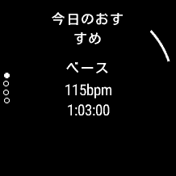

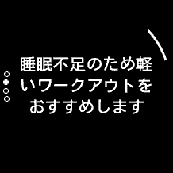

ランニングとサイクリングのアクティビティにおいて、開始時に推奨メニューを表示してくれる。

これは、Edgeシリーズでも採用されていたトレーニングステータスに基づき、VO2 Maxの向上に向けたプランとなっている。このプランに従ったアクティビティを開始すると、ローラートレーニングのように**ターゲットの心拍もしくはパワーから外れたときにアラートで知らせてくれる。**

もっとも、公道ではパワー値によるターゲティングはほぼ不可能なのでメインは心拍でのターゲティングになるだろう。

**単純なパワートレーニングと違い、体調も考慮**してくれるのがありがたい。

### コンディション管理

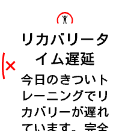

スマートウォッチの**大切な役目として24時間の心拍モニタリングがある**。これはサイクルコンピューターでは代替できない役目だ。

**安静時心拍数は非常に有能な指標で、その日に残っている疲労を面白いほどに反映**してくれる。しかも、これは運動による疲労だけでなく日常生活や風邪などの体調不良も可視化される。

**パワートレーニングの指標がレーサーとしての能力指標だとすれば、安静時心拍数は体調（コンディション）の指標として利用できる。**

特に、毎週練習とレースを繰り返すシクロクロスシーズンでは、平日の練習強度を決めるのに非常に役に立つ。

### モーニングレポート

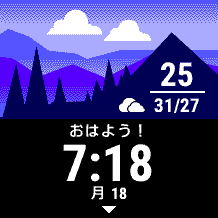

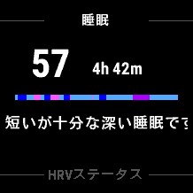

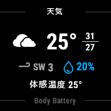

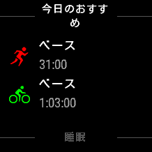

モーニングレポートは、ここまで上げた体調管理のサマリーを朝起きたときに全て通知してくれる機能。

起きてさぁ何をしよう、というタイミングでの意思決定に非常に役立つ。

これまでは走り出してみてから「何か調子が悪い…」ということでプラン変更することも多々あったが、客観的な状態がプッシュされることで無駄な時間をかなり削減できる。

## ForeAthlete 45Sとの比較

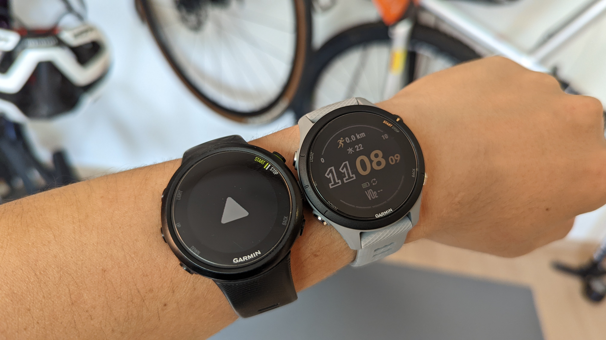

これまで使っていた[ForeAthlete 45S](https://www.garmin.co.jp/products/intosports/foreathlete-45s-white/)（以下FA45S）と比較してみた。

サイズは1mmほど[FR255](https://amzn.to/3IMI0Ec)の方が大きいが、ほぼ違和感なく付け替えができた。[FR255S](https://amzn.to/3IMI0Ec)では**バンドが交換可能なタイプとなり**、バンドを強く締め付けなくても手首にフィットするのが良い。

また、増えた機能的の中では **「トレーニングステータス表示」「睡眠スコア」** が一押し。

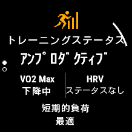

トレーニングステータスは、アクティビティの頻度とVO2Max値の変動を追い、**アクティビティがパフォーマンス向上に寄与しているかどうか**を教えてくれる機能。休息を入れるべきか、高強度練習を増やすべきか低強度練習を増やすべきか、アドバイスしてくれる。

睡眠スコアは睡眠の質の指標で、[FA45S](https://www.garmin.co.jp/products/intosports/foreathlete-45s-white/)では**時間だけだった睡眠計測を睡眠の質を考慮した解析**をしてくれる機能。短いけれども質が良かったのか、長いけど質は悪いのか、といった内容を教えてくれる。睡眠時間は仕方なく短くなることもあるので、その中でも健康的な生活を送れているか把握できる。

総じて、高機能になったこともあり計測だけでなく、分析についてもGARMIN CONNECTの表示できる情報が増えて、かなり楽になったし参考になるアドバイスが貰えるようになった。

## 24時間着けられますか？

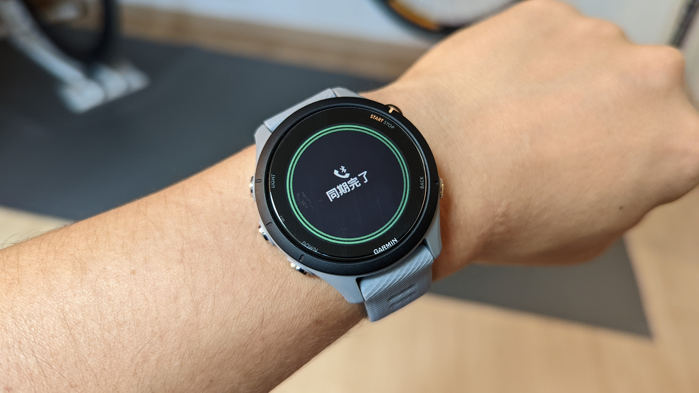

**Garminスマートウォッチのおすすめは"S"シリーズだ。**これは、今回の買い替えで確信に至った。

Garminスマートウォッチは、モデル名末尾に"S"のついた小さいサイズをラインナップしていることがほとんど。基本的には女性向けという位置付けになっているのだが、よほど手首が太い人は除いて、Sモデルを利用した方が良いと考えている。

睡眠を含めたログを取得するデバイスで**最も大事なことは、日常生活の全ての局面で邪魔にならないこと**だ。Garminのスマートウォッチはハイエンドモデルほど巨大化する傾向がある。45Sから255へ切り替えた場合、約6mmも直径が大きくなる。

大きく厚いデバイスが手首にあると、重いし違和感の元になる。なるべく**薄く軽い方が長い時間装着するうえでストレスにならない**という理由で、小さいSシリーズを好んでいる。

<LinkBox url="https://www.amazon.co.jp/dp/B09P1J6B9D/" isAmazonLink />

## カラー液晶の強み

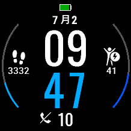

そして、カラー液晶とシンプルな丸型液晶。これも個人的な必須ポイントになった。**心拍やパワー、バッテリー残量など色がついていた方が直感的に把握しやすい情報がスマートウォッチには多い。**

基本的にスマートウォッチを凝視することはあまりないので、目をやった一瞬で情報が把握できるかどうかが非常に大切というのが持論だ。

一瞬だけ[Instinct2S](https://amzn.to/3OqPFJS)を使ったこともあるのだが、モノクロ液晶の視認コストの高さが嫌になりすぐに売り払ってしまった。

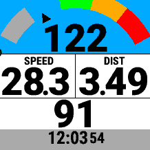

カラー表示の方が、Connect IQというカスタムウォッチフェイスの選択肢も増え、楽しいことが多い。

## まとめ

[Forerunner 255S](https://amzn.to/3IMI0Ec)はサイクルコンピューターとパワーメーターだけでは見えなかった、自分のコンディションを可視化する装置になる。

二桁モデルのForeAthlete 55シリーズも同世代にラインナップされているが、トレーニングステータスや睡眠スコアといった解析機能に劣る。（正確にはGARMIN CONNECTでアンロックされないだけのようだが）

パワーメーターペアリングによる、サイクルコンピューターのバックアップとしての機能も期待できるので、**サイクリストによって必要十分な機能を持ったGarminスマートウォッチの中で最も安価**なモデルとなるだろう。

<LinkBox url="https://www.amazon.co.jp/dp/B0B18M3381/" isAmazonLink />
