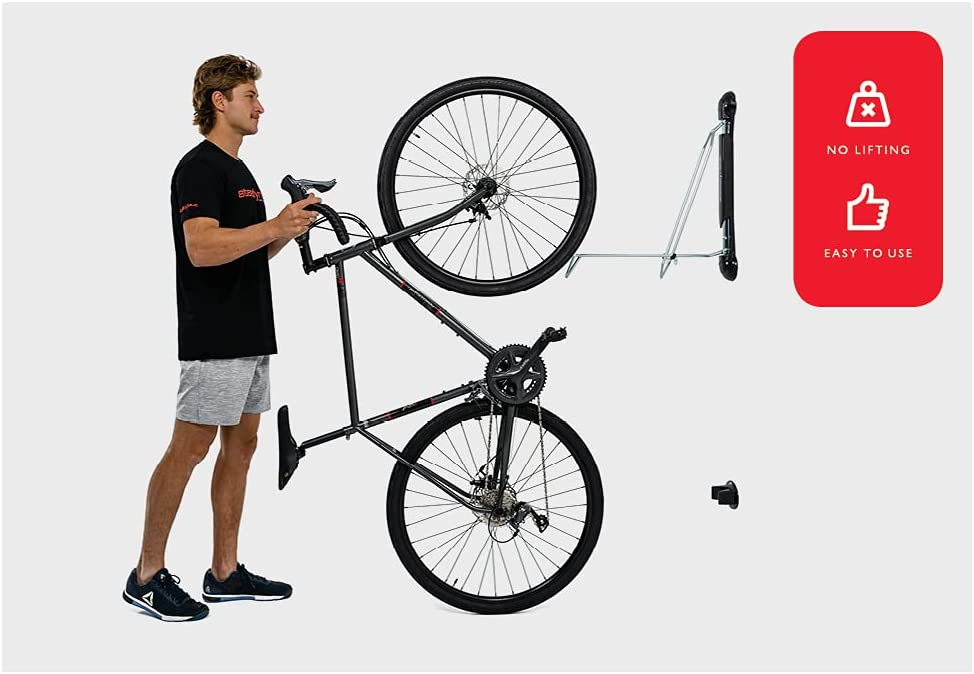
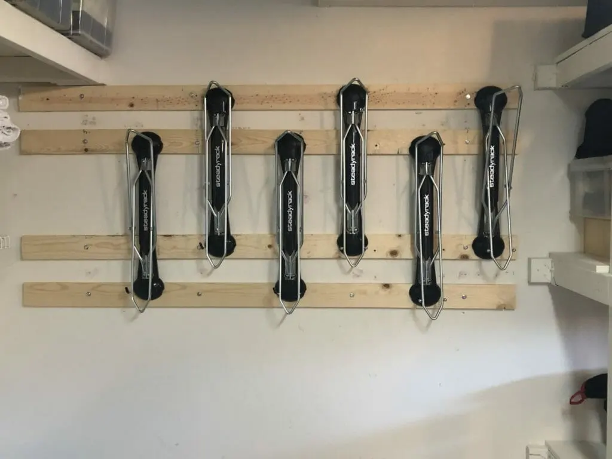
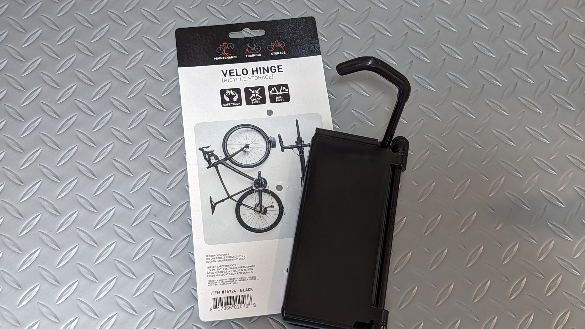
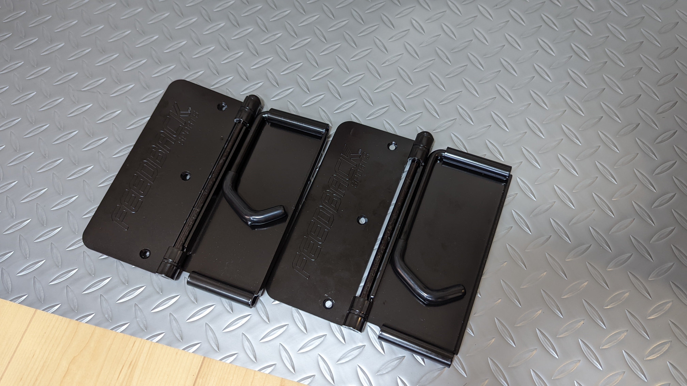
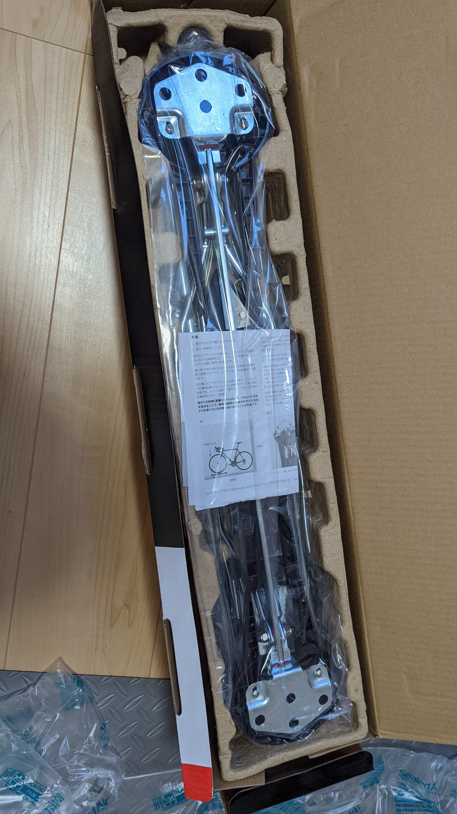

戸建て購入・転居に伴い、自転車の保管戦略を見直す必要が出てきた。

当初は、前の部屋から持ち出した2x4材に、[ミノウラの2x4専用ハンガー](https://amzn.to/3OJmNgO)を使って保管していたのだが、ハンガーの幅が狭く、420mmの微フレアハンドルでは壁に干渉するという課題が発生していた。

使える面積も広くなり、これまでの横向き壁掛けラックは上に配置した自転車の取り出しやすさに難があったため、縦置きラックへの変更を決意。

あらためて、最新の縦置きラック事情を調査してDIYすることにした。

## 計画編

Z軸を用いた横置き保管に比べ、縦置き保管は空間の利用効率が悪い。

取り出し部の空間を考慮しなければならない他、ハンドル幅分の横スペースの確保が必要になるためだ。

それに加え重要なのは**ルンバビリティの確保**だ。[ルンバ](https://amzn.to/3a947rS)を使う我が家では、全ての破損可能性のある家財とコードは浮かせるか保護しなくてはならない。

しかし、**今日の縦置き事情では、左右にスイングするバイクハンガーを使う**ことで、この2つの問題を共に解決できることがわかった。

今回利用するのは、[Feedback sportsのVelo hinge](https://amzn.to/3ybW9pS)と、[SteadyRack](https://amzn.to/3bJFGl4)だ。共にスイングして壁に寄せるように保管できる。

<LinkBox url="https://www.amazon.co.jp/dp/B00H96DA00/" isAmazonLink />

<LinkBox url="https://www.amazon.co.jp/dp/B004N9BUEY/" isAmazonLink />

加えて考える必要があるのは、壁掛けにする3台をどのように保管し、どのハンガーを使うか。

[SteadyRack](https://amzn.to/3bJFGl4)は[Velo hinge](https://amzn.to/3ybW9pS)の2倍以上のコストがする。その代わり、リムではなくタイヤを引っ掛ける方式なので、**引っ掛けやすいしホイールへの負担もない。**

手持ちの4台のうち、1台はローラー上が定位置、MTB・街乗りCX・グラベルロード（ディープリム）が縦置きになるとすると、**[ZIPP303S](https://paypaymall.yahoo.co.jp/store/qbei/item/pc-810594/)を履いているグラベルロードだけは[SteadyRack](https://amzn.to/3bJFGl4)を利用したい。**

持ち上げるのが大変なMTBにも[SteadyRack](https://amzn.to/3bJFGl4)を奢りたいところだが、いかんせん大きくて高いので、今回はコストを重視。

### 1x4材を使った強化骨組み

次に考えるのは壁への取り付け方法。

一般的な日本家屋の石膏ボードは自転車を支えることはできないため、[LABRICO のアジャスター](https://amzn.to/32LE9Et)を使って2x4材と組み合わせるか、下地を探して直接ネジ留めする方法のどちらかとなる。

<LinkBox isAmazonLink url="https://www.amazon.co.jp/dp/B01HTRVZ0A/" />

この点は、SteadyRack輸入代理店で、「石膏ボードに複数台のラックを取り付ける方法」が解説されており非常に参考になった。

<LinkBox url="https://adventure-aid.store/pages/steadyrack-plasterboard" />

画像のように、横向きの骨組みを作ることで、最小幅でのラック取り付けができる。

ただ、自分の場合はVelo hingeと組み合わせる都合上、この案は採用できず。**Velo hingeを使う場合は1x4の横幅とマッチしないため、何枚も1x4を使う必要性があった。**

そのため、もう1つの手段である**間柱に合わせて設置する案を採用**。

### 下地に直接ネジ留めする

間柱を活用することで、**間隔が固定される代わりに木材を計測・切断・購入しなくていいというメリットを得られる。**

賃貸では選択できない手段だが、持ち家のメリットを存分に活かさせてもらった。

下地の場所を事前にチェックする必要があるので、ホームセンターで下地チェッカーを購入。針を刺して下地の有無を事前に確認してからネジ留めする。

<LinkBox url="https://www.amazon.co.jp/dp/B07X5L138Y/" isAmazonLink />

## Feedbak Velo Hinge & Long Hook

縦置き用のバイクフックにヒンジ機構を持たせた、その名の通りのバイクフック。

この機構により、バイクをかけた後で横に倒し、占有スペースを一時的に減らすことができる。

### Long Hook

今回は、[Velo hinge](https://amzn.to/3ybW9pS)本体に加え、このLong hookを利用した。

実は標準のvelo hingeは2.4インチまでのタイヤしか装着できず、タイヤを含めたリムハイトは74mm以内である必要がある。

実際に試したところ、ワイドリムに2.3インチのMTBタイヤは既に装着が難しい。MTBではほぼ必須だ。

### Velo Hinge使用感

比較的、取り付けが簡単だった。この手のフック全体に言えることだが、**付属のネジが電動工具に耐えきれない**ので、別途ホームセンターで硬いネジを購入する必要がある点に注意。

構造もシンプルなので、調整や故障対応が簡単そうなのも良い。

## SteadyRack

[SteadyRack](https://amzn.to/3bJFGl4)は届いたときそのゴツさに圧倒された。Velo hingeはAmazonの最小箱に入るサイズ感だったのに対し、値段なりの複雑性がある。

### 取り付け

住宅建材はホームセンターの2x4材と違い、硬い木材を利用している。**下穴無しでの施工はほぼ不可能と思った方がよい。**

太いネジ、電動工具必須

### SteadyRack使用感

ラックに乗せる力がとても少ない

ホイールに一切負荷がかからない構造で素晴らしい。

本体は重く、ネジも長く太いので取り付けは大変。下穴は必須。
