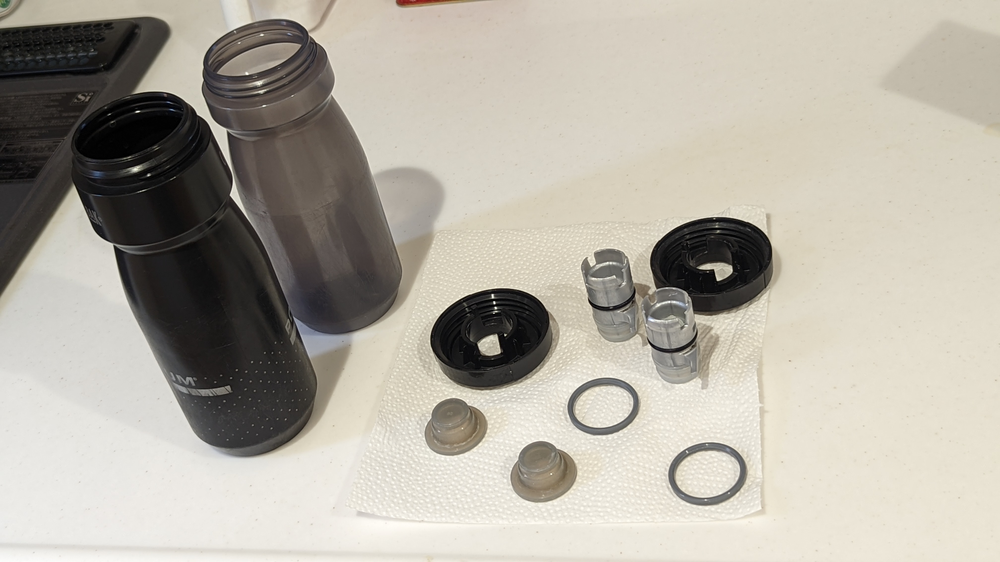
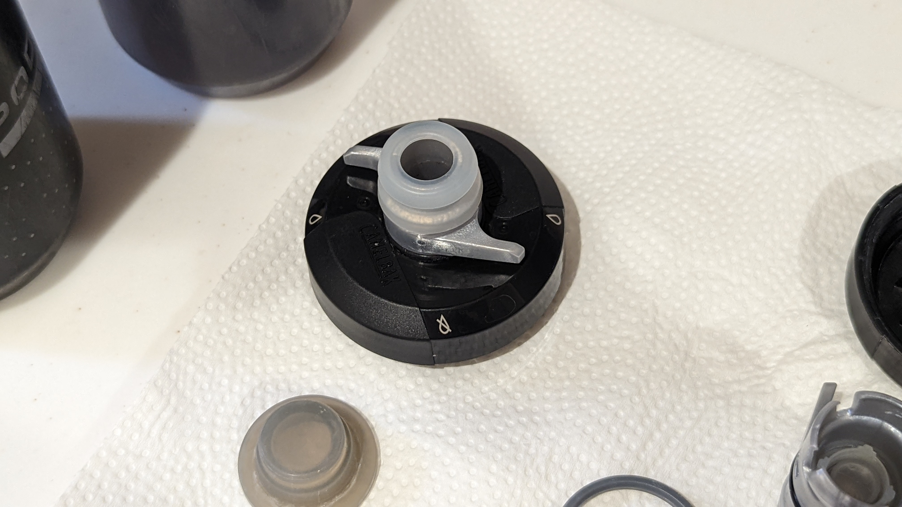

## 宣伝

8/13に行われるコミックマーケット100の1日目で、同人誌「サイクリング・デジタルトランスフォーメーション」を頒布します。

<LinkBox url="https://www.gensobunya.net/c100/" />

デジタル機器でサイクリングライフを変革しよう！アクションカメラ5機種のレビューと、マウント8種類を撮影イメージと共に徹底解説！

後半は、サイクルコンピューター・スマートウォッチの使いこなし・WEBサービスの連携設定をして、自分のコンディションを徹底的に可視化して、自分だけのデジタルトレーナー化する現代のサイクリングログ活用について。ライド動画とライドログはもちろん、ライフログも合わせてあなたもサイクリングをDXしましょう\
**本文70ページ**。

会場価格1000円

[メロンブックスさんでも委託販売](https://www.melonbooks.co.jp/detail/detail.php?product_id=1579831)いたします。
