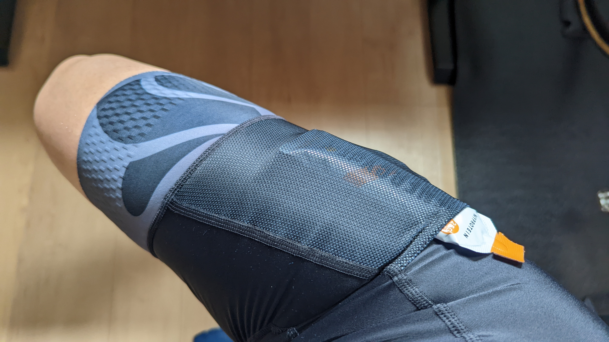

## グラベルライド文化の一端

荷物を多く持つ必要性のあるグラベルライド。ライド途中での補給は望むべくもない環境のため、自活するための補給食を多く持つ必要があった。

そんな背景から、バイクパッキング用具で荷物を積むよりも、もっとスマートな持ち方（もしくは、それに追加するため）生まれたのがカーゴビブショーツ。

太腿のサイドや、

## ニセコグラベル

すくみずさん記事

楽しそうだったのでエントリーした。グラベルライドのために色々買った。

## PERFORMANCEエンデュランス ビブショーツ

オーダージャージで有名なチャンピオンシステムだが、既製品もオンラインショップで注文できる。

<LinkBox url="https://champsys.shop/collections/mens-shorts-bibshorts/products/performance-endurance-bibshorts-unison-mens" />

比較候補、Rapha, SAUCE, ファンキアー

ちょっと固い。

### ロングレングスオプション

自分は短足なので、必要ないと思っていた…が、脚の長さに拘わらず、サイドが固くなるカーゴビブショーツでは追加した方がよさそう。同サイズでも締め付けが強く感じる。

そもそも、公式でも太腿の太い人にお勧めされていた。

> 裾のグリッパーの位置も膝の近くまで下がるため、圧迫感が軽減される傾向にあります。とくに太腿の大きいライダーは、快適性が向上します。

脚も腕も太いので、本来はオプション追加すべきだった。反省。**オンラインショップでも受注制作なので、オプションは自由だ。**

<!-- textlint-disable -->

## 宣伝

8/13に行われるコミックマーケット100の1日目で、同人誌「サイクリング・デジタルトランスフォーメーション」を頒布予定。

<LinkBox url="https://www.gensobunya.net/c100/" />

デジタル機器でサイクリングライフを変革！アクションカメラ5機種のレビューと、マウント8種類を撮影イメージと共に徹底解説！

後半は、サイクルコンピューター・スマートウォッチの使いこなし・WEBサービスの連携設定をして、自分のコンディションを徹底的に可視化して、自分だけのデジタルトレーナー化する現代のサイクリングログ活用について。ライド動画とライドログはもちろん、ライフログも合わせてあなたもサイクリングをDX！\
**本文70ページ**。

会場価格1000円

[メロンブックスさんでも委託販売](https://www.melonbooks.co.jp/detail/detail.php?product_id=1579831)を予定。

<!-- textlint-enable -->