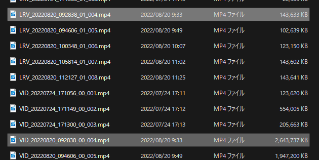

## Overview

## 優秀なモバイルアプリ

Insta360のカメラ全般における**最大の長所がモバイルアプリの性能と機能。**

アクションカメラ界において、ハードウェア面では圧倒的な信頼と性能を誇る[GoProシリーズ](https://amzn.to/3CjVje5)だが、ソフトウェアはお粗末でモバイルアプリ・PCアプリ共に残念な出来と言わざるを得ない。

純正アプリのGoPro Quikは動画転送にとんでもない時間がかかり、編集もできるが動作は重く、レンダリング時に落ちたりフリーズするのは日常茶飯事。端的に言って酷かった。1分の動画を転送するのに5分待って、編集の1アクションごとに10秒以上は待つといった具合だ。

**Insta360のモバイルアプリはスマートフォンでのプレビュー・編集共にほぼ待ち時間なしで開始することができる**。もちろん**編集もほぼ待ち時間なく作業可能**。BluetoothとWifiでカメラと同期する点はGoProと同一のはずなのだが、なぜこうも差が出るのか…

見たところ、Insta360のカメラは、オリジナルとは別にモバイル転送用のファイルを同時に生成するという動作をしているようだ。

SDカードの中を除くと、**同一の動画が二つのファイルになっており、片方はFullHDサイズの軽量版**になっている。これで転送量を落として、モバイルアプリの操作レスポンスを上げているようだ。

スマートフォンで編集・プレビューするモチベーションは、撮った動画をすぐSNSへ上げるような速報性にあるので、このような仕様でも問題はないと思われる。

ただ、**不思議なのは編集のレスポンス**。GoProもInsta360も、ローカルに持った動画ファイルに対して編集しているはずなのだが、なぜこうも作業レスポンスに差が出るのか…この辺りはInsta360のノウハウが効いているのだろうか。

### さらに詳しいレビュー・Goなどの別モデル

宣伝

## GoProとの違い

### 手振れ補正

GoProの方がよい

### ソフトウェア・ファイル保存

Insta360の圧倒的勝利

ファイルが分割されないのもよい

## まとめ

<PositiveBox>

- モバイルアプリによるプレビュー・編集・書き出しが超高速
- SDカードに保存されたMP4ファイルの分割もない

</PositiveBox>

<NegativeBox>

- ハウジング必須でサイズ・重量が大きい
- 手ブレの物理補正ではGoProに劣る

</NegativeBox>