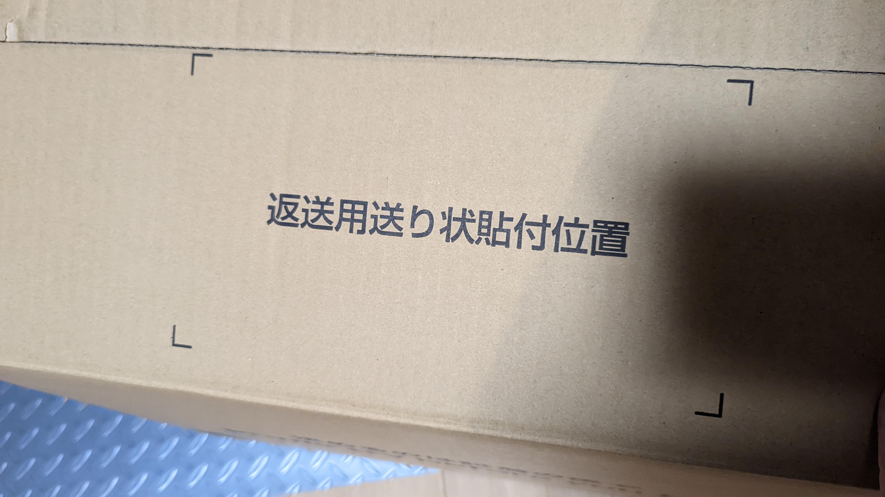

## Try before you buy とは

Amazonのファッションカテゴリに属する商品で、通販でありながら試着を実現するのが[Try before you buy](https://amzn.to/3PuNcOZ)だ。

`決めるのは試着の後で`というキャッチフレーズの通り、**サイズ違いや色違いの商品をまとめて取り寄せ、試着の上合わなくても返品は（Prime会員なら）無料というサービス**

以前はPrime Wardrobeという名前だったこともある。

サイクルウェアの一部も対象となっており、今回これを利用する機会があったので試してみた。

## プロセス

1. 専用カートで商品を追加
2. 到着・試着
3. 返送

[Try before you buy](https://amzn.to/3PuNcOZ)のプロセスは、Amazonで未使用品を返品する際の流れと大差ない。

違う点は、**専用のショッピングカートやサジェストが用意**されること、**梱包されている箱が再利用**を前提としていること、**返送用伝票が同封される**ことの3点だ。

以前購入した、[パールイズミのベンチレーションビブパンツ](https://amzn.to/3wamvZb)も、このシステムを利用して購入した。

<LinkBox url="https://blog.gensobunya.net/post/2022/08/perl_indoor_bib/" />

今回は直近で購入した[クロームのHONDOバックパック](https://amzn.to/3Qyc3Ta)を例に説明していく。

### 専用カート

[Try before you buy](https://amzn.to/3PuNcOZ)対応商品は、デフォルトでは専用カートや専用購入ボタンが用意されている。

1商品をカートに入れると、自動的に色違いをサジェストしており、機能としての力の入れっぷりがうかがえる。

試着が不要であれば、通常の注文も可能だ。

### 到着・試着

今回、バックパックを色違いで2つ注文しただけあって、かなり大きな箱で家に到着した。

置き配対応の戸建てだったからよかったものの、まず間違いなく宅配ボックスには入らない…と思われる（140サイズ）

商品は薄いビニール袋に入れられており、試着時にこれは破ってもよい。

試着・返品のプロセスについては丁寧な説明書が同梱されている他、納品書の代わりに暫定でいくら利用したかが記載されたレシートも入っている。

到着から7日以内に返品すれば、返品した側の商品の請求は発生しない。

ただ返品すればよいのではなく、**注文詳細からどちらの商品を返品するか、なぜ返品するか理由を入力する必要がある**点に注意。

カードへの請求は、7日経過するか、返品をWEBにて確定した時点で行われる模様。

### 返品

説明書のほかに、返送用の伝票が入っている。

Amazonといえばペラペラの梱包段ボールだが、[Try before you buy](https://amzn.to/3PuNcOZ)の箱は返送を前提としているためか、厚めでしっかりとしている。

それでいて、ツールフリーで開梱・再梱包できるようにミシン目や両面テープが最初から貼られているなど、返送のストレスを可能な限りなくすよう努めているようだ。

## ポイ活要素

Try before you buyでの買い物は、購入時にも表示されるが購入金額に対してのAmazonポイント（通常1%）は付与されない。（[Amazonマスターカード](https://amzn.to/3A2eEOh)の追加ポイントも付与されないが、カスタマーサポートに問い合わせたところ不具合のようだ）

通常購入時にポイント利用分金額にはポイント付与されないため、[Try before you buy](https://amzn.to/3PuNcOZ)に対してポイントを利用すると、実質ポイント価値をわずかながら上げることができる。

そもそも全て返品しても無料なので、全返品の上再度お目当てを通常購入することでポイントを最大限取得もできる（道義的にどうかと思うが…）

## まとめ

サイクルウェアは肌に直接着るものも多いので、結局下着越しで試着することになるが、サイズ感を確認できるのは非常に安心できる購入体験だ。

欠点としては、マーケットプレイスは対象外でAmazon販売の製品しかこのシステムを利用できないこと。サイクルウェアはほとんどがマーケットプレイス販売で、Amazon販売のラインナップはお世辞にも多くない。

Amazon販売で買えるサイクルブランドの代表は[パールイズミ](https://amzn.to/3ArsafK)なのだが、自分のサイズ感を既に知っている人が多そうだ。

サイクリストが[Try before you buy](https://amzn.to/3PuNcOZ)を便利に使えるかどうかは、今後のラインナップ拡充にかかってくるだろう。
