## ニセコグラベル 2022 Autumn

<LinkBox url="https://nisekogravel.com/" />

今年グラベルロードを購入した自分にとって、どうしてもやっておきたかったことがあった。

それが、**長距離グラベルイベントへの参加**。

日本でまだ黎明期のグラベルイベントは数も少ないが、その分厳選された、アーリーアダプターのためにグラベルの魅力を詰め込んだイベントが開催されている。

**何年も開催されているイベントとしては、Rapha主催のプレステージが最初に挙げられる**。ただ、無念ながら自分周辺の交友関係でRaphaと近しい人間がいないため、毎回「いつの間にかエントリー始まってて開催日に情報をキャッチする」パターンが多い。

そんな中、2021年・2022年春に開催され、オープンに参加を募っているイベントだったのがこの[ニセコグラベル](https://nisekogravel.com/)だ。

> 北海道ならではの雄大な自然と、グラベルロードバイクの特徴である優れた走破性を活かし、林道、 農道、砂利道、アスファルトなど、舗装・未舗装にとらわれずハイブリッドに駆け回る、新たなラ イド体験ができます。 インフラの発達による道路の舗装化が広く行き届いている日本では、グラベルロード普及と定着に 多くの課題があります。 しかしここ北海道には、極端に高くない山々や、豊かな樹木に囲まれた林 道が多く、グラベルロードならではの路面を問わず楽しめるハイブリットな自由度を活かした、「日本らしいグラベル」の遊び方を確立することができます。
> <https://nisekotourism.com/ja/events/niseko-gravel-2022/>

グラベルという地形がそもそもあまりない日本において、北海道というグラベルにぴったりの地域色を活かしたイベント。

Spring Rideの参戦記事を何本か読み、すっかりAutumnへ行く気になってしまったので、エントリーを心待ちにしていた。

なんせ100kmオーバーのグラベルイベントだ。未体験のライドに心躍らないわけがない。

## 完璧な計画

エントリー開始即チームを編成に動く。

今回は、春ライドに参加したすくみずさんと、親しくしているさきぷさんに声をかけた。全員既婚者故に若干の家庭内調整が発生したものの、二人とも快諾頂けた。

かくして、オシャレな雰囲気に混じることのできないオタクたちのチーム、**Raphaなんて着ていないし全員Androidユーザー**という、イベントのブランディングに反するチームが結成された。

申し込んだ際の計画は、**Spring Ride経験者の知見を反映した全4日の行程。**前々日夕方に北海道入りし、札幌観光。翌日（イベント前日）は軽いライドと北海道グルメを楽しみ、当日は思い切り楽しんだ後、後泊して体力を回復させて帰京というスケジュールだ。

## 飛行機輪行、そして北海道グルメ

金曜夕方に新千歳空港へ降り立つ。自転車を持っての北海道は実に9年ぶりで感慨深い。

国内での**飛行機輪行については、電車でも使う輪行袋をベース**に、ディレイラーを外して養生テープでフレームに巻き付け、ペダルを外しておくというシンプルなスタイル。

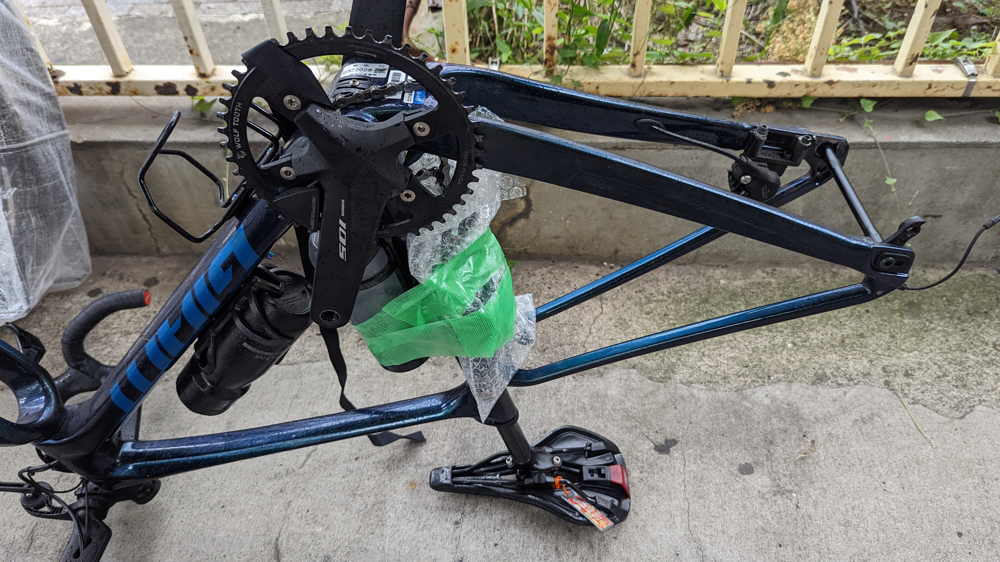

当時と違うのはディスクブレーキになったこと。

ローターの変形やフレームの保護を考え、今回は **[IKEAのDIMPAバッグ](https://www.ikea.com/jp/ja/p/dimpa-storage-bag-transparent-90187753/)と[ダミーアクスル](https://twitter.com/ab_peko/status/1532235970258448384/photo/4)** を用いて、ズレが発生しないようにして輪行袋と一緒に放り込んだ。

輪行袋はおなじみ[Pekoさんの超軽量タイプ](https://peraichi.com/landing_pages/view/peko/)。

43cタイヤともなると、DIMPAのサイズがやや心配だったがギリギリ呑み込んでくれた。あと数ミリ太かったら厳しかった。

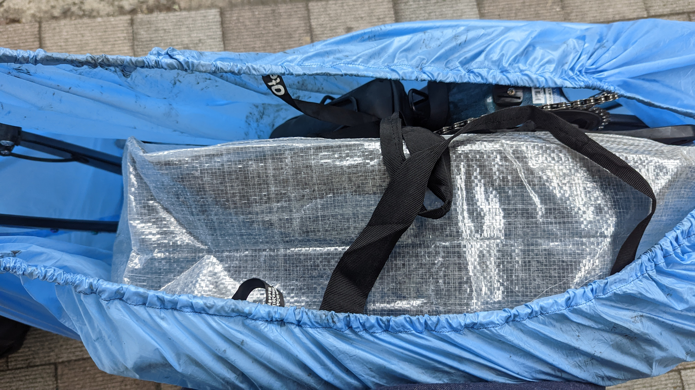

このスタイルの**良い点は、壊れやすい箇所が片側に限定されること**だ。ハンドルをクランク側に切って、同じ側にホイールバッグを投入すればノンドライブサイドはほぼフラット。

飛行機輪行の際に課題となる **「横倒しにする際どちらを下にしますか？」に対して明快に答える**ことができ、破損リスクも減らせるという寸法だ。

### 北の飯はうまい

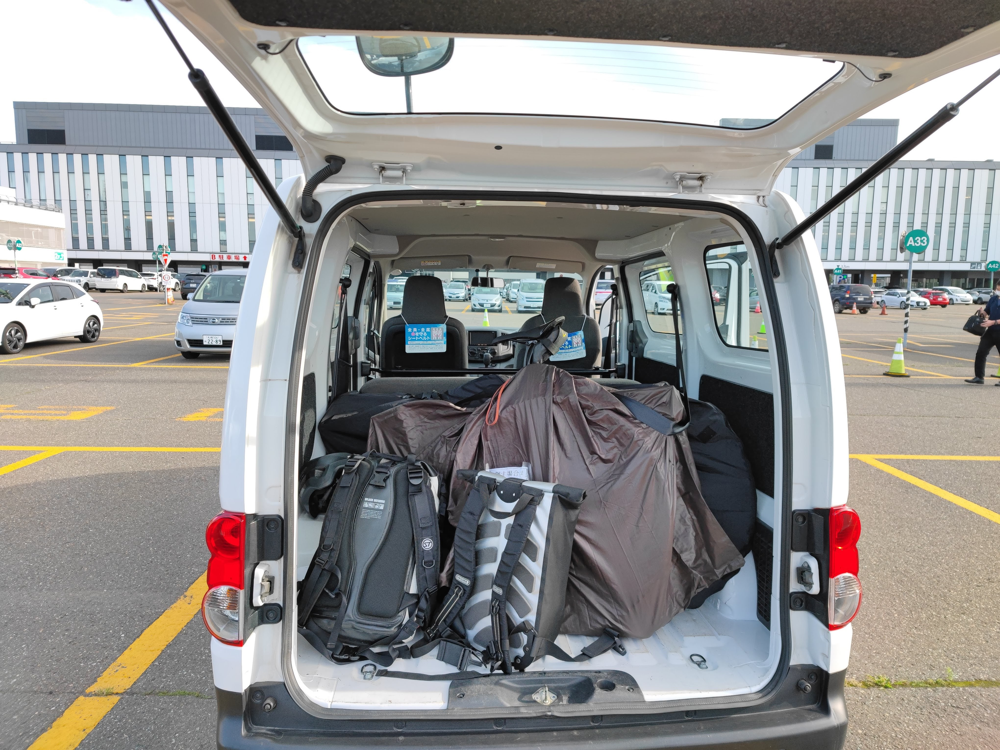

集合後はハイエース**ではなく**バネットバンをレンタルして、宿まで移動した後に札幌でジンギスカンを楽しむ。

金曜日の夜というタイミングにも関わらず、予約なしという段取りの悪さで突撃したため、第一候補の店には入れなかったが、GoogleMap評価4.8の店に飛び込むことができた。

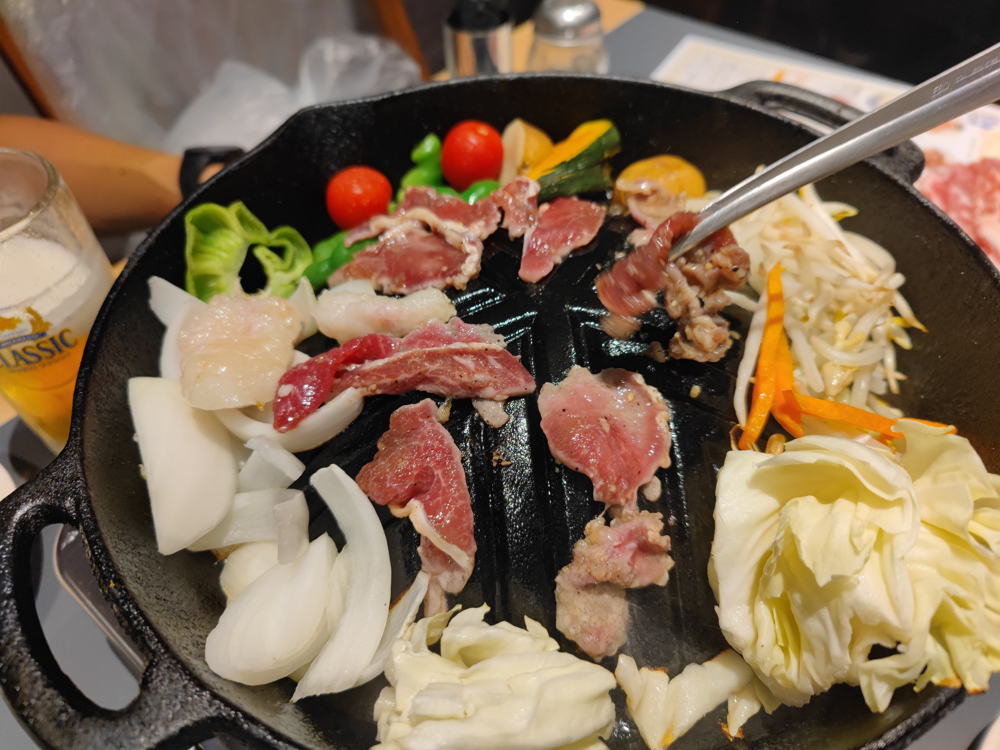

肉と肉と酒に舌鼓を打ちつつ、臭くなった服を全てランドリーにぶちこみ、良いスタートを切れたと談笑しながらこの日は終了。

## ウォーミングアップの石狩グラベルライド

旅の二日目、ニセコグラベル本番前日。

この日は、札幌エリア住民おなじみの「サンドリア」のサンドイッチを朝食に、石狩エリアのグラベル含む40kmほどのライドを行った後にニセコへ移動する予定だ。

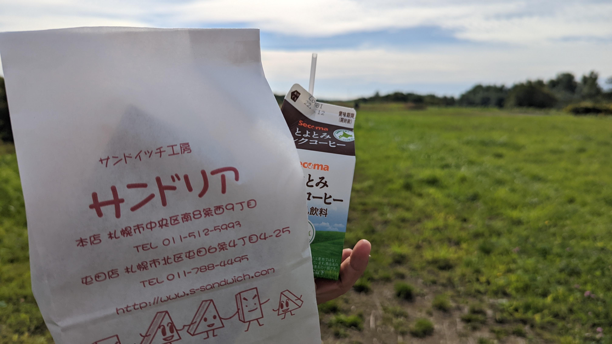

サンドリア本店は夜職の人にも対応できる24時間営業。早朝になりがちなサイクリストにもありがたい存在だ。

### 石狩グラベルライド

石狩川沿いの適当な駐車場に車を停めて、まずは広大な大地を眺めながらサンドイッチで一服。

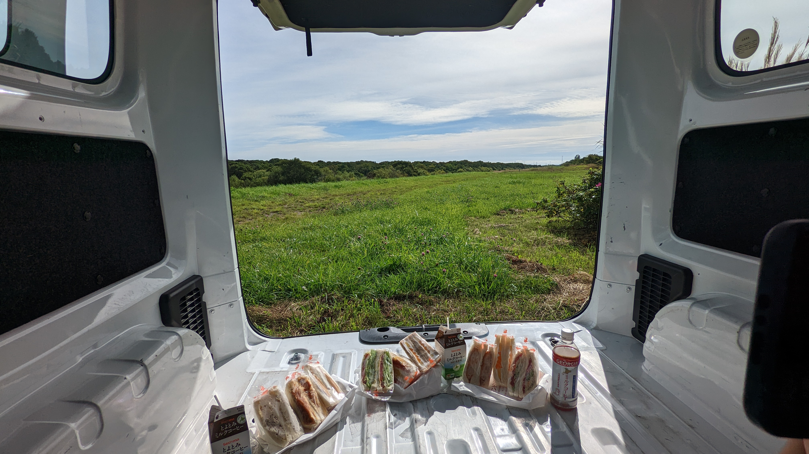

この日は44kmの適度な登りを組み込んだグラベル込みライドだ。ウォーミングアップ兼機材慣らしにはちょうどいい。

<iframe height='405' width='590' frameborder='0' allowtransparency='true' scrolling='no' src='https://www.strava.com/activities/7744811695/embed/0af8eb595067d0aded80fa0d771351d53c6ba9d4'></iframe>

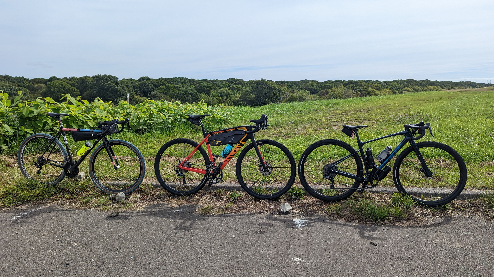

河川敷に入ると、平坦な舗装路とグラベルが入れ替わり立ち代わり現れ、早くもテンションは最高潮に。

関東平野のような喧噪とは無縁の広い道に感慨を覚えながら進んでいく。北海道のような雪国は、除雪やチェーンで路面が荒れていることがお約束だが、グラベルロードのタイヤはそれを全く感じさせず、ただただ景色のみを楽しむことができた。

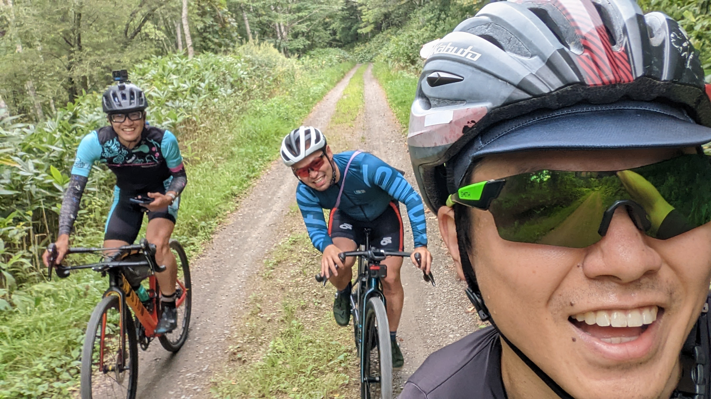

この日は [Insta one RS](https://amzn.to/3xajHLP) の操作をミスっており良い動画は撮れず。本番前のテストとしても役立つライドだった。

新たに購入した[LAMEDA長袖ジャージ](https://www.lameda.jp/)の着心地や、それぞれの装備を確かめつつ、平坦基調の往路ではあっという間に折り返し地点の[カシオペアの丘](https://goo.gl/maps/EweLTHp8a3K7fRsSA)に到着。

シクロワイヤード撮りをしたり、存分に遊びながら復路の山がちなグラベルへ。

ここも、未舗装のままの林道が残されており正にグラベル天国といった様相だった。登りではすくみずさんがフォトアタックを繰り返すが、反応せずに被写体としての責務を全うすることに集中…

<blockquote class="twitter-tweet">
極上グラベルライド、お先に頂きました。 <a href="https://t.co/sI5bnWkxVs">pic.twitter.com/sI5bnWkxVs</a>
&mdash; すくみずさん (@skmzmw) <a href="https://twitter.com/skmzmw/status/1565898291031654405?ref_src=twsrc%5Etfw">September 3, 2022</a></blockquote>

元々が、GARMIN CONNECTで公開されていたルートをベースにしたので、20%の不整地登りをこなす途中、軽トラのおじさんに行き止まりであることを告げられるなどのハプニングはあったものの、ネタ写真も撮りつつ、気持ちいい疲労感でライドを終えることができた。

<blockquote class="twitter-tweet">
赤報隊で培った鉄砲火器の知識を元に作った 炸裂弾だ🎃 <a href="https://t.co/urpYwl0KtL">pic.twitter.com/urpYwl0KtL</a>
&mdash; すくみずさん (@skmzmw) <a href="https://twitter.com/skmzmw/status/1565902034314076160?ref_src=twsrc%5Etfw">September 3, 2022</a></blockquote>

### ニセコへ

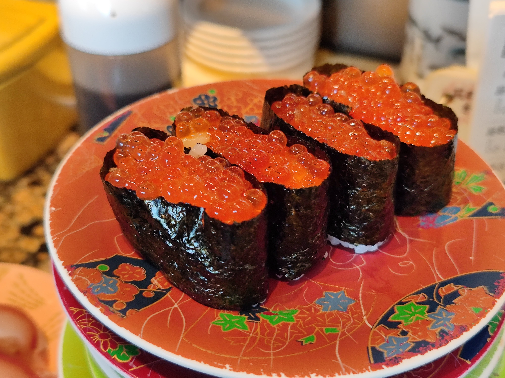

ニセコに移動しがてら、花まるで寿司を堪能。

道中は牧場ソフトも頂き、全人類が北海道でやるべきことのチェックリストを順調にクリアしていく。

ニセコエリアにたどり着くと、リゾートらしい英語ファースト日本語セカンドの世界が我々を出迎えた。

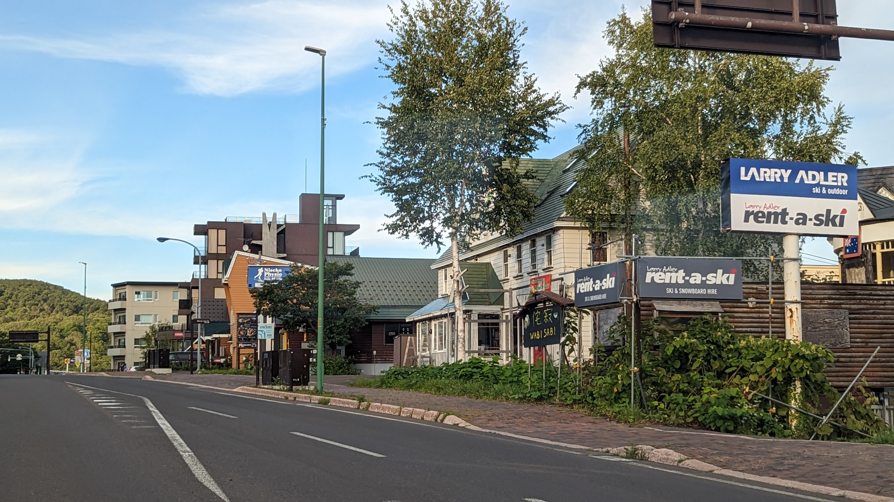

本会場であるニセコアンヌプリ国際スキー場で前日受付を終え、シルバーGRXやつむりさんの洗練されたハンドル回りを楽しみつつも、知人との挨拶を終えたあとはそそくさと退散。
漏れ聞こえた会話によると、パートナーは沢山いるがあまりお金を払わなくともパートナーになれるらしい。

<blockquote class="twitter-tweet">
Canyon「新刊落としました」 <a href="https://t.co/x6IKdKsNZn">pic.twitter.com/x6IKdKsNZn</a>
&mdash; ゲン@C100委託はメロンブックスとKindle (@gen_sobunya) <a href="https://twitter.com/gen_sobunya/status/1565953384590413826?ref_src=twsrc%5Etfw">September 3, 2022</a></blockquote>

<blockquote class="twitter-tweet">
神楽坂つむりさんの洗練されたハンドル周り <a href="https://t.co/8NImhtXiuB">pic.twitter.com/8NImhtXiuB</a>
&mdash; ゲン@C100委託はメロンブックスとKindle (@gen_sobunya) <a href="https://twitter.com/gen_sobunya/status/1565959202832412672?ref_src=twsrc%5Etfw">September 3, 2022</a></blockquote>

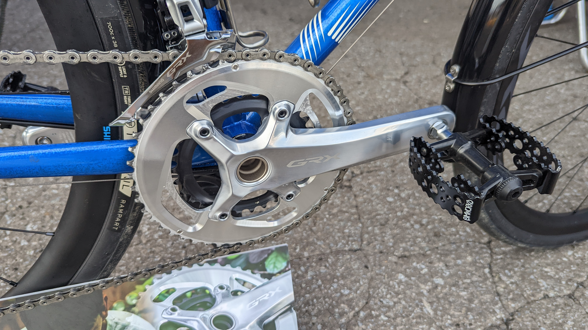

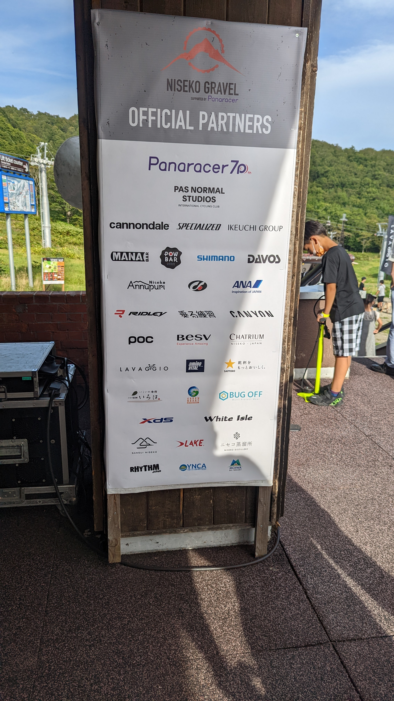

この日は味噌ラーメン屋で英気を養い、セイコーマートの100円パスタパックを朝食に買い込み、明日に備えた。

ニセコグラベル本番、エクストラロングコースが予想を超えたハードライドになるとはこの時まだ誰も予想していなかった…