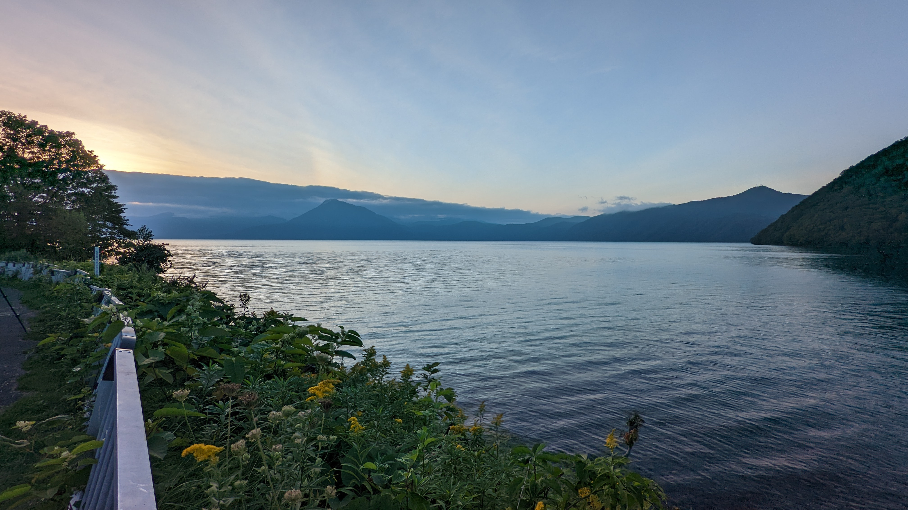

ニセコグラベル2022の本番は、学生時代を彷彿とさせるセイコーマート・グルメで幕を開けた。

[前日まで](https://blog.gensobunya.net/post/2022/09/nisekogravel22_1/)に比べると、どんどんと食事のグレードが下がっているように見えるが、**これが北海道ライドのリアルだ**。（多分）

<LinkBox url="https://blog.gensobunya.net/post/2022/09/nisekogravel22_1/" />

ニセコグラベルは最も長いエクストラロング **（114km 2200m UP）** でも、8時スタート16時ゴールとなっており、朝は遅めの設定。

受付も前日に終わっているため、必然的に起床も遅くなる。

「このコースプロフィールで制限時間がたった8時間なのは、少なすぎやしないか…？」という事実に、前日になってようやく気が付くも、今更どうにもならない。

<iframe src="https://ridewithgps.com/embeds?type=route&id=39986908&sampleGraph=true" style="width: 1px; min-width: 100%; height: 700px; border: none;" scrolling="no"></iframe>

スキー場を出発して、ニセコ周辺の地形をぐるりを回るコースで、エクストラロングは角速度を稼ぐことのできない山に登って下るだけの2本のグラベル（内1本はイベント以外走行不可）を追加したコースとなっている。

前日は撮影失敗したカメラも、今回はしっかりセット完了。

## スタート

<blockquote class="twitter-tweet" data-partner="tweetdeck">
おはようございます！<a href="https://twitter.com/hashtag/%E3%83%8B%E3%82%BB%E3%82%B3%E3%82%B0%E3%83%A9%E3%83%99%E3%83%AB?src=hash&amp;ref_src=twsrc%5Etfw">#ニセコグラベル</a> スタートしてます！グラベルサイクリスト大集合感すごい！<a href="https://twitter.com/hashtag/nisekogravel?src=hash&amp;ref_src=twsrc%5Etfw">#nisekogravel</a> <a href="https://t.co/5NParTlSJI">pic.twitter.com/5NParTlSJI</a>
&mdash; エリグチ@サイスポ編集部 (@ergtick2019) <a href="https://twitter.com/ergtick2019/status/1566217636857651200?ref_src=twsrc%5Etfw">September 4, 2022</a></blockquote>

イドイベントらしい。ゆるーいカウントダウンとスタートで始まったニセコグラベル。

ところがどっこい、**正しいルートはこの動画のアングルで見て左向き**である。

数十メートル進んだところで集団も気が付き、Uターンを始める……自分の近くで回りきれず落車が発生していたが、大した怪我も無さそうなので気にせず正ルートへ戻ってダウンヒルを始める。

改めて参加者を見ると、各々の服装や装備も実にバリエーション豊か。

Tシャツや襟シャツの人もいるし、バッグ類も積載にかなりの差がある。

流石にエクストラロング参加勢は軽装で上下サイクルジャージという人が多いものの、グラベルの自由さを感じさせる。

## 顧客が求めていたグラベル、そしてメロン

ロングコースと共通になっている、序盤の長いダウンヒル

<iframe width="560" height="315" src="https://www.youtube.com/embed/V9sx1nGNnhg" title="YouTube video player" frameborder="0" allow="accelerometer; autoplay; clipboard-write; encrypted-media; gyroscope; picture-in-picture" allowfullscreen></iframe>

そこまで荒れていないダブルトラックのグラベルが延々と続き、気持ちよくスピードに乗せて自転車が進んでいく。

コーナーでは、うまく轍を捕まえれば減速を最低限にでき、気持ちのいい時間を伸ばすことができる。その一方で、シクロクロスと違い、**各々の機材差が大きい**ことを考慮に入れる必要がある。

何も考えずについていくとブレーキポイントを見誤るため、自分の空気圧・タイヤ選択などを踏まえた自分だけのラインを選んでいく必要があった。ブレーキをミスすると、砂利路面ということもあって無理ができず大きく膨らまざるを得ない。

今回の**タイヤセッティングは[パナレーサーのグラベルキングSK 43c](https://amzn.to/3U2z4ji)を、前後にそれぞれ2.2気圧、2.4気圧とした。**

<LinkBox url="https://www.amazon.co.jp/dp/B07D6WP95G/" isAmazonLink />

**ダウンヒルを楽しみたかったため、**ほぼ[SRAMの空気圧ツール](https://axs.sram.com/guides/tire/pressure)のお勧めから、フロントのみやや下げ気味に設定した。

結果として、集中力の低下していた後半までダウンヒルで転ぶことはなかったので、下りに関しては上手くいったようだ。

ギア比設定ミスで登りが非常につらかったが、これに関しては別途書く機材記事に記載していく。

顧客が求めていたグラベル、顧客が求めていた舗装路。

北海道らしさを堪能しつつ序盤は進んでいく。

### おまちかね、北海道エイドステーション

長いダウンヒルを終えた参加者を待ち構えるのは、北海道メロンを提供するエイドステーションだ。

この手の**ロングライドイベントにおける最大の楽しみは、補給を最低限持ちつつ、エイドステーションで美味しい食べ物をたっぷり頂けることだと考えている。**

通例であれば、取り分けは1回というのがお約束ではあるが、今回はなんと**メロン食べ放題**だった。

さらに、受付時に加えて各エイドで、エナジーバーとして[MANABAR](https://www.mana-energy.bar/)と[POW BAR](https://thepowbar.com/)のどちらかが支給される。

<LinkBox url="https://www.mana-energy.bar/" />

<LinkBox url="https://thepowbar.com/" />

どちらも添加物を極力抑え、美味しい補給食として使うことができた。**甘味だけでなく酸味やフレーバーの味も前面に出ているほか、適度なしっとり感**となっており食べやすいのがとても良い。

[チャンピオンシステムのカーゴビブ](https://champsys.shop/collections/mens-shorts-bibshorts/products/performance-endurance-bibshorts-unison-mens)にもしっかり収まり、後半の体力消耗エリアに備えることができた。

<LinkBox url="https://blog.gensobunya.net/post/2022/08/champ_sys_cargo/" />

## エクストラロングコースのグラベルダウンヒル

メロンの後に待ち構えるのは、クストラロング組だけのグラベルダウンヒルが2本。

<iframe width="560" height="315" src="https://www.youtube.com/embed/lCRjLxJueTA" title="YouTube video player" frameborder="0" allow="accelerometer; autoplay; clipboard-write; encrypted-media; gyroscope; picture-in-picture" allowfullscreen></iframe>

<iframe width="560" height="315" src="https://www.youtube.com/embed/fgOIUGPaCzU" title="YouTube video player" frameborder="0" allow="accelerometer; autoplay; clipboard-write; encrypted-media; gyroscope; picture-in-picture" allowfullscreen></iframe>

**舗装路UP→グラベルDOWNのシンプルな構成で、難易度高めな下りを脳汁垂らしながら楽しめる**というわけだ。

ここでは、脚の合った地元北海道ライダー2名とご一緒させてもらった。CannondaleのSlate, TopStoneでゴリゴリに走っているが、**なんと片方の方は無印グラベルキング**……

グリップは怪しそうなのにかなりのスピードでぶっとばしていたのだが、CJエリートライダーとのことで納得。

なおこちらが当人のご感想。

<blockquote class="twitter-tweet">
ブロックのありがたみを感じました。 無印＝ 虚無 SS＝少し滑る SK＝少し食う <a href="https://t.co/DBgKT8jnEq">https://t.co/DBgKT8jnEq</a>
&mdash; ozonetch (@ozonetch) <a href="https://twitter.com/ozonetch/status/1567724023894900736?ref_src=twsrc%5Etfw">September 8, 2022</a></blockquote> 

地味に嫌らしいアップダウンをモリモリ走りながら中間地点の「道の駅らんえつ」に到着。

**オフロードでは、平坦でもそれなりに踏まないと進まない**ため、アップダウンを繰り返しながら登っていくプロファイルになるとかなり脚を使う。

**フロントシングルのギア比では、最適なギア比を選択できず、フロント46T**ということも相まって軽いギアを回していけないため中間地点にしてかなりの疲労を蓄積してしまっていた。

長めの休憩を取り、アイスクリームと地元のミニトマトで回復。

**ミニトマトは甘みも塩気もしっかりしており、まさに絶品**。袋いっぱいに入って130円だったがチームでペロリと食べてしまった。

## 無心の後半戦

休憩後、5kmという非常に長いグラベルクライムをこなし、完全に脚は売り切れてしまった。

後半のグラベルは主に平坦と登りに設定されているというプロフィールから、途中チーム員から「グラベルもういいかな…」という言葉が発されるほど。

王滝でもそうだが、**余りにも景色が変わらないと人間は途中で飽きてしまう**。それがいかに素晴らしいものであっても……

**後半に求められているものは、舗装路と下り。間違いない**

もう記憶が定かでもないので、文章にも落ちて来ない。

## ゴール、そして失われた4日目

**終盤にいくつかの激坂グラベル**が設定されており、ショートコースの**e-bike勢にぶち抜かれるなど熱烈なセールス**を受けながら、攣りかけた脚を引きずりスキー場へゴール。

なぜ生き急ぐようなペースで走り、サドルトークに花を咲かせることもなく、入念な構図の写真を撮ることもなかったのか…

それは、**声をかけた張本人である自分が月曜日から海外出張へ行くことになってしまったため。**

ニセコから新千歳まで約2時間半。不確定要素を考慮した上で飛行機に間に合わなければならず、深夜帰宅を選択せざるを得なかった。

ハイペースに付き合い、ゴール後の談笑や余韻を最低限に新千歳まで運んでくれたチームメンバーにはこの場を借りて深く感謝する。

幸いにも、脚の仕上がっているメンバーのおかげで夕暮れの支笏湖や温泉を堪能する余裕はあった。

新千歳近くの明らかに地元住民しか来ない温泉、440円也。

飛行機から体を引きずって自宅に帰還したのは日を回ってから。

翌朝6時半に起床して、セットしておいた荷物を持って出国。これにて私のニセコグラベルは終了した。

<blockquote class="twitter-tweet">
ニセコ グ ラベル 第三部完 <a href="https://t.co/Pl0OOPbUq3">pic.twitter.com/Pl0OOPbUq3</a>
&mdash; ゲン@C100委託はメロンブックスとKindle (@gen_sobunya) <a href="https://twitter.com/gen_sobunya/status/1566578644558159872?ref_src=twsrc%5Etfw">September 5, 2022</a></blockquote>
