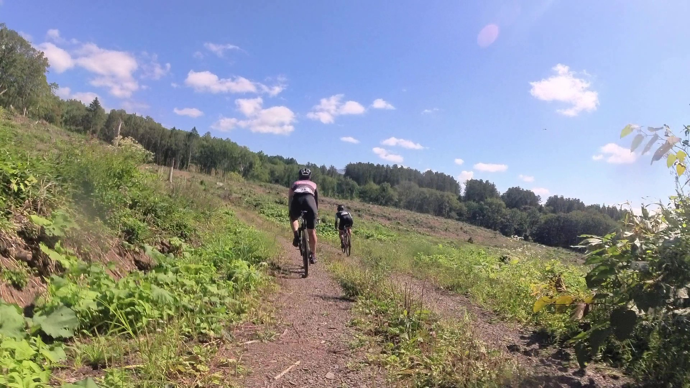
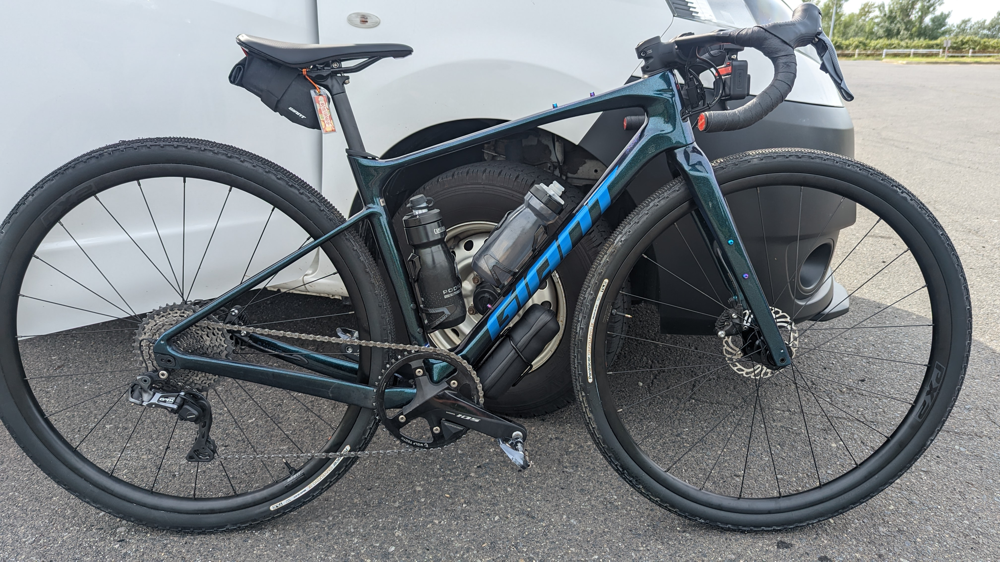

ニセコグラベル2022は、前々泊で北海道入りして、前日ライドとイベント当日でたっぷり自転車に乗り、北海道の自転車ライフと食文化を満足いくまで堪能できた。

<LinkBox url="https://blog.gensobunya.net/post/2022/09/nisekogravel22_1/" />

<LinkBox url="https://blog.gensobunya.net/post/2022/09/nisekogravel22_2/" />

グラベル率約50%のエクストラロングコース、雄大なロケーション、それこそ後半グラベルに**飽きるまでグラベルを堪能したと言っていいだろう**。

コースは最高だったが、[愛車のREVOLT ADVANCED](https://blog.gensobunya.net/post/2022/04/revolot_adv22_review/)でのグラベルライドは初めてだったこともあり、**様々な良かった点と反省点があった。**

## バイク

<LinkBox url="https://blog.gensobunya.net/post/2022/04/revolot_adv22_review/" />

GIANT REVOLT ADVANCEDは北米の長距離グラベルレースをターゲットとして開発された車体。

レーシングユースの剛性を備えていながら、トップチューブやフォークにマウント用のダボ穴を備えていて拡張性も高い。

グラベルロードの性格を決める対応タイヤ幅は最大42mmで、フリップチップをロング側に切り替えることで53mmまで拡張できる。

これまでは、TCRからおさがりの**AGILIST TLR 30c**を履かせて**ロードバイクとしても使えるグラベルバイクを目指した構成**にしていた。インジケータが薄くなってきたのでこれを機に完全にグラベルバイク仕様へと変更した。

### タイヤセッティング

今回は飛行機輪行ということもあり、完成車付属のGIANT P-X2 DISCホイールにノブのあるグラベルタイヤをインストールした。

- Front: [グラベルキングSK 43c](https://amzn.to/3U2z4ji) 2.2Bar
- Rear: [グラベルキングSK 43c](https://amzn.to/3U2z4ji) 2.4Bar

※ライダー体重66kg

<LinkBox url="https://www.amazon.co.jp/dp/B07D6WP95G/" isAmazonLink />

[グラベルキングSS](https://amzn.to/3d4VBvu)で転がりの良さを稼ぐこともできたが、**せっかくグラベル天国に行くのだから、グラベル区間での楽しさを最優先した**。

スプリングライドの参加者たちのレビューから、38cのセミスリックでは下りがナーバスという情報を耳にしていたので、経験者の学びを素直に取り入れさせてもらった。

**結果としてこのタイヤセッティングは大成功で、一度の転倒もなくエクストラロングの114kmを走りぬくことができた。**

グラベルのような砂利のコーナーはシクロクロスの33mmタイヤではかなり神経を使うが、**43cのノブのあるタイヤなら、ライン選択を間違えなければ最小限のブレーキでコーナーを抜けることができ**、とても気持ち良い。

これとは別に、関東のような舗装路区間の長いグラベルライドと日常ライドのため、[ZIPP303S](https://paypaymall.yahoo.co.jp/store/qbei/item/pc-810594/)に[グラベルキングSS](https://amzn.to/3d4VBvu)の38cを履いたセットを用意した。

今後はシチュエーションに応じて「P-X2 + グラベルキングSK 43c」「ZIPP303S + グラベルキングSS 38c」の二種類のホイールを使い分けていく。

### ハンドル

今回投入の秘密兵器。我らがPrimeの[Orra Aero カーボングラベルハンドルバー](https://www.wiggle.jp/prime-orra-aero-%E3%82%AB%E3%83%BC%E3%83%9C%E3%83%B3%E3%82%B0%E3%83%A9%E3%83%99%E3%83%AB%E3%83%8F%E3%83%B3%E3%83%89%E3%83%AB%E3%83%90%E3%83%BC)だ。

<LinkBox url="https://www.wiggle.jp/prime-orra-aero-%E3%82%AB%E3%83%BC%E3%83%9C%E3%83%B3%E3%82%B0%E3%83%A9%E3%83%99%E3%83%AB%E3%83%8F%E3%83%B3%E3%83%89%E3%83%AB%E3%83%90%E3%83%BC" linkurl="https://ck.jp.ap.valuecommerce.com/servlet/referral?sid=3171302&pid=886932159&vc_url=https%3A%2F%2Fwww.wiggle.jp%2Fprime-orra-aero-%25E3%2582%25AB%25E3%2583%25BC%25E3%2583%259C%25E3%2583%25B3%25E3%2582%25B0%25E3%2583%25A9%25E3%2583%2599%25E3%2583%25AB%25E3%2583%258F%25E3%2583%25B3%25E3%2583%2589%25E3%2583%25AB%25E3%2583%2590%25E3%2583%25BC%3Futm_source%3Dvaluecommerce%26utm_medium%3Daffiliates%26utm_campaign%3Daffiliate-website" />

ポイントは以下の3点

- フレアハンドルによる**ブラケットでのエアロポジション＋下ハンの安定性**
- ワイヤー内装による**エアロ効果**
- 形状・素材によるエアロ効果と**振動吸収性**

これも、**狙い通りの効果を発揮してくれた**。

下りは基本的に下ハンで安定してハンドリングができ、平地や舗装路ではブラケットを持つと体を小さくすぼませることができ、空力的に良い体勢を取ることができる。

ロングライドではいかに体力消費を抑えるかが鍵なので、**楽できる局面では徹底的に楽をしておくのが鉄則。**

グラベルでも長距離ならエアロは効いてくるのだとよくわかった。次の項目であるギア比でミスを犯し、後半脚が無くなっていた分を平坦や下りでいい具合にカバーできたのは空力のおかげ。

### ギア比

## ウェア

### 夏用アームカバー・レッグカバー

### カーゴビブショーツ