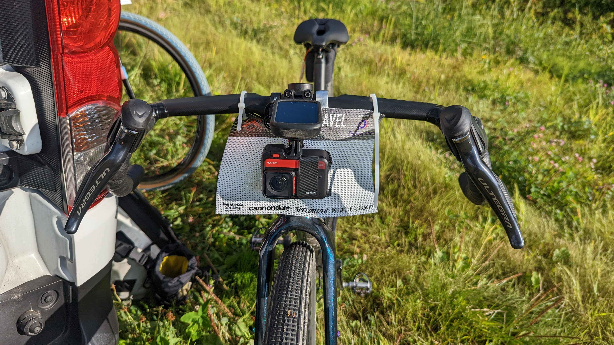
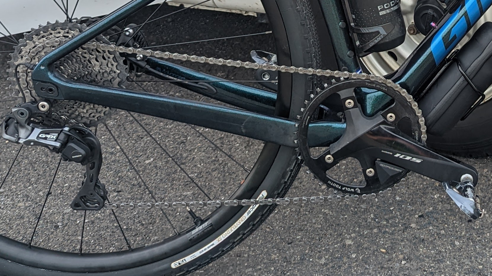
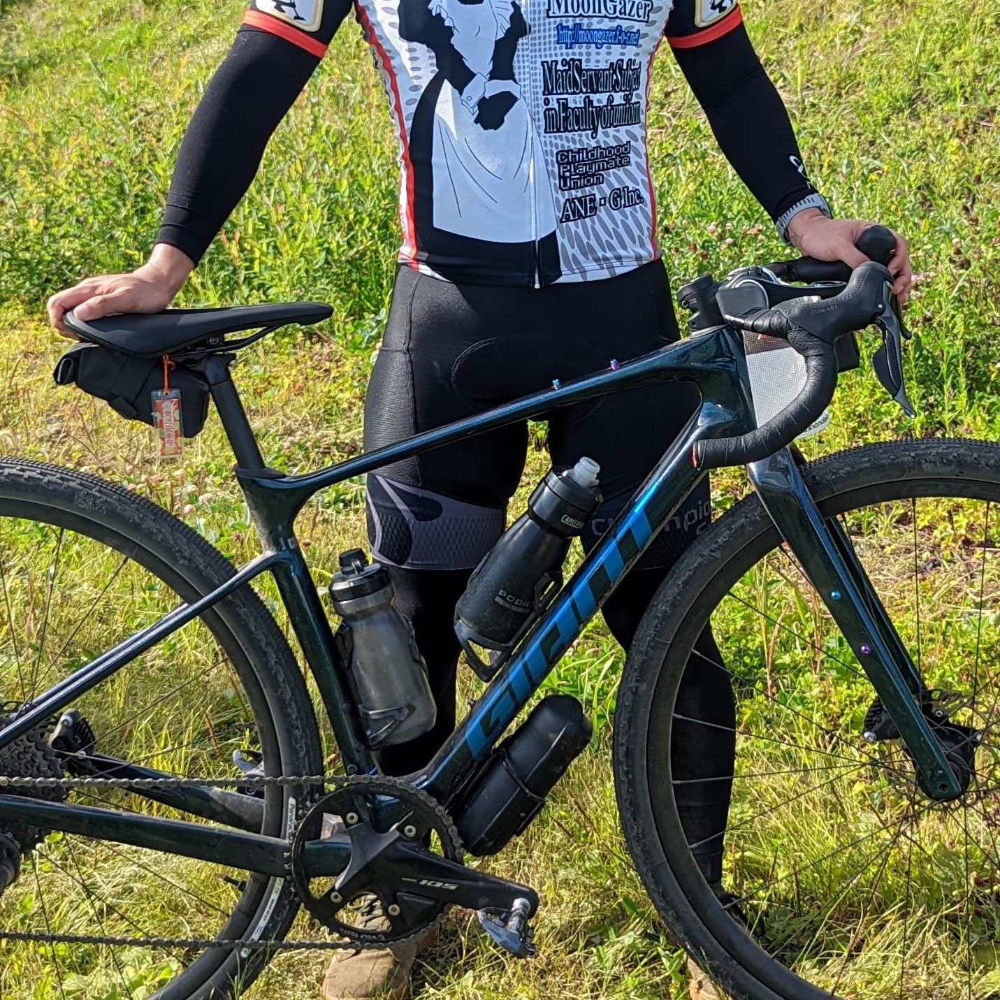

ニセコグラベル2022は、前々泊で北海道入りして、前日ライドとイベント当日でたっぷり自転車に乗り、北海道の自転車ライフと食文化を満足いくまで堪能できた。

<LinkBox url="https://blog.gensobunya.net/post/2022/09/nisekogravel22_1/" />

<LinkBox url="https://blog.gensobunya.net/post/2022/09/nisekogravel22_2/" />

グラベル率約50%のエクストラロングコース、雄大なロケーション、それこそ後半グラベルに**飽きるまでグラベルを堪能したと言っていいだろう**。

コースは最高だったが、[愛車のREVOLT ADVANCED](https://blog.gensobunya.net/post/2022/04/revolot_adv22_review/)でのグラベルライドは初めてだったこともあり、**様々な良かった点と反省点があった。**

## バイク

<LinkBox url="https://blog.gensobunya.net/post/2022/04/revolot_adv22_review/" />

GIANT REVOLT ADVANCEDは北米の長距離グラベルレースをターゲットとして開発された車体。

レーシングユースの剛性を備えていながら、トップチューブやフォークにマウント用のダボ穴を備えていて拡張性も高い。

グラベルロードの性格を決める対応タイヤ幅は最大42mmで、フリップチップをロング側に切り替えることで53mmまで拡張できる。

これまでは、TCRからおさがりの**AGILIST TLR 30c**を履かせて**ロードバイクとしても使えるグラベルバイクを目指した構成**にしていた。インジケータが薄くなってきたのでこれを機に完全にグラベルバイク仕様へと変更した。

### タイヤセッティング

今回は飛行機輪行ということもあり、完成車付属のGIANT P-X2 DISCホイールにノブのあるグラベルタイヤをインストールした。

- Front: [グラベルキングSK 43c](https://amzn.to/3U2z4ji) 2.2Bar
- Rear: [グラベルキングSK 43c](https://amzn.to/3U2z4ji) 2.4Bar

※ライダー体重66kg

<LinkBox url="https://www.amazon.co.jp/dp/B07D6WP95G/" isAmazonLink />

[グラベルキングSS](https://amzn.to/3d4VBvu)で転がりの良さを稼ぐこともできたが、**せっかくグラベル天国に行くのだから、グラベル区間での楽しさを最優先した**。

スプリングライドの参加者たちのレビューから、38cのセミスリックでは下りがナーバスという情報を耳にしていたので、経験者の学びを素直に取り入れさせてもらった。

**結果としてこのタイヤセッティングは大成功で、一度の転倒もなくエクストラロングの114kmを走りぬくことができた。**

グラベルのような砂利のコーナーはシクロクロスの33mmタイヤではかなり神経を使うが、**43cのノブのあるタイヤなら、ライン選択を間違えなければ最小限のブレーキでコーナーを抜けることができ**、とても気持ち良い。

これとは別に、関東のような舗装路区間の長いグラベルライドと日常ライドのため、[ZIPP303S](https://paypaymall.yahoo.co.jp/store/qbei/item/pc-810594/)に[グラベルキングSS](https://amzn.to/3d4VBvu)の38cを履いたセットを用意した。

今後はシチュエーションに応じて「P-X2 + グラベルキングSK 43c」「ZIPP303S + グラベルキングSS 38c」の二種類のホイールを使い分けていく。

### ハンドル

今回投入の秘密兵器。我らがPrimeの[Orra Aero カーボングラベルハンドルバー](https://www.wiggle.jp/prime-orra-aero-%E3%82%AB%E3%83%BC%E3%83%9C%E3%83%B3%E3%82%B0%E3%83%A9%E3%83%99%E3%83%AB%E3%83%8F%E3%83%B3%E3%83%89%E3%83%AB%E3%83%90%E3%83%BC)だ。

<LinkBox url="https://www.wiggle.jp/prime-orra-aero-%E3%82%AB%E3%83%BC%E3%83%9C%E3%83%B3%E3%82%B0%E3%83%A9%E3%83%99%E3%83%AB%E3%83%8F%E3%83%B3%E3%83%89%E3%83%AB%E3%83%90%E3%83%BC" linkurl="https://ck.jp.ap.valuecommerce.com/servlet/referral?sid=3171302&pid=886932159&vc_url=https%3A%2F%2Fwww.wiggle.jp%2Fprime-orra-aero-%25E3%2582%25AB%25E3%2583%25BC%25E3%2583%259C%25E3%2583%25B3%25E3%2582%25B0%25E3%2583%25A9%25E3%2583%2599%25E3%2583%25AB%25E3%2583%258F%25E3%2583%25B3%25E3%2583%2589%25E3%2583%25AB%25E3%2583%2590%25E3%2583%25BC%3Futm_source%3Dvaluecommerce%26utm_medium%3Daffiliates%26utm_campaign%3Daffiliate-website" />

ポイントは以下の3点

- フレアハンドルによる**ブラケットでのエアロポジション＋下ハンの安定性**
- ワイヤー内装による**エアロ効果**
- 形状・素材によるエアロ効果と**振動吸収性**

これも、**狙い通りの効果を発揮してくれた**。

下りは基本的に下ハンで安定してハンドリングができ、平地や舗装路ではブラケットを持つと体を小さくすぼませることができ、空力的に良い体勢を取ることができる。

ロングライドではいかに体力消費を抑えるかが鍵なので、**楽できる局面では徹底的に楽をしておくのが鉄則。**

グラベルでも長距離ならエアロは効いてくるのだとよくわかった。次の項目であるギア比でミスを犯し、後半脚が無くなっていた分を平坦や下りでいい具合にカバーできたのは空力のおかげ。

### ギア比

**今回最大の失敗**

「ロードバイクとしても使えるグラベルバイク」として、**オンロードで下り基調を考慮して、フロント46T - リア11-42T**の構成としていた。このギア比なら50km/h前後の速度でも問題なく脚を回せるからだ。

一方で、デメリットとして**最低ギア比が1.095とグラベルバイクとしてはやや高め**であること、**ロー寄りのギア比が飛びがち(24-28-32-37-42)**ことだ。

最低ギア比は若干足りない程度でまだ我慢の余地があったのだが、フロントシングル故に持つ**ギア比が飛ぶというデメリットは114kmという長丁場では大きかった**

序盤の登りこそチーム内で合わせて登ることができたものの、後半は完全に脚がバテており登りで辛い思いをした。

オンロードメインの使い方では、ほぼトップ側半分が主体となる構成なので、多少のケイデンス変化は押し切れるという経験を持っていたのだが、トルクの重要性が増すオフロードではさらに影響が大きくなり、適切なギア比を選択できないということはかなりのストレスになっていた。

**後ろから見ていても「明らかに快適なケイデンスに調整できていない」**という意見をもらったので、よほどの粗いペダリングになっていたことが想像できる。

<LinkBox url="https://blog.gensobunya.net/post/2021/10/single_road_longterm/" />

そもそも、フロントシングルロードを運用していて同じことはわかっていたつもりだったが、オンロードもオフロードも走るグラベルロードではよりデメリットが濃く出た形だ。

シクロクロスやマウンテンバイクといった、速度域を限定できる自転車ではフロントシングル構成は有効だが、**ロードバイクやグラベルバイク（オンロード兼用）の場合はフロントダブル**が現段階での最適解だと改めて認識した。

### ツール類

イベントということもあり、バッグは必要最低限で、**パンク修理キットのみをもってライドに臨んだ。**

普段であればダウンチューブ下のツールボックスには輪行袋が入っているのだが、**ニセコグラベル中に輪行袋が役立つシチュエーションは皆無。**

登りがきついこともあって、不要なものは積載せず**補給食類も全てウェア内に収納**した。

反省点としては、**カメラのバッテリーが途中で切れる**ことを理解しつつ、何の対策も取っていなかったこと。チームメンバーは抜かりなくフレームバッグに予備バッテリーを仕込んでいたので、次回はライドを楽しむためのツール群を持つためのバッグは装着しようと思う。

空力はなるべく損ねたくないため、背の低いトップチューブバッグや小さめのフレームバッグが候補か。

## ウェア

朝晩は涼しい予報の北海道ニセコだったが、この日はライドを始めることには25度前後となっており、普通の夏ウェアを着用した。

グローブもロングフィンガーで、**基本的には肌を出さないことでトラブルを防止**。

### 夏用アームカバー・レッグカバー

肌がかぶれやすい体質ということもあって、**草との接触を最低限に抑え**つつ、**日焼けダメージも軽減**するために夏用のアームカバー・レッグカバーを着用した。

藪漕ぎこそなかったものの、グラベル区間ではススキが張り出している区間も多かったので、ミ**ミズ腫れや日焼けを起こすことなく完走**できた。

<LinkBox url="https://www.amazon.co.jp/gp/product/B01MXTBQ8U/" isAmazonLink />

<LinkBox url="https://www.giant.co.jp/giant23/acc_datail.php?p_id=A0002338" />

共にシームレス構造のカバーで、気化熱によるクーリング機能も期待できる。

特に[RxLソックスのアームカバー](https://amzn.to/3xo7Tpm)は優秀で、完全シームレス構造により**カットしてサイズを調整可能**、洗濯後の**端の丸まりを抑える加工**がされていて、安価ながら快適に使う工夫がされている。

また、オンロードオフロード問わず、ロングライドをすると路面のゴミや砂埃を巻き上げ、脛に付着することは避けられない。

今回はフィニッシュ後に空港へ急ぐ必要があったため、**風呂に入れない場合でも、最低限泥や汚れの付着した肌を見せないで済む**という意図もあった。

### カーゴビブショーツ

[チャンピオンシステムのエンデュランスビブショーツ](https://champsys.shop/collections/mens-shorts-bibshorts/products/performance-endurance-bibshorts-unison-mens)を着用した。

<LinkBox url="https://blog.gensobunya.net/post/2022/08/champ_sys_cargo/" />

厚めのパッドのおかげか尻が振動で痛くなることはなかったし、[各エイドで配られる補給食](https://amzn.to/3de1xlP)に加え、マイプロテインの[リカバリージェル](https://px.a8.net/svt/ejp?a8mat=3N3PXV+GF7GHE+45DI+BW0YB&a8ejpredirect=https%3A%2F%2Fwww.myprotein.jp%2Fsports-nutrition%2Frecovery-gel-elite%2F11214831.html)、[エナジーゼリーエリート](https://px.a8.net/svt/ejp?a8mat=3N3PXV+GF7GHE+45DI+BW0YB&a8ejpredirect=https%3A%2F%2Fwww.myprotein.jp%2Fsports-nutrition%2Fenergy-gel-elite-12-pack%2F11271257.html)も脚のポケットに収まった。

## 総括

ウェアや補給など、ロードの経験を活かせる点については、悪くない装備だったように思える。

一方でギア比やパッキングなど、経験の薄い部分には不備が目立った。

普段からグラベルタイヤを履くようになったので、地元でライドを重ねつつ、次回までに最適解を探っていきたい。
