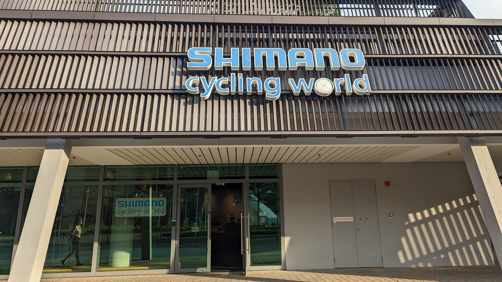
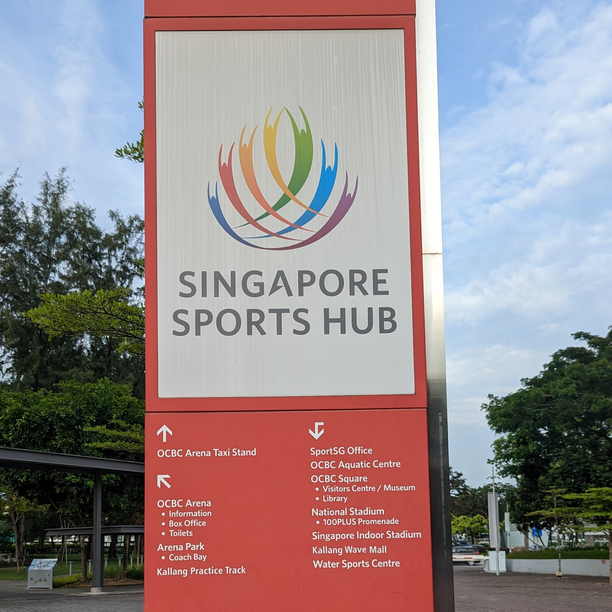
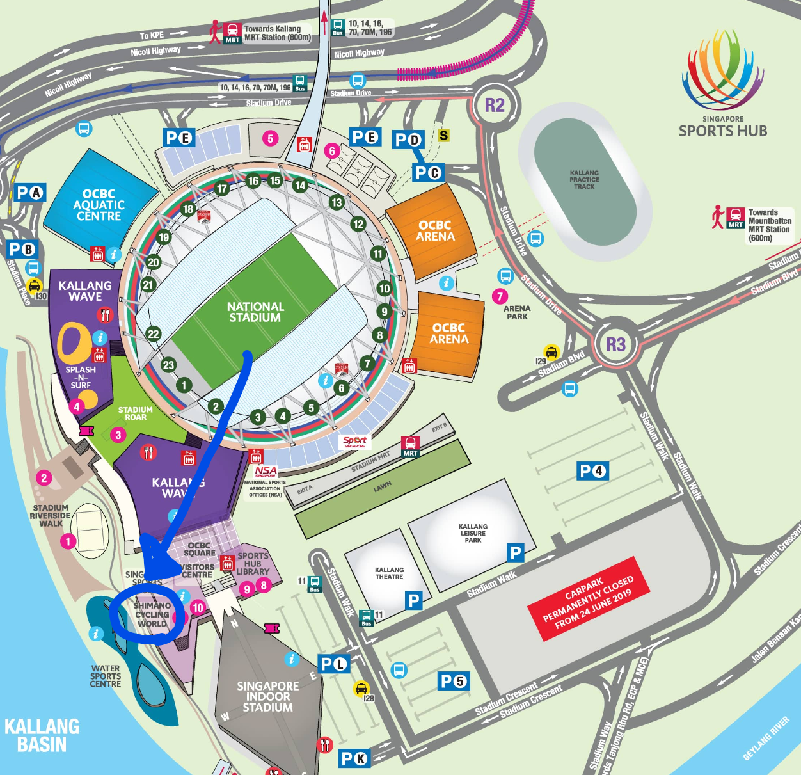

ニセコグラベルの余韻を楽しむ間もなく仕事でシンガポールへ。

しかし当然、頭の中はニセコグラベルの思い出がぐるぐるしているし、Twitterのタイムラインは「ニセコグラベルがああだったこうだった…」

ホテルのジムや周辺のランニングで運動はしているものの、自転車欲の高まった状態では満足とはいかない。

この欲求を解消すべく、隙間時間を見つけて、シマノシンガポール謹製施設の[シマノ・サイクリングワールド](https://www.shimano.com/jp/100th/history/cultural_activities/facility02.php)へ行ってきた。

## SHIMANO CYCLING WORLDとは

SHIMANO CYCLING WORLDはシンガポールのSports Hubなる複合スポーツ施設内に開設されている体験型展示施設。

**Sports Hubはシンガポールの中心地にある、シンガポール国立競技場を中心としたスポーツ施設**で、およそ思いつくほとんどのメジャースポーツを実施できる設備を持つ。

アジア最大級の大きさを誇るとのことで、本格的な競技場以外にもスポーツブランドの入るショッピングモールが併設されているほか、スポーツ教室のような子供向けの施設も多く入っていた。

**MRT（地下鉄）直結なので、観光客でも簡単に訪れることができる。**

シマノサイクリングワールドは施設の南西隅でひっそりと運営されていた。

## 施設の概要

