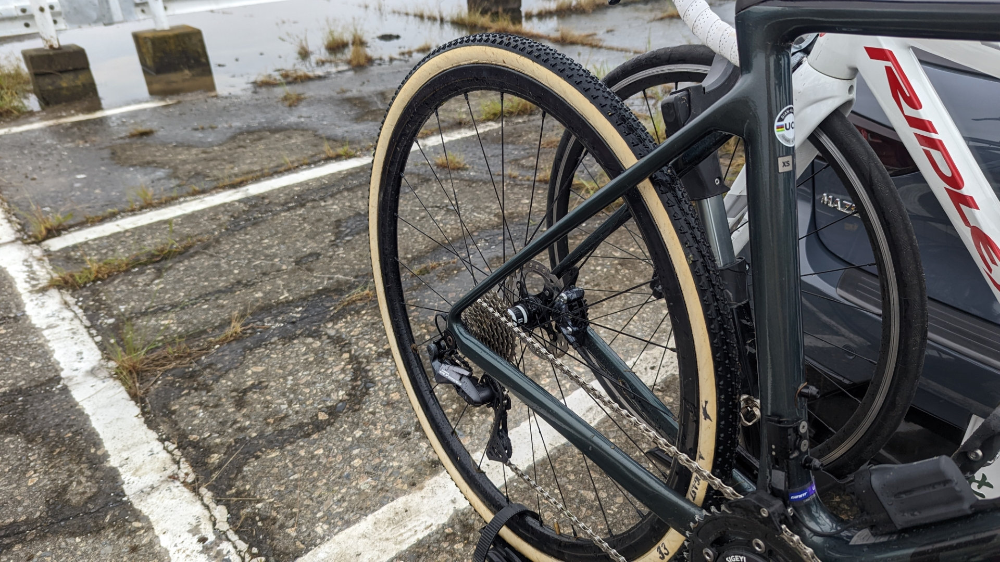

## 「良いけど手間がかかる」というイメージ

シクロクロスにおけるタイヤ選択では、チューブラータイヤが性能的に最も良いものであることに異論はないと思う。

**低圧時の横G耐性・グリップの分かりやすさ・しなやかさと転がりの両立・リム打ちへの耐性**と、シクロクロスに必要な要素を全て備えている。

その市場の小ささ故に、シクロクロス以外ではほぼ目にしないハンドメイドブランドの[デュガス](https://www.a-dugast.com/)が最大手であるが、その信頼は絶大だ。

ハンドメイドゆえの精度の悪さも、オフロードかつチューブラー方式ということもあってデメリットが小さい。

一方で、シクロクロスにおけるチューブラータイヤは、防水性や剥がれやすさ対策のために、一定の手間がかかるというのが一般的なイメージだ。

### シクロクロスタイヤも簡単に運用したい

自分は、シクロクロスタイヤをチューブラーにすると決めてから、**「簡単かつ安定してチューブラータイヤを運用する」**というテーマで機材運用をしている。

昨年までは、2019年に書いた以下の記事の通り、[Effeto Mariposa Cargona](https://amzn.to/2u8o89K)テープに加えて[シリコンコーキング材](https://amzn.to/3T71FmQ)でシーリングをするという手段を取っている。

<LinkBox url="https://blog.gensobunya.net/post/2019/01/tublar_ope/" />

数年運用してみて、「もっと簡易な方式にできるのでは？」という疑問がわいたので、2022年から方法を変えてみたいと思う。

## 利用実績と仮説

今年は、**タイヤサイド及びリムとの隙間をコーキングで塞ぐことを省いた**。

古いタイヤを剥がした際に、コーキングが剥がれている部分でも、**サイドからの浸水によるリムテープの劣化がほぼなく**水分による劣化・汚れは主にバルブホール内側周辺に集中していた。

バルブホール周辺も粘着力が落ちているわけではなかったので、**「[Cargonaテープ](https://amzn.to/2u8o89K)の防水性をもっと信頼してもよいのでは？」**という仮説が生まれた。

元々の記事でも_「ウェットコンディション時に接着剤が膨らんだり溶けたりしないように開発されている」_とあったのだが、完全には信用していなかった。

<LinkBox url="https://www.cyclowired.jp/lifenews/node/191669" />

今年からは、この言葉を完全に信用していく。

また、サイドに関してはデュガスタイヤにはもともとサイドに防水加工がされているモデルを使用しており、ケーシング自体への防御力はある程度確保されている。

防水層が2レイヤーから1レイヤーになることの影響を確認していくシーズンだ。

## 早速の泥レース

幸か不幸か、今年一発目の土浦JCXはあいにくの泥レース。

試走しては高圧洗浄、レースが終わったら高圧洗浄というタイヤにとってのハードコンディションだ。

<LinkBox url="https://blog.gensobunya.net/post/2022/10/2022_ibarakicx_2/" />

今のところ、タイヤの接着がゆるくなったという感覚はなく、問題なく利用できている。

また、サイドについてもデュガスのコーティングが落ちているということはなく、反対に**コーキング材のように泥粒子がこびりついて落ちないということもなくなった**のでレース後のタイヤが実に綺麗だ。

タイヤはどんなに長くても2シーズンで交換することにしているので、それまで持ってくれれば御の字だ。

泥レースや高圧洗車の回数にもよるが、剥がれるまでレポートを続けていく