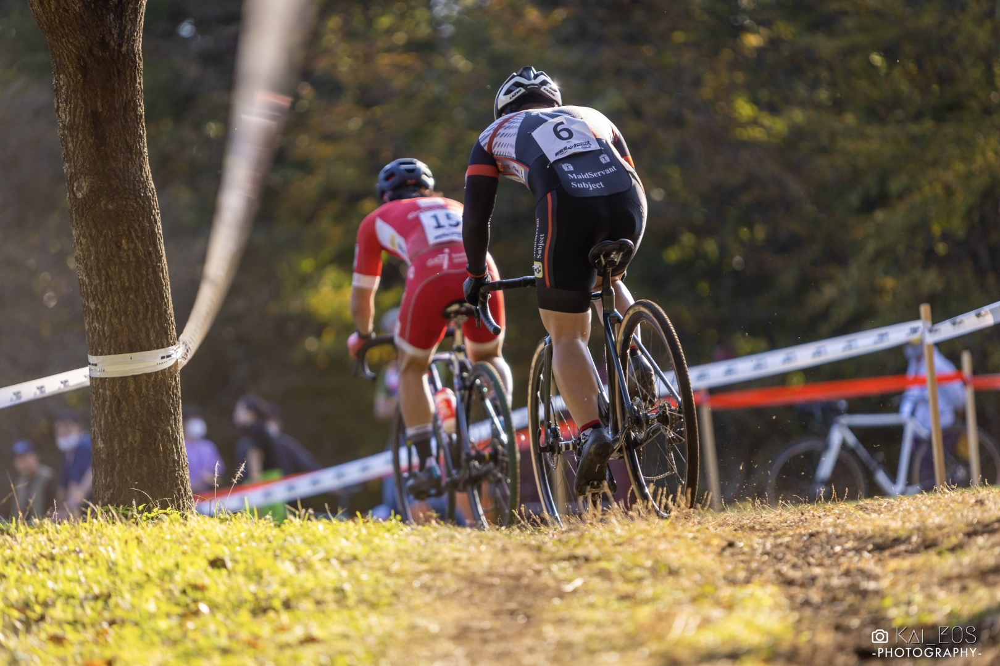
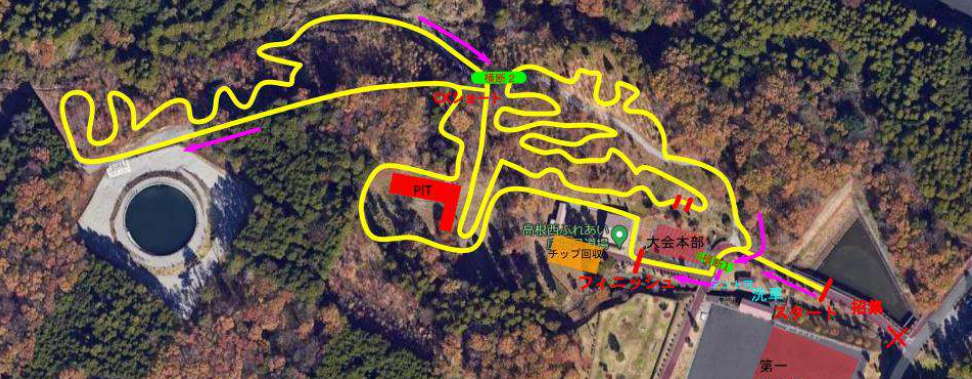

## Summary

Photo by [海](https://twitter.com/Kai_Eos)

スタートが上手くいき、久しぶりの1時間レースとなったが終盤粘ったことでフルラップとシングルリザルトをゲット。

## リザルト

9/15位（+5:37)

### 機材

- メインバイク
  - GIANT TCX ADVANCED PRO
  - Farsports CX TU + A.Dugast Smallbird 33mm (F: 1.7bar, R: 1.75Bar)

## コース

御殿場シクロクロスは2022から新設となったレース。

富士山の裾野エリアである火山灰の土質と、なだらかな斜面を活用したコースになっている。

コースマップ左上に向けて登り斜面になっているコースは、長い緩やかなレースを決める登りと、如何にタイムを失わないかが鍵となる曲がりくねった下り（と時々激下りと火山灰質の砂）で構成されている。

ジャンプアップを狙うのならば登りが、ペースを刻むならノーミスとメリハリが重要になるコース。

登りを重視して空気圧は高めの1.7Barとした。

## レース

エントリー数が15人と少なく、埋もれる心配はないがスタートすぐにS字コーナーの登りなので、詰まったら踏み出しにパワーを使うことは間違いないので、1列目から積極的に前を取りに行った。

登りでは当然地脚の差が出るので、すんなりパスしてもらって得意な下りと砂セクションを活用して追いかける。

砂場とシケインが下った後に出てくる点と、ラインを外すとタイムロスの大きいコーナーが多かったので、最高地点を過ぎた後もバイクコントロールに集中せざるを得ない良いコースだ。

40分ほど淡々と7位で踏み続けたが、そろそろ脚が……

昨シーズン1度もフルラップしていない身には、1時間踏みっぱなしでレースペースは厳しかった。全体的な出力は落としつつも、要所の登り返しや急坂をダンシングで踏み切って登坂リズムを崩さないように工夫し、タイムロスを最小限に抑えていく。

2名に抜かれ9位となったが、先頭も来ないし前後のライダーも遠く離れた。ノーミスで淡々と周回を重ねろと言い聞かせ、荒れているところで腰を浮かせ、ラインを丁寧に取り、踏まないと大きなタイムロスになる場所だけ気合を振り絞った。

2年ぶりのフルラップ完走。

今週は野辺山グラベルチャレンジがあり、高所で距離を乗るチャンスがあるので、幕張までにもう1段階コンディションを上げたいところ。
