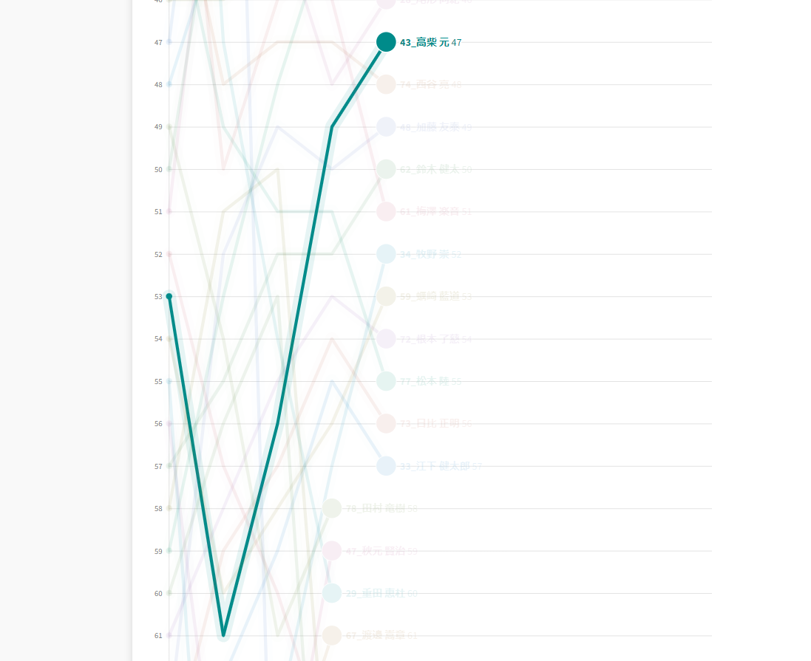

## Summary

準備不足もあり、スタートで失敗したものの、技術で定位置くらいまでは戻すことができた。

目標を見失っているので、モチベーションを保つ方法が必要か…？

## リザルト

47/73位（-6 lap)

### 機材

- メインバイク
  - GIANT TCX ADVANCED PRO
  - Farsports CX TU + A.Dugast Smallbird 33mm (F: ???bar, R: ???Bar)

## 失われた目標

今年は、[全日本選手権の参加資格に変更](https://jcf.or.jp/%e5%85%a8%e6%97%a5%e6%9c%ac%e9%81%b8%e6%89%8b%e6%a8%a9%e8%87%aa%e8%bb%a2%e8%bb%8a%e7%ab%b6%e6%8a%80%e5%a4%a7%e4%bc%9a%e3%82%b7%e3%82%af%e3%83%ad%e3%82%af%e3%83%ad%e3%82%b9-%e5%8f%82%e5%8a%a0-2/?category=cyclocross)があり、これまでのリザルトではとてもではないが男子エリートへの参加資格は取れないものとなってしまった。

これまで、全日本選手権参戦を目標にJCXシリーズを転戦していた身にとっては、この変更は今年の目標の喪失を意味しており、一通り体の準備はしたものの、どうにも気合が入らないままの参戦となった。

参加資格の変更に関する諸々のプロセスに物申したいことは多々あるが、直接JCFに送信したので割愛する。

## レース

ゼッケン43番で6列目からのスタート。機材でも???となっているように、タイヤの空気圧は試走でいい感じにしたのみ、特に定量的な計測はしていないという気の入らなさであった。

スタートスプリントもこれに漏れず、試走でコースをなんとなく見ただけでスタートループ後最初に詰まるコーナーを左右勘違いしており、前走者の出遅れと合わせて後ろに埋もれてしまった。

とはいえ、昨年もっと上の集団で走っていたこともあり、泥区間やキャンバー区間をうまく使って徐々に順位を上げる……が、シクロクロス慣れしておらず何度かスリップダウンをしてしまい、序盤は抜いてはコケを繰り返した。

高速で泥の轍にタイヤを通すことだけは上手くいっていたので、かなりの速度差を付けて抜きにかかったところに横でよろめいた人に当たって吹き飛んだのは中々辛かった。

それでも、（自分がレース中の）後半では関西シクロクロスで有名な泥棒さんとのマッチアップを経て集中力が戻ってきたこともあり、ガッツリ順位を上げてゼッケンとほぼおなじ順位の集団でフィニッシュでまとめることはできた。

改めてGARMINのログを見てみると、心拍や疲労に比べて踏めている（いわゆる「調子」）を示すパフォーマンスコンディションは後半にかけて向上していた。

脚を節約できていると見るべきか、序盤バタバタしていると見るべきか、ウォーミングアップが足りないと見るべきか……データの見方はいくつかあるものの、足切りが無ければもっと上の順位まで行けたであろう感覚がある。

スタートで失った分を取り戻したはいいが、この日は先頭も速くコースが短いことも分かっていたはずなので、頭を整理せずにレースに入ってしまったことが最大の反省。

次戦は御殿場CX。初コースになり、60分走り切れるのでしっかりと感覚をシクロクロスに戻していきたい。
