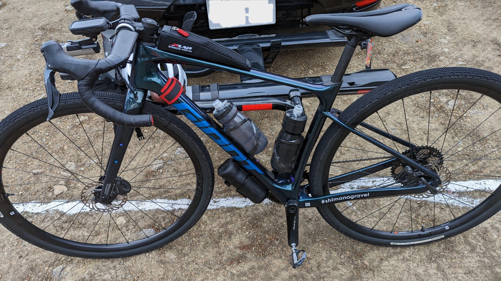

ニセコグラベルでグラベルライドの楽しさを知ってしまい、北海道に心を囚われてしまった

スーパーやコンビニの北海道フェアや、北海道物産店のポップアップストアに目を取られ、ガラナやカツゲンを探す日々。

こんなことではいけない。グラベルロードをもっと使い倒すために、本州最大級のグラベルイベントである野辺山グラベルチャレンジに参戦を決めた。

## 野辺山グラベルチャレンジとは

野辺山グラベルチャレンジは2019年に初開催（当時はシクロクロスとの併催）されたが、コロナ禍により今年2022年にようやく第二回が開催されることとなった。

今年は独立かつ2daysでの開催となり、ロングコースなら1日目に75km, 2日目に45kmを走る。

また、レースカテゴリも用意されており、コース途中の登りセクションのいくつかで登りのタイムトライアルが行われる。**登りがリエゾンで下りで計測するMTBのエンデューロレースとは逆の趣**だ。

しかし、**競わずとも楽しいのがグラベルライド**。ニセコグラベル時のチームから大阪在住の[すくみずさん](https://twitter.com/skmzmw)を除き、[さきぷさん](https://twitter.com/sakimopuro)と二人でのんびりツーリングカテゴリで走ることにした。
なお二人とも家庭の事情で参加は1日目のみだ **（重要）**

1日目は75kmで**1900m UP**というコース。

中々の登りだ…しかしニセコと違い終盤の舗装路は登りが優しいし、会場である滝沢牧場の周辺は比較的平坦だ。

脚への負担は大きいが、景色や下りの快感も大きいものと期待していた。

## 装備

ニセコグラベルでの反省を活かしつつ、今年初の寒中ライドということでウェアリングには気を使う。

<LinkBox url="https://blog.gensobunya.net/post/2022/09/nisekogravel22_3/" />

### バイク

ニセコグラベルでギア比が高すぎた反省を活かし、今回は**フロントを44Tに交換**した。

登りに関しては淡々と回していれば終わるという気持ちでやっていく。

タイヤは前後ともニセコグラベルと同じ[グラベルキングSK 43c](https://amzn.to/3U2z4ji)。

<LinkBox url="https://www.amazon.co.jp/dp/B07D6WP95G/" isAmazonLink />

### ウェア

問題は気温。**会場の野辺山は当日最低気温2度、最高気温も11度と海辺で生活している関東民には堪える寒さ**だ。当然、今年最も寒いライドになる上に気温差も大きいので、これに対応するレイヤリングが必要になる。斜度の高いグラベルではかなり暑くなることも予想される。

考え抜いた結果、サンボルトの[サーモスーツ](https://store.shopping.yahoo.co.jp/sunvolt-store/sy-983-bordeaux.html)にインナーは[ドライナミック系のサマーメッシュ](https://amzn.to/3pqy0W5)、防風にジレを1枚着てレッグカバーはニセコと同じ夏用というチョイスに落ち着いた。

このレイヤリングは大正解で、朝に少し体を動かした以降は不快感なく過ごすことができた。

<LinkBox url="https://blog.gensobunya.net/post/2021/02/sunvolt_wintersuit/" />

## ライド

### 荒れた、路面

軽く舗装路を下って細い山道を登り、この日最も長いグラベルダウンヒルが始まる。

談笑しながらゆっくり下る予想をしていたのだが、どうにも様子が違った。

**路面が激しく荒く、こぶし大とまではいかなくとも鋭く大きい砂利**に加えて、**水の流れた跡がひっきりなしに現れる**。また、人工の水切り溝もグラベルバイクには大敵だ。セクションによっては数百メートル毎に現れ高速でのプッシュプルを強いられる。

そう、本州の未舗装林道はこれがスタンダード。王滝の路面を少し優しくしたような下りが延々と続く。

周りを見るとそこかしこでパンクしたライダーが修理作業を行っている。

43cブロックタイヤを履かせていた自分は、かなりスピードを上げられたものの、30c台前半で参加している人はおっかなびっくりというスピードだ。溝にタイヤを取られたら前転は免れない。

MTBを先に行かせつつ、リムブレーキバイクで参戦している同チームのさきぷさんを待ったりしながら進んでいく。

グラベルのフィニッシュ地点近くは直線で、立哨の方が遠くに見えるなか、しがみついていたブレーキの握力を緩めながらノートラブルに感謝……した瞬間に前タイヤから「ブスッ」という音とシーラントの飛び散る音が響いた。パンクーーーーー

噴出は止まっているものの、走行可能なレベルまで空気圧を上げる途中で再度シーラントが吹き出す始末。タイヤを確認すると大きな突き刺し跡がど真ん中にあったので観念してチューブを入れ再出発する。

シーラントがバイクにたっぷり付着し、洗車が面倒だなぁなどと考える余裕がまだあった。

### 準備不足

第2のグラベルセクションまでは舗装路のアップダウンが続く。

ふと気がつくと、RDが動作したりしなかったり…ジャンクションのインジケーターは無情にも赤く点灯している。

そう、**Di2のバッテリー切れ**だ。普段秋口に長くロードに乗ることはなかったので、すっかり充電を忘れていた。お祈りしながら、なるべくロー側になるよう変速をしたところ、最後の電力を振り絞って32Tまではシフトダウンすることができた。

ここから先（ほとんどの昇り）を44T-32Tでこなすことになる。

## ひたすらアップダウン

第2セクションのグラベルも基本は下り。

ただし、グラベルとは思えない下り斜度で、**荷重移動でサドルが腹の前に来る**シチュエーションもあった。荒れかたは第一セクションほどではないが、気をつけないと前転やパンクするだろう。

**上ハンドルでのんびりと下ることはほぼなく、フレアした下ハンドルにしがみつきながら**バイクをコントロールしていく。

ミニVに38cタイヤで参戦していたさきぷさんは、「止まれない」と言いながら下っており、空気圧も高めだったことも相まって上半身にかなりのダメージを受けていた。

リエゾン区間とも言える舗装路において、固定ギアの都合上スピードが上がらなかったおかげか、中後半の登りグラベルで脚に余裕があったのは幸い。

コースも半分を過ぎたあたりから、ようやく雄大な景色を認識できるコースが始まった。

残り何kmと考え始めたあたりから、ようやくグラベルでも滑らかな路面も出てきて安心するが、水切りの脅威は常にあるので油断は禁物。

最後の計測セクション後はガツンとした上りこそないものの、バイクコントロールとグラベルクライムで消耗した体に堪えるアップダウン。

フレアハンドルを大きく使ってトルクを稼ぐとシングルでも効率よく登れることがわかったが、上半身を消耗する。後半は体を振る余力がない。

最後に爽快な、比較的なめらかな直線下り…と見せかけて、最後の最後に水の流れた溝が現れ焦った。

ラストの舗装路は優しく、のんびりと牧場にゴールしたのが14:30頃。5h30mnのライドだった。

### 計測セクション

我々とは無関係だったが、レースカテゴリではグラベルのヒルクライム区間でセンサーを用いたタイムトライアルを行っていて、その合計タイムの短さを競っている。

エイドステーションはTT区間の終わりに設けられており（この日は2か所）、水とバナナ、そして前田製菓の[Way to Go](https://amzn.to/3NjUOEo)が配られていた。

レースをしないと心に決めてはいたものの、ギア比を固定されてしまった身で気持ちよく登ろうとするとそれなりの負荷になってしまっていたので、この補給は体に染みわたる。

## まとめ

帰ってしまい聞いていなかったが、中間パーティーで**「1日目は量、2日目は質」**というコース設計が話されていたらしく、Epicなライドをするには2日目だけに参加するのが今年の正解だったようだ。

ニセコのような極上感を求めて1日目だけを走るのは、いわば砂漠に突っ込んでコーラを求めるような行為……

とはいえ、**本州のグラベルは上り下りも斜度が高く、車通りも少なく路面が締まり切っていない**というコースが多いというのは共通かと思われる。逆に言えばそれから上方向にコンディションがブレることで極上グラベルとなる。

来年は我々のような犠牲者を出さないため、コースマップも重要だがコースプロフィールの考え方も事前公開してもらいたいところだ（本当にお願いします）

<LinkBox url="https://www.amazon.co.jp/dp/B07D6WP95G/" isAmazonLink />
