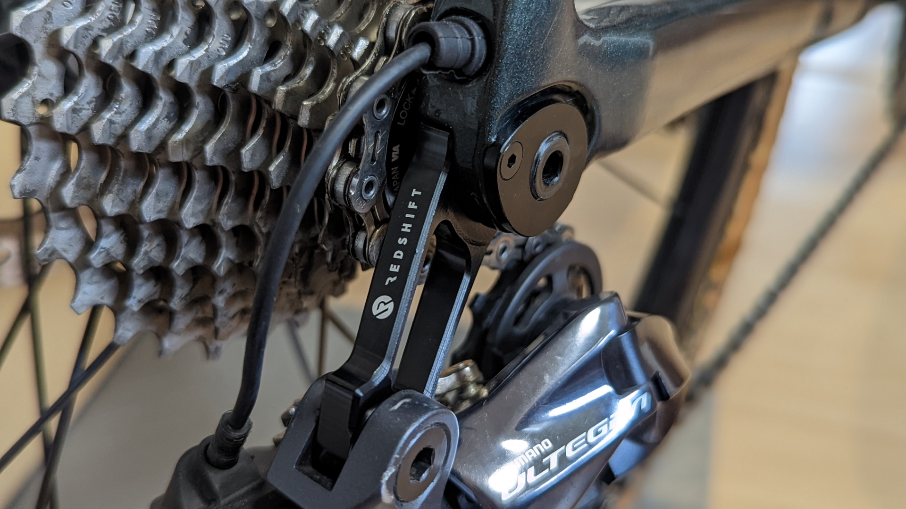
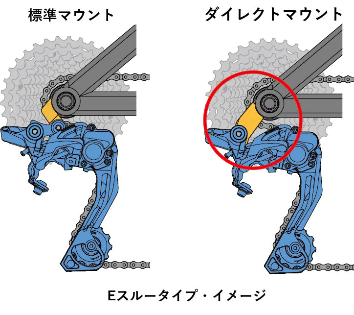
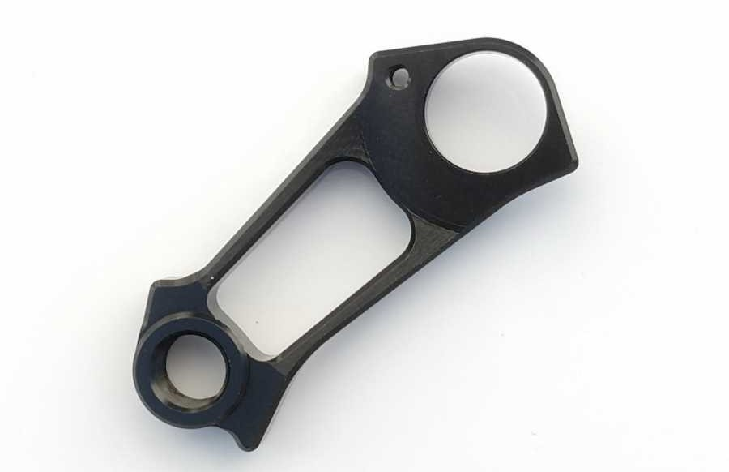
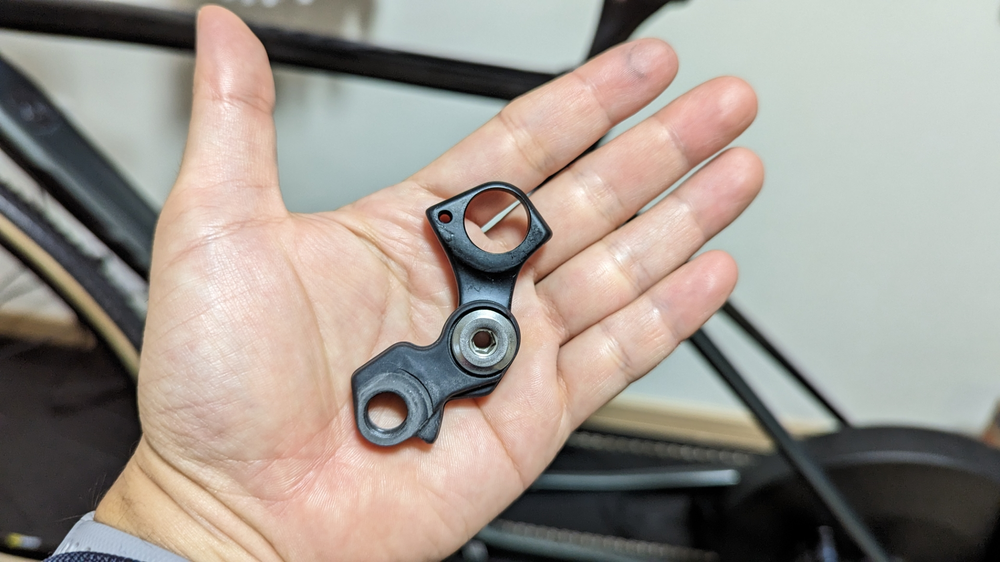

ディレイラーハンガーを1個曲げてしまったので、予備として調達がてらダイレクトマウントタイプのディレイラーハンガーを購入した。

メーカーによっては純正ハンガーより安く調達できる可能性がある上に、半信半疑だったメリットを体感してみたかった……利点があるから導入したというよりも興味が湧いたから買ってみたという流れだ。

幸いにも**現行TCXのリアエンドは現行TCRと互換性がある**。複数年式・複数モデルでリアエンドの形を使いまわしてくれるGIANT方式は色々なところでメリットが大きい。

## ダイレクトマウントハンガーとは

フレームとリアディレイラーを直結させるタイプのリアディレイラーハンガーを指す。

標準マウント（RDの付属品）は可動部分だが、**ダイレクトマウントハンガーは稼働せず、そのぶん後ろ側にオフセットされた形状と**なっている。

ホイールを装着するときに挿入する側が大きく開く上に、マウントが可動しない分確実に装着することができるので、**ホイールの取り外しが容易になる**とされている。

同一箇所を比較するとこうなる。

RDのパーツの一部とフレーム付属のリアエンド部が、ダイレクトマウントハンガーと等価の部分となる。

## 入手元

[PayPayフリマ](https://paypayfleamarket.yahoo.co.jp/)やメルカリで怪しいセラーが販売しているものを購入した。

販売価格は2000円ほどだが、[PayPayフリマ](https://paypayfleamarket.yahoo.co.jp/)の初回購入クーポンを使って1000円ほどで入手できた。

<LinkBox url="https://paypayfleamarket.yahoo.co.jp/item/q1061589932" />

怪しいといっても、メーカーはサスペンションステムで有名な[Redshift](https://redshiftsports.com/)だ。**少なくともロゴだけは。**

<LinkBox url="https://redshiftsports.com/" />

ロゴは一緒なのだが、公式サイトにラインナップはない…謎のパーツである。パクリブランドの可能性もかなり高い。

なお、Aliexpressでも[Mixed](https://s.click.aliexpress.com/e/_DltmppD)や[CaneCreek](https://www.aliexpress.com/item/1005003542653228.html)というブランド名で売っているが、中身は同じだしなんならRedshiftのロゴのまま届くらしい。

## 所感

ダイレクトマウントハンガーで謳われるメリットは、「ホイールの脱着が楽になること」「剛性向上による変速精度の向上」の2点。

ホイールの脱着が楽になるという点については、**気のせいかもしれないが、少し楽になったように感じる。**

ホイールよりも、**固定ローラーへのセットは明らかに簡単になった**。ローラーはホイールと違い、一切動かない上に、ディレイラー側も可動部が減っているので、無駄な動きが無くスルーアクスル部分に導かれるのだろう。

変速精度向上については、一切体感できなかった。

剛性向上すれば、変速精度も上がるという点はその通りなのかもしれないが、オフロードを走っており尚且つDi2ということでは、余り体感できる変化が無かった。

**特筆すべきは実質1000円～2000円で入手できる**という点だろうか。同等品と思われる[SIGEYIのダイレクトマウントハンガー](https://store.shopping.yahoo.co.jp/aris-c/suz-4589887630259.html)は5000円から6000円ほどだ。

**GIANTの純正ハンガーが1200円ほど**で手に入ることを考えると、わざわざ高いうえに効果がそこまで高くないものは買わないだろう……出所も怪しい。

在庫潤沢・即発送で入手できるリアディレイラーハンガーと考えて使うのがよさそうだ。
