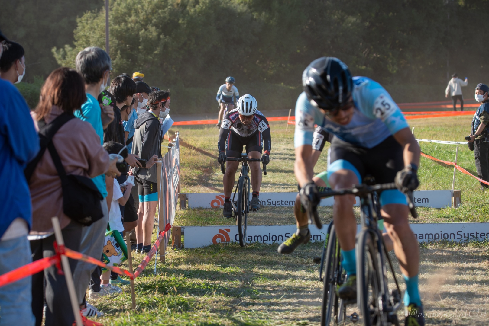

## Summary

- バリアを全周回乗車クリアできた（9割ステアケース）
- モチベーション高くレースを終えられた
- でもゼッケンより後ろでゴール

## リザルト

40/70位（-4 lap)

### 機材

- メインバイク
  - GIANT TCX ADVANCED PRO
  - Farsports CX TU + A.Dugast Smallbird 33mm (F: 1.7bar, R: 1.75Bar)

## 試走レビュー

コースが大きく変更され、西側（マリンスタジアム側）の盛り土が無くなった影響かタイトコーナーが多く追加された。

芝は相変わらず深く、忍者返しは乗りづらい角度にされスピードの高いところと低いところの差が大きくなった。

また、シケインの場所と高さが大きく変わり、メインの芝生エリアに設置されて高く低くなった上に、高速でシケインに突っ込んでその後は緩い登りと軽い逆キャンバー、というレイアウト。乗って行けるとかなりのアドバンテージを取れる。

今年初ではあったものの、試走でも問題なく乗ったまま行ける低さであったことを確認したのでレースも全周回乗っていくと決めた。

## プレワークアウトサプリで気合一発

今回、レース前にマイプロテインで購入した[プレワークアウトゼリー](https://px.a8.net/svt/ejp?a8mat=3N3PXV+GF7GHE+45DI+BW0YB&a8ejpredirect=https%3A%2F%2Fwww.myprotein.jp%2Fsports-nutrition%2Fpre-workout-gel-12-pack%2F10798884.html)を投入してみた。

<LinkBox url="https://www.myprotein.jp/sports-nutrition/pre-workout-gel-12-pack/10798884.html" linkurl="https://px.a8.net/svt/ejp?a8mat=3N3PXV+GF7GHE+45DI+BW0YB&a8ejpredirect=https%3A%2F%2Fwww.myprotein.jp%2Fsports-nutrition%2Fpre-workout-gel-12-pack%2F10798884.html" />

**1本あたりカフェイン221mg**という実にモンエナ600ml分のカフェイン含有量を誇るこのサプリ。

飲んでしばらくしたら肌がピリピリして、勝手に心拍が上がり落ち着かなくなってきた。気分はジャックハンマー。

## レース

スタートループ直後のコーナーが全て狭いので、一瞬で集団が引き延ばされる（予想通り）

忍者返しも70人いるME1ではまともに乗れない。縦方向の動きが激しくなるエリアでは冷静に前の詰まり具合を見て降車していき、ミスをなるべく少なくするのが幕張のコツ。

周辺のメンツに比べ、走り込みが足りず芝生で離されるものの、シケインで降車しないことによって脚と心拍を節約し、テクニカルエリアでくらいついていく。ミスした人を一人づつパスする。

今年のコースは、タイトコーナーが多くなった分（自分のレベルだと）息が整ってしまうペースに収斂することが多く、例年の「ずっと速い」という印象とは異なった。

ピットからの掛け声でそろそろ終わりであると分かった次の80%カットエリアで、自分のすぐ後ろで80%がコール。1周限りのランタンルージュの栄誉を得、最後だけクリアにシケインを跳んで、終了した。

<blockquote class="twitter-tweet">
ﾌﾝｽ <a href="https://t.co/jQQFbZcGfQ">pic.twitter.com/jQQFbZcGfQ</a>
&mdash; ゲン (@gen_sobunya) <a href="https://twitter.com/gen_sobunya/status/1589379468925493248?ref_src=twsrc%5Etfw">November 6, 2022</a></blockquote> 

## 役立った装備

駐車場が遠いので、[アウトドアワゴン](https://amzn.to/3WODID8)に[すのこ](https://amzn.to/3FipbXB)と着替え用の[ポップアップテント](https://amzn.to/3isxA0Q)を陣地にセッティング。今年も役立った。

<LinkBox url="https://www.amazon.co.jp/gp/product/B08P729HZ4/" isAmazonLink />

<LinkBox url="https://www.amazon.co.jp/gp/product/B017LI8HD0/" isAmazonLink />

## Photo

Cover photo by [@CB_178](https://twitter.com/CB_178)
