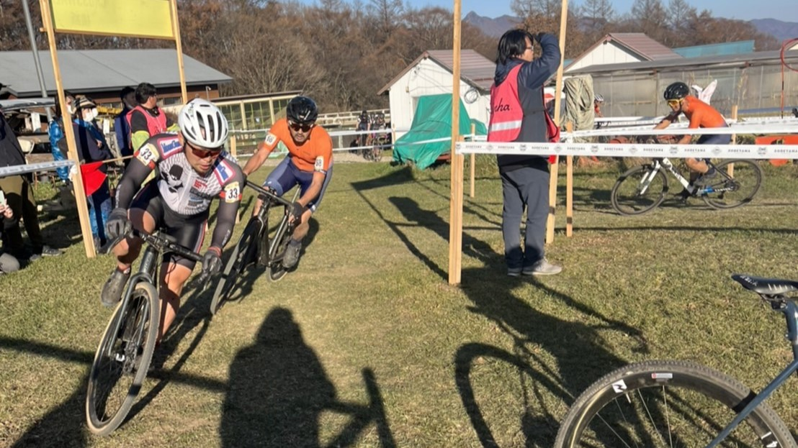

## Summary

- まさかの80%ルール適用無し
- ストレングスの重要性

## リザルト

50/70位（-1 lap)

### 機材

- メインバイク
  - GIANT TCX ADVANCED PRO
  - Farsports CX TU + A.Dugast Smallbird 33mm (F: 1.6bar, R: 1.65Bar)

## 試走レビュー

いつもの野辺山…ではあるものの、非常に乾燥したコンディション故に様々なところがスリッピー。

泥区間も完全に乾いておりおっかなびっくり曲がるというコーナーが多い。

ロングコース名物のキャニオンは更に広くなっており自転車が1台すっぽりと嵌まる広さになっており、今年はスキル練不足もあって乗車クリアは不可能だった。

## レース

JCXレースということで、今日のレースは30分か40分か…という会話を周辺としていたところ **「今日は80%ルール適用無し」という噂が流れてくる。**

しかし、公式アナウンスは何もない…

しかし周りを見渡すと、**いつもの80%宣告用に用意されているテントが降ろされたまま稼働している気配がない**。どうやら本当に1時間レースになるようだ…**野辺山の1時間フルレース、人生初では？**

何も分からないが、野辺山は切られる時でも体は常にボロボロなので、落ち着いてスタートしてあとからガンガン上げていくスタイルで1時間使い切ることに脳内閣議決定。

そして特に80%ルールに対する告知は無いままレーススタート。

ME1らしくない1コーナーでのガチャつきを後ろからクリアしていき、登りでごぼう抜きにされつつも下りからテクニカル区間にかけて車列に混じってのんびり下り隙あらばポジションを1つづつ上げていく。

焦っているのか何なのか分からないが、コーナーで吹っ飛んでいく人がかなり多いのでそれなりにポジションを上げるが、**予想以上に登りで踏めず**全体として中々順位が上がっていかない。バギーコースで1回ミスしてしまいポジションを下げたのも痛かった。

**パワーを上げようとしても腰や腹筋がそれに耐えきれる予感が無く、筋トレをサボっていたことを心の底から後悔する**時間が始まった。脚も心肺も行けそうなのに踏めないというのはもどかしい。

聖や光さんが後ろから迫ってくるので、紳士的にパスしながら周回を重ね、最後の1周だけフルパワーで踏んで2つ順位を上げてゴールしたら体がバラバラになりそうだった。
