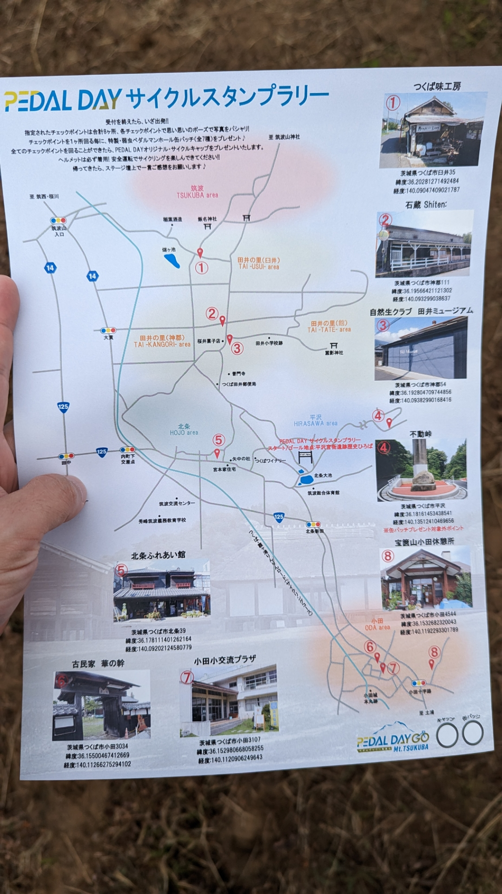

めずらしく、レースイベントではないサイクルイベントに脚を運んでみた。

つくば市で開催されている[Pedal Day Go](https://pedaldaygo.com/)、目当てはスタンプラリーでもらえる弱虫ペダルグッズとサイクルキャップだ。

<LinkBox url="https://pedaldaygo.com/" />

つくば市といえば、弱虫ペダルサイクリングチームの本拠地がある。もちろん今回のイベントも共催だ。

例によって渡辺先生がライドイベントを1日に三回行い、合間にトークショーにサイン会もやっていた。週刊連載を抱えながらこの働き、本当に頭が下がる。

## スタンプラリー

会場である[平沢官衙遺跡歴史ひろば](https://maps.google.com/maps?ll=36.177621,140.103835&z=13&t=m&hl=ja-JP&gl=US&mapclient=embed&q=%E5%B9%B3%E6%B2%A2%E5%AE%98%E8%A1%99%E9%81%BA%E8%B7%A1)の周辺、つくばりんりんロード沿いのスポットを8か所回るスタンプラリー。

7か所はスタンプをもらうことで弱虫ペダルの缶バッジが、1か所チャレンジスポット **（不動峠山頂）** を含めて回るとチャンピオンシステム製のサイクルキャップが手に入る。

そしてチェックポイントは当日まで発表されないシステムだ。

朝9時から受付開始なのだが、台紙は先着順で配布。関東圏の弱虫ペダル関連イベントの熱を知っている人は、これの意味するところが分かると思う。

野辺山・土浦・幕張・王滝…渡辺先生関連の情熱を知っているので速めの動き出しで問題なく待ち時間を最小化できたが、朝の受付には長蛇の列ができていた。

### チャレンジスポット不動峠

このスタンプラリー最大の壁は、**難所**とされている不動峠。

この日は25度近くまで気温が上がる、11月とは思えない快晴で暖かい日だったうえ、同行者の体力も心肺なので**最初に不動峠を回ってつくばりんりんロードを使って周回を作るコースを作成。**

不動峠は3.8kmで平均勾配7%の**そこまで難易度の高くない**峠。とはいえ、中盤と終盤に10%オーバーの斜度が待ち構えており、序盤の緩さも相まって　**「追い込むといくらでも辛くできる」**タイプの峠。

何より、このイベントの主な参加層である、体力の充実していないサイクリストには中々パンチのある設定だ。

Twitterで感想を覗くと、**脚をついたとか諦めたとか、リアルな一般サイクリストの世界が垣間見える。**

### 併催秋祭り

この日は[Pedal Day Go](https://pedaldaygo.com/)以外にも[筑波麓秋祭り](https://aki-fes29836.com/fes2022/)の期間に被っており、そこかしこでフルーツや甘味を楽しむことができる環境だった。

スタンプラリーも行っていたので、二つを1日でコンプリートすることも可能だ。

## 会場グルメ

自転車関連メーカーはいつも通りなので、目に新しいのはつくば周辺のグルメ。

神奈川県民は東京より北に行くことがあまりないので、こういう機会に楽しんでおきたい。レースでは、走り終わるとフードワゴンが閉店していることが多い。

名物のフードワゴンはもちろん、近隣のカフェやレストランがブースを出している。昼食に牛丼を頂き、その後近隣の[古民家カフェ・ポステン](https://www.cafe-posten.com/)へ。

ポステンは会場にもブースを出していたせいか、店舗は人手不足感があったものの美味しいケーキとコーヒーを頂くことができた。

## 終わってみて

こうしてみると、**ボリューム抑え目に感じたスタンプラリーも、午前中に終わってしまえば会場と周辺でお金を落とすことになる**し、良く設計されたイベントだった。

昼ごはんとカフェに加えて、スタンプラリー中もそこらへんで売っていたみたらし団子を頂いたので完全にカロリーオーバーであることには目をつむろう。
