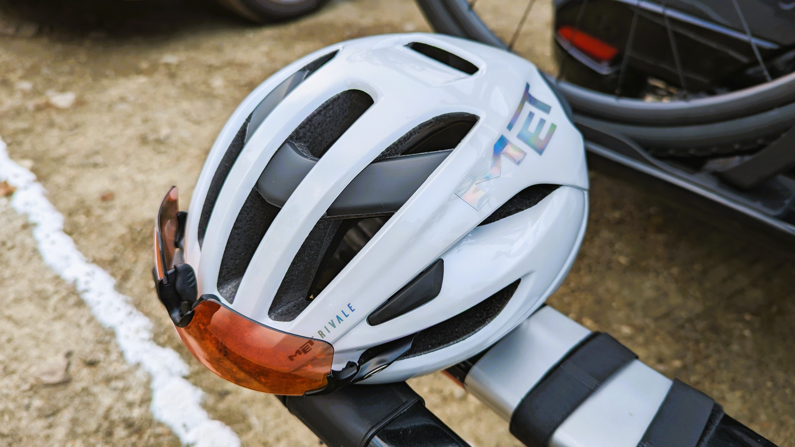
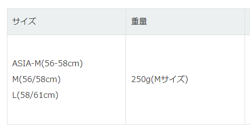
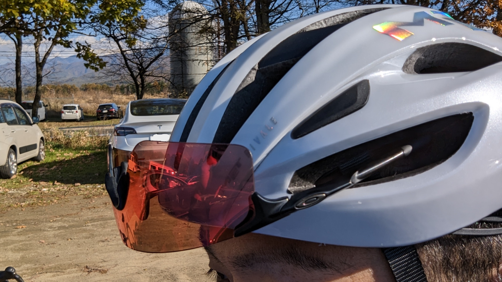

## ヘルメットの交換時期

[自転車用のヘルメット寿命は約3年](https://www.ogkkabuto.co.jp/hg/ind.html#8)と言われている。

この数値自体の信憑性について、検証されているのを見たことはないが樹脂なので紫外線や汗で劣化するのは間違いない。

見た目壊れていないものを捨てるのはなんだか気が引けるが、**ヘルメットは最悪の場合自分の生命や尊厳を守る最後の砦**なので、保険と思って3年ごとに買い換えている。

ここ最近は軽くて涼しく、安かったLAZERの[GENESIS AF](https://amzn.to/3FCWwiz)を愛用していたが上記のマイルールで期限が到来したので交換することとなった。

## MET RIVALE MIPS AF

今回購入したのはMETの[RIVALE MIPS](https://shopping.yahoo.co.jp/search?first=1&tab_ex=commerce&fr=shp-prop&mcr=c0c4c1a6141c29615b7bfd4a3c79e3d5&ts=1667462794&sretry=1&p=Rivale%20mips&sc_i=shp_pc__searchBox&area=14)。

METのヘルメットは、この[RIVALE MIPS](https://shopping.yahoo.co.jp/search?first=1&tab_ex=commerce&fr=shp-prop&mcr=c0c4c1a6141c29615b7bfd4a3c79e3d5&ts=1667462794&sretry=1&p=Rivale%20mips&sc_i=shp_pc__searchBox&area=14)のみアジアンフィットが用意されており、丸型……いわゆるOGK頭でもフィットする。

**MIPS装備でありながら250g**というなかなか優秀な重量だ。

<LinkBox url="https://store.shopping.yahoo.co.jp/qbei/pi-924571.html" linkurl="https://ck.jp.ap.valuecommerce.com/servlet/referral?sid=3171302&pid=887657037&vc_url=https%3A%2F%2Fstore.shopping.yahoo.co.jp%2Fqbei%2Fpi-924571.html" />

### 軽量性 vs MIPS

（上位機構のMIPS AIRを除くと）200g台後半から300g台に届くことも珍しくないMIPSモデルでは優秀な数値のRIVALEだが、流石に軽量フラッグシップであるOGK IZANAGI(S/Mサイズ225g)や以前使っていたLAZERの[GENESIS AF(Mサイズ210g)](https://amzn.to/3FCWwiz)と比較すると流石に重い。

とはいえ、**ヘルメットは頭を守るのが第一義**なので、ダメージを軽減できるに越したことはない。300gを越えてくると流石に導入が躊躇われるが、この程度の重量増で済むのなら保険と割り切って重くなるのはアリだと考えている。

不幸にも大転倒して、なおかつ後腐れなく現世から退場できる身ならいいが、恐らく大抵の場合簡単には死ねないだろうし…

### 機能性

このヘルメットの最も気に入った点は、セミエアロでもクーリング性能でもなくこのサングラスポートの出来の良さ。

ヘルメットをかぶっている場合、**サングラスポートを通じて頭とポートでサングラスをいい具合に保持できる場所に備えられている。**

[GENESIS](https://amzn.to/3FCWwiz)ではサングラスを保持できるものの、保持力に不安があり頭を振るとどんどん落ちてきてしまっていたので、これは明確に加点ポイント。**激しいヒルクライムやちょっとしたオフロードでサングラスを外しても不安が無い。**

### クラッシュリプレイスメント

<LinkBox url="https://www.cyclowired.jp/news/node/380980" />

2022/11/01以降に購入した場合、購入日から2年以内に乗車中の事故で破損した場合、希望小売価格の半額を負担する事で新しいヘルメットと交換できるサービスがスタートしている。

ギャランティシールが本体に貼られている製品が対象のようだ。残念ながら私が買ったのは10月なのでプログラムの対象ではないが…これから買う際は比較メリットたりえるだろう。

代理店が変わったおかげで、色々サービスが改善されていて良い傾向だ。

## まとめ

<PositiveBox>

- 定価でも1万円台という価格
- ワンサイズだがアジアンフィットあり
- MIPS付き
- クラッシュリプレイスメントプログラム

</PositiveBox>

<NegativeBox>

- アジアンフィットのカラー・サイズバリエーションが少ない
- （個人的な範囲では）品薄

</NegativeBox>

様々な自転車関連品が値上げされている中、1万円台でそこそこ軽量なMIPS製品というだけで貴重。

<LinkBox url="https://store.shopping.yahoo.co.jp/qbei/pi-924571.html" linkurl="https://ck.jp.ap.valuecommerce.com/servlet/referral?sid=3171302&pid=887657037&vc_url=https%3A%2F%2Fstore.shopping.yahoo.co.jp%2Fqbei%2Fpi-924571.html" />
