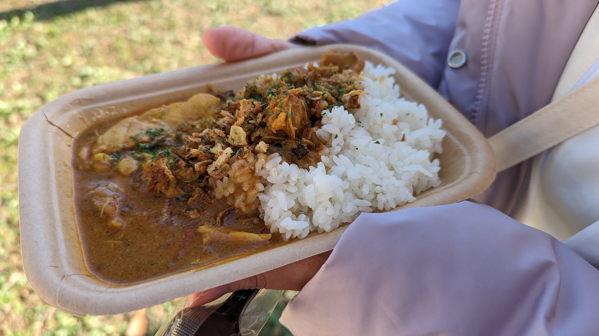
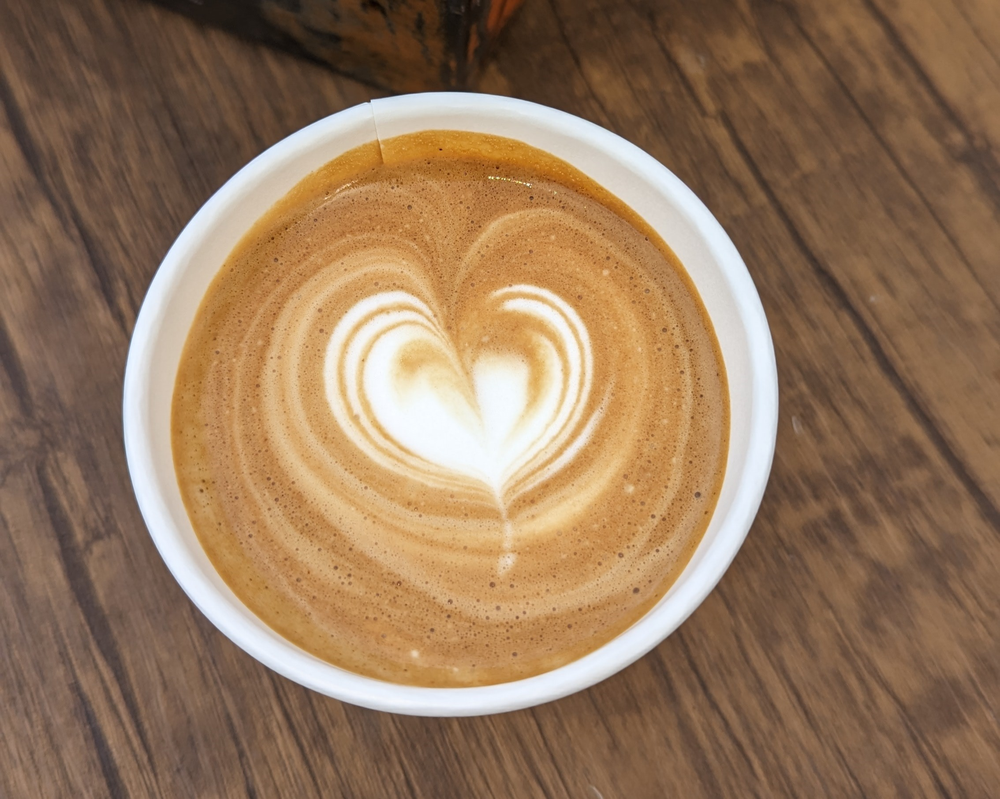
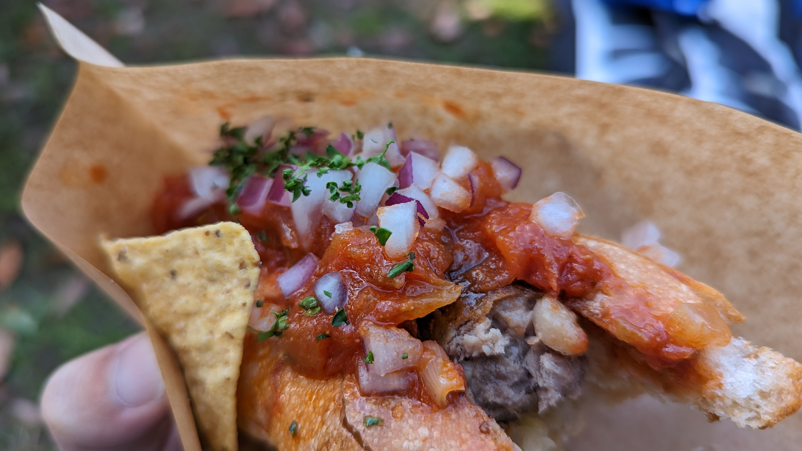
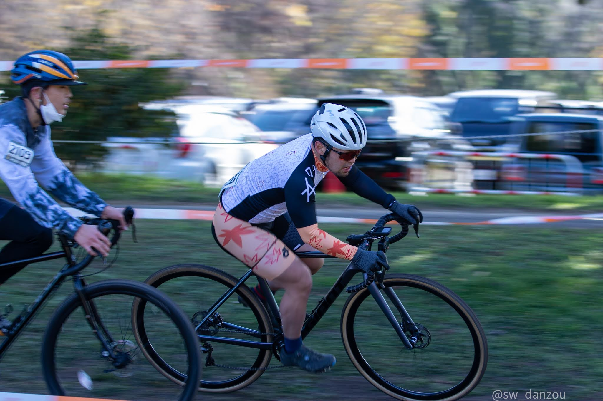
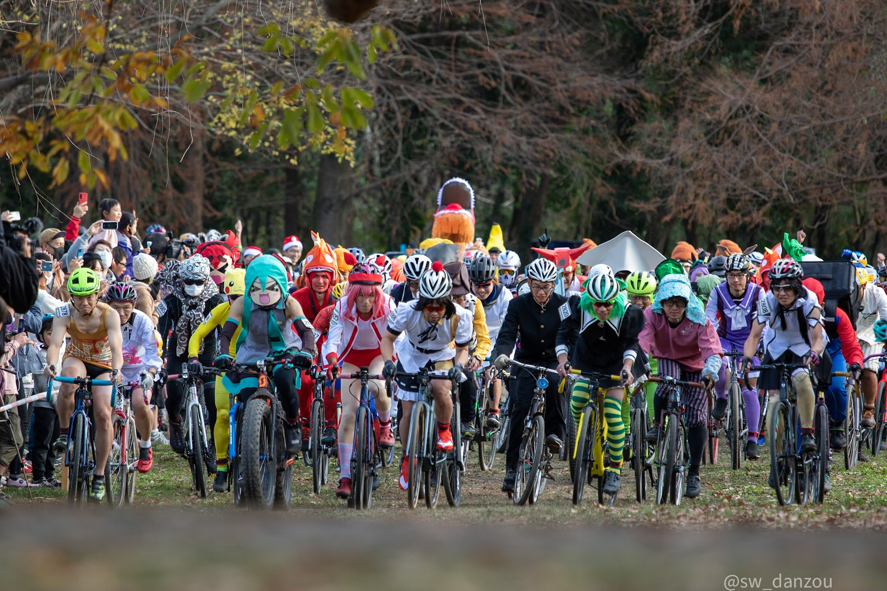
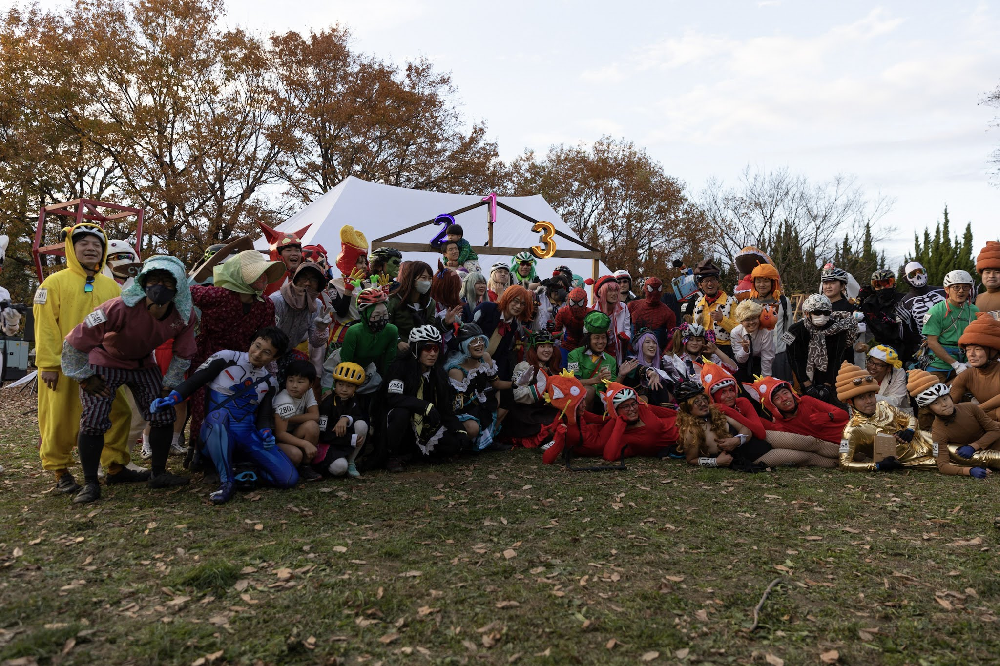

## バイクロアやらないと年が越せない

秋ヶ瀬バイクロア、それは自転車乗りのお祭り…

アウトドアフェスとシクロクロスの間の子のような、買い物と食べ物と自転車レースとボルダリングとキッズの遊び場全てが揃う体育会系イベントと真逆の存在。

みんなで適当に集まってデイキャンプをしながら、知人のレースを煽るのもいいし、自分がレースに出てもいい。飯はうまい（重要）

## 1日目

今年は乗り物に乗らない日を設定…**なぜなら酒を飲みたいから**

電車とバスを乗り継ぎ、11時ごろに会場へ到着。

頭の中はTwitterで皆がこぞって食べていたフリッツとクラフトビールのセットでいっぱい。

<blockquote class="twitter-tweet">
これよ！！！ <a href="https://t.co/lUAWEdfUWD">pic.twitter.com/lUAWEdfUWD</a>
&mdash; ゲン@C101 12/31東3 Z-15b (@gen_sobunya) <a href="https://twitter.com/gen_sobunya/status/1598873640392880129?ref_src=twsrc%5Etfw">December 3, 2022</a></blockquote>

会場到着するなり、挨拶回りもせずCANYON隣のこのフリッツ＋ビールを目指して並び、むしゃむしゃしながら仲間のキャンプ地へ赴く欲望の塊と化していた。

バイクロアはいわゆる**コテコテの商業フードワゴンではなく、地域の店が出展に集まっている**というのが本当に良い。

会場着いてすぐ言ったビール＋フリッツのコンボも、地元ブリュワリーのお店だ。

ほとんどの店ではPayPayも使えてありがたい。自転車イベントで財布は大事にしまわれていることが多いので、スマホだけで済むというのは非常に便利。

チームラリーを観ながらそこそこに退散。**名物であるARAKAWA12（夜7時から朝7時の耐久レース）**にも多数の知り合いが出ているのだが、これを見ると帰宅が大変になるので、SNS観戦にとどめた。

関西シクロクロスで一緒に走っていた、京大サイクリング部OBの[衣川君](https://twitter.com/kinugawayoshiki)が優勝していて、KUCCの凄みが継承されていることに感銘を受けるなどしていた。

## 2日目

妻を連れてレースの日。

なおオウルクラス**衣装はこの日初家族お披露目**。

### ファストクラス

この日はファストクラスとオウルクラスの2本参戦。

今年のコースは例年に増してイージーな設計となっており、殆ど減速する箇所が無い。ドラフティングもがっつり効くので先頭集団での争いが必至。

30分間友人のなぐはると戦った末、ラップされるライダーの処理時に抜け出され、2位となった。

一度も緩まない先頭集団での戦いはほぼクリテリウムに近く、バイクロアとは思えない強度。

<iframe width="560" height="315" src="https://www.youtube.com/embed/Si0c9Fcpiko" title="YouTube video player" frameborder="0" allow="accelerometer; autoplay; clipboard-write; encrypted-media; gyroscope; picture-in-picture" allowfullscreen></iframe>

### オウルクラス

バイクロア名物、オウルクラスは今年も健在…というか過去最大の参加者規模となり、ますます盛り上がりを見せている。

秋ヶ瀬でも**覇権コンテンツはウマ娘**。圧倒的な参加者数を誇っていた。それ以外にもいつものフリーザ様やトーマス、チャリダーの面々に加えて初期オウルクラスで表彰台常連だったレジェンドであるウンコさんも復帰。

チェンソーマンも2人参戦！小学生が「チェンソーマンだ！」と言っていたのが最高だった。~~会社のハロウィンパーティーであんなにいたアーニャがオウルクラスには何故か一人もいない…~~

90人かつ狭く短いコース、オタクレーサーズは各々のコスプレに身を包み出走。

幻想郷最速の名のもとホールショットは頂きました！

<blockquote class="twitter-tweet">
バイクロア、最終レース「オウルクラス」カオスにスタートしました！<a href="https://twitter.com/hashtag/bikelore12?src=hash&amp;ref_src=twsrc%5Etfw">#bikelore12</a> <a href="https://t.co/d8Gv5rJj7C">pic.twitter.com/d8Gv5rJj7C</a>
&mdash; 澤村ケンタロー（けーず、パカ） (@kentar0) <a href="https://twitter.com/kentar0/status/1599286469830774784?ref_src=twsrc%5Etfw">December 4, 2022</a></blockquote>

その後、ファストクラスと同じくフラットイージーなコース特有の高速パックでの我慢比べが続く。かなりのスピードを出していたにもかかわらずMTB(ピカチュウ)もファットバイク(キクミミさん)もついてくる。

なるべく前に出てトラブル回避で進行してあわよくば振り落そうとしているのだが、誰もパックから落ちていかない地獄の展開。これファストクラスでもやったな…

今年は**痛ジャージレーサーがおらず、純度100％のコスプレレース**となったオウルクラスだが先頭集団のパワーは本物。**衣装の空気抵抗が嫌になるが仮装しないという選択肢は無い。**

バイクロアで最も評価されるべきは、この遊びの延長であるという精神性を常に忘れないことと、キッズレースの重要性をわかっていることの2点であるとは思う。

そんなことを考えながらラスト1周を前にして……まさかの転倒

<blockquote class="twitter-tweet">
バイクロアのオウルクラス。 レースが動いた瞬間を別角度から…🎥 <a href="https://twitter.com/hashtag/Bikelore?src=hash&amp;ref_src=twsrc%5Etfw">#Bikelore</a> <a href="https://t.co/gF0AvIY1Km">https://t.co/gF0AvIY1Km</a> <a href="https://t.co/uIpsS7q5PT">pic.twitter.com/uIpsS7q5PT</a>
&mdash; やまちぁん💐🐈🐾 (@Yamachiaaaaan) <a href="https://twitter.com/Yamachiaaaaan/status/1599546442531864576?ref_src=twsrc%5Etfw">December 4, 2022</a></blockquote>

~~おのれラバッジョ~~

ピカチュウの隙をついてインからオーバーテイクしようと思ったのが運の尽き。スリップした後に放水で濡れたウィッグがアイウェアに張り付いてしまい払うためにペースダウン…

ファストクラスの最速ラップを越えるペースだった最終ラップで前を捕まえることは叶わず、表彰台は逃してしまった。

最後はお約束の記念撮影。また来年！

全編オンボードはこちら

<iframe width="560" height="315" src="https://www.youtube.com/embed/iffYlkvmAxo" title="YouTube video player" frameborder="0" allow="accelerometer; autoplay; clipboard-write; encrypted-media; gyroscope; picture-in-picture" allowfullscreen></iframe>