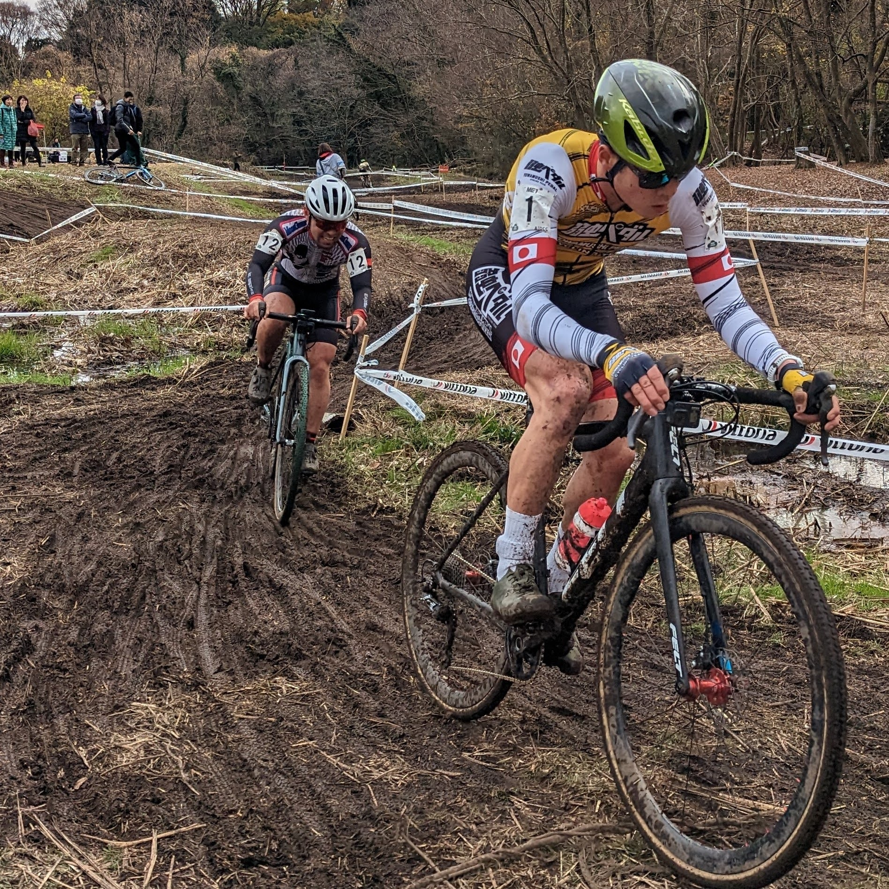
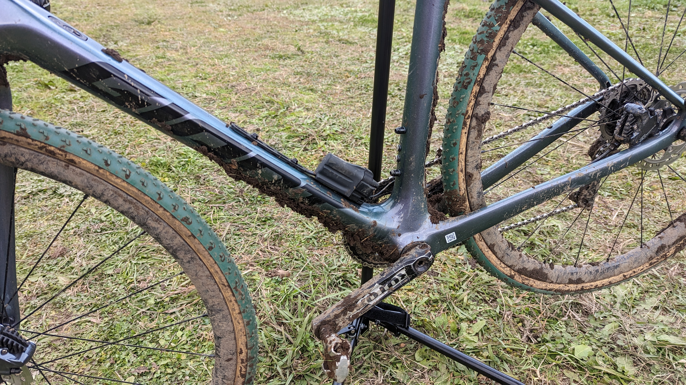

## Summary

今年初のマッド＆テクニカルコース。

楽しく試走はできたものの、レースでは直線を踏んでいけず沈没…

## リザルト

25/36位（-1 lap)

### 機材

- メインバイク
  - GIANT TCX ADVANCED PRO
  - Farsports CX TU + [Michelin POWER CX MUD TU](https://px.a8.net/svt/ejp?a8mat=3N3PXV+GGEBOY+45DI+NSP1V&a8ejpredirect=https%3A%2F%2Fwww.probikekit.jp%2Fbicycle-tyres%2Fmichelin-power-mud-tubular-cyclocross-tyre%2F12239871.html) 33mm (F: 1.70bar, R: 1.70Bar)

<LinkBox url="https://www.probikekit.jp/bicycle-tyres/michelin-power-mud-tubular-cyclocross-tyre/12239871.html" linkurl="https://px.a8.net/svt/ejp?a8mat=3N3PXV+GGEBOY+45DI+NSP1V&a8ejpredirect=https%3A%2F%2Fwww.probikekit.jp%2Fbicycle-tyres%2Fmichelin-power-mud-tubular-cyclocross-tyre%2F12239871.html" />

## 試走レビュー

[MTBクロスカントリーで使われた実績](https://www.cyclowired.jp/lifenews/node/187039)もある筋金入りのテクニカルコース。

シャビシャビの泥に覆われたストレートと、根っこと急坂の林間コースが特徴。乗車クリアできるところは多いものの、1時間レースで常に乗れることはないだろうという箇所が多く、泥付きの無さに定評のあるMichelinタイヤが根っこで滑ってしまう。

とはいえ、ストレートでのトラクションも重要なので、タイヤはMichelinマッドのままにしておく。泥が付かないということは、1時間に渡って一定のグリップを維持してくれるということもあり、集中力が落ちても同じ感覚で林間コースを走ることのできるメリットは大きいと判断。

## レース

<iframe width="560" height="315" src="https://www.youtube.com/embed/knI2NnoYcS0" title="YouTube video player" frameborder="0" allow="accelerometer; autoplay; clipboard-write; encrypted-media; gyroscope; picture-in-picture" allowfullscreen></iframe>

スタートの落車に巻き込まれ、大きく順位を落とす。その後、林間で狡くポジションを上げていくが、いかんせんパワーが出ない。

ここ数週間、GARMINのトレーニングステータスが「疲れている」か「オーバーリーチ」しか見ていないのもあり、休養不足か？練習不足か？という考えが頭をよぎりながら周回を重ねる。

自分のペースは1周8分程度だったのだが、宣告された周回数はなんと10。

中盤でトップの聖に抜かされたのだが、タイミングよく下りに切り替わるところだったので1分ほど追跡してラインをトレース。勉強になった。

<blockquote class="twitter-tweet">
ようやっとる感を出しました <a href="https://t.co/mZTUMupYHB">pic.twitter.com/mZTUMupYHB</a>
&mdash; ゲン@C101 12/31東3 Z-15b (@gen_sobunya) <a href="https://twitter.com/gen_sobunya/status/1601881233310769152?ref_src=twsrc%5Etfw">December 11, 2022</a></blockquote> 

やはり周回数は多かったようで、ゆうに1時間以上経ってから最終周回に突入、76分かけて-1 lapで完走した。

途中からもはや順位は興味の外だったが、1時間レースでのスタミナの足りなさは今期を通しての課題。思い切ってフルレスト込みの大休養をして宇都宮CXに備えてみて、休養が足りないのか練習が足りないのかテストする。

## Photo

Cover photo by [@skp](https://twitter.com/sakimopuro)
