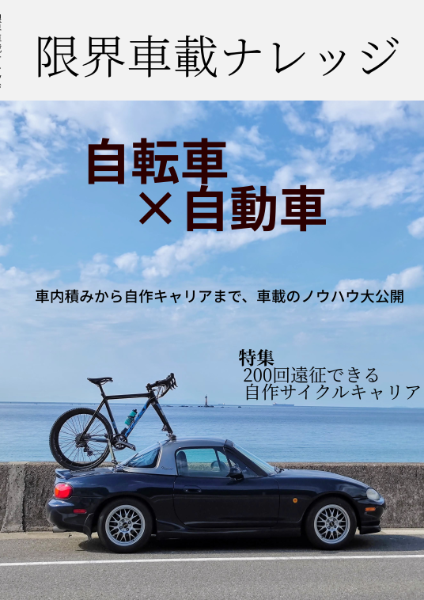
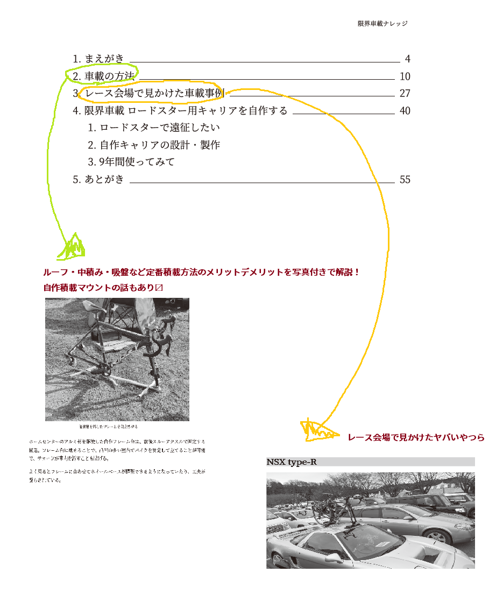
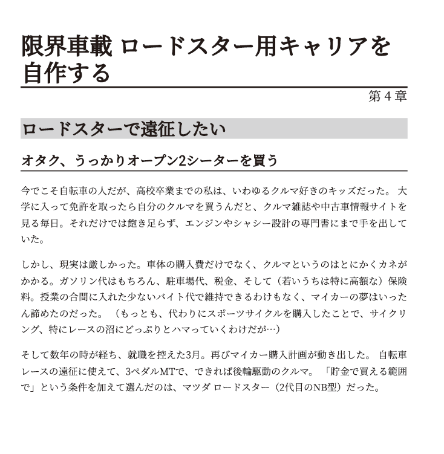

サークル「幻想サイクル」として今年も冬コミ（コミックマーケット101）に参戦。

**12/31東京ビッグサイト**でサークルスペースは**Z-15b**。すくみずさんと共著で『限界車載ナレッジ』を頒布します

## C101新刊: 限界車載ナレッジ

レース遠征や遠場のライドに欠かせない『車載』をテーマに設定。

基本的な積み方である「中積み」「ルーフキャリア」、レンタカーに便利な「トランクキャリア」、CX,MTB会場でよく見る「ヒッチキャリア」、それに加えて吸盤キャリアなどの変わり種の紹介とそれぞれのメリットデメリットを解説する。

車載のノウハウに加え、**実際の（一部特異な）車載事例**を紹介しつつ、**すくみずさんの『自作ロードスタールーフキャリア』の製作秘話**も掲載。

マイカー持ちでキャリア検討中、、マイカー自体を検討しているサイクリストはもちろん、車好きにも楽しめる一冊になっているつもり。

全58ページ、イベント会場での頒布価格は1000円です。

## 委託販売

今年も冬コミは事前購入チケット制（販売終了済み）です。

来場できない方は[メロンブックス様での委託販売](https://www.melonbooks.co.jp/detail/detail.php?product_id=1747534)をご利用ください。委託販売価格は1572円（税込）です。

<LinkBox url="https://www.melonbooks.co.jp/detail/detail.php?product_id=1747534" />

電子カラー版は鋭意準備中です。

## おしながき

会場では、過去頒布した[「サイクリング・デジタルトランスフォーメーション」](https://amzn.to/3juW5xz)[「Cyclocross Deep Dive」](https://amzn.to/3PYAeuy)も合わせて頒布予定です。

イベント価格各1000円。
