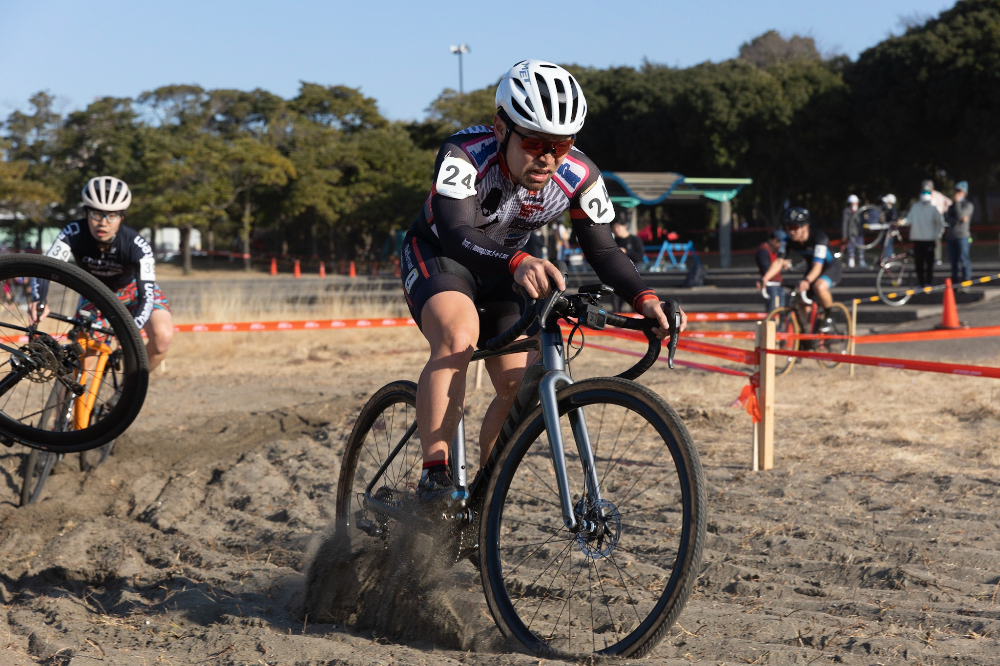

## Summary

## リザルト

29/52位（-1 lap)

### 機材

- メインバイク
  - GIANT TCX ADVANCED PRO
  - Farsports CX TU + Dusgat Smallbird(F:1.5Bar, R:1.55Bar)

## 試走レビュー

## レース

<iframe width="560" height="315" src="https://www.youtube.com/embed/h6y6OSFqBmU" title="YouTube video player" frameborder="0" allow="accelerometer; autoplay; clipboard-write; encrypted-media; gyroscope; picture-in-picture; web-share" allowfullscreen></iframe>

## Photo

Cover photo by [@hiroyo_okubo](https://twitter.com/hiroyo_okubo/)
