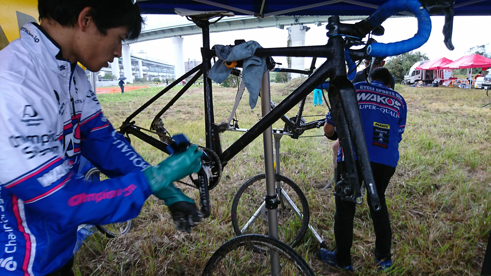
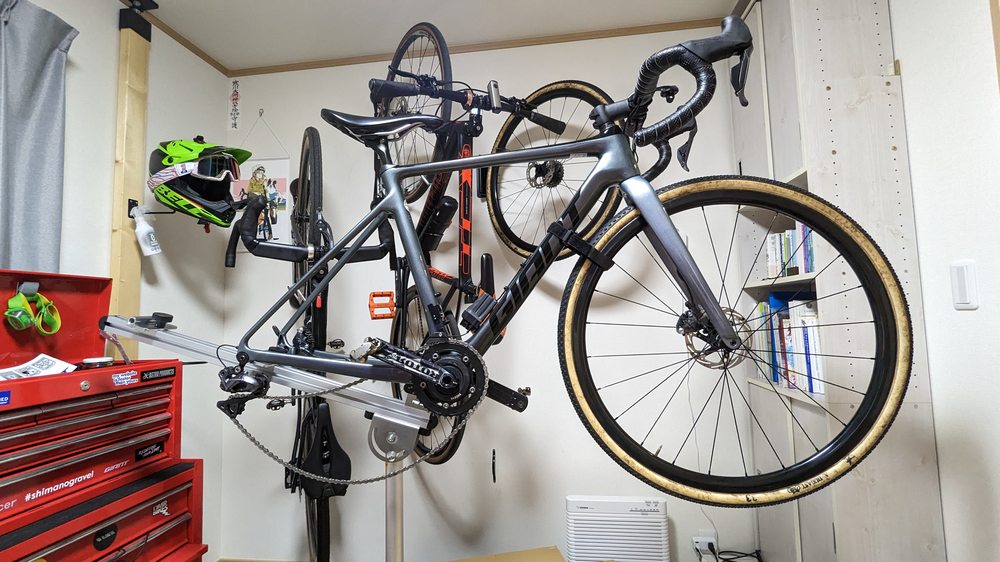
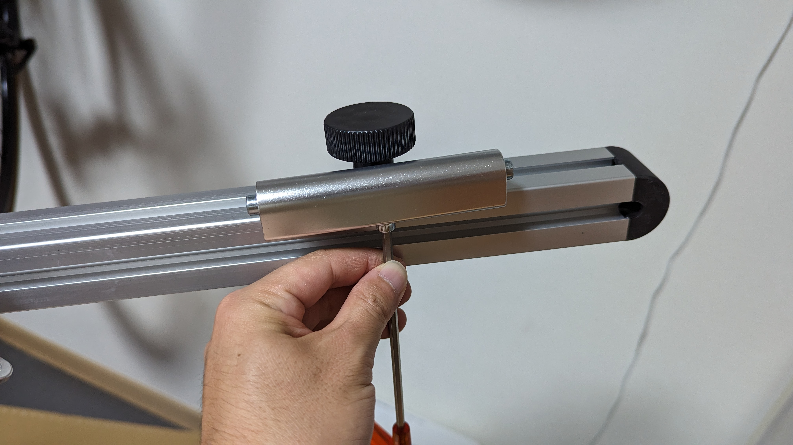
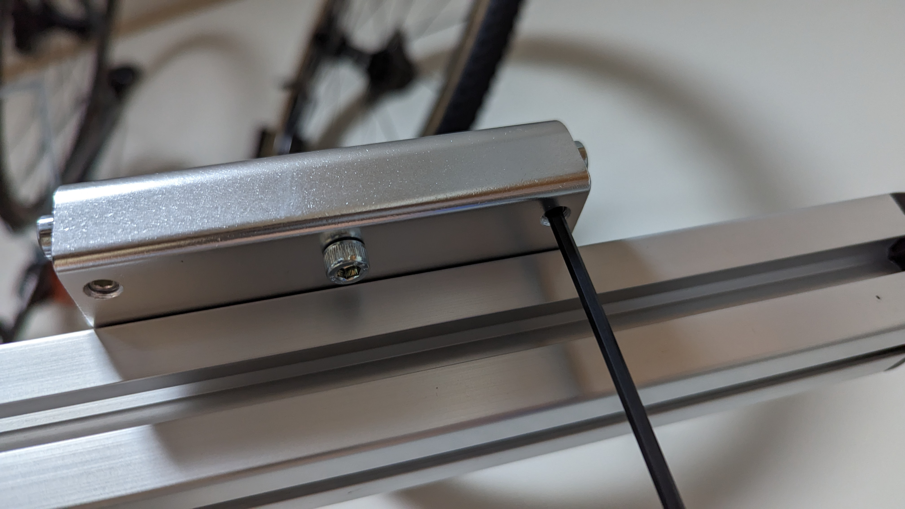
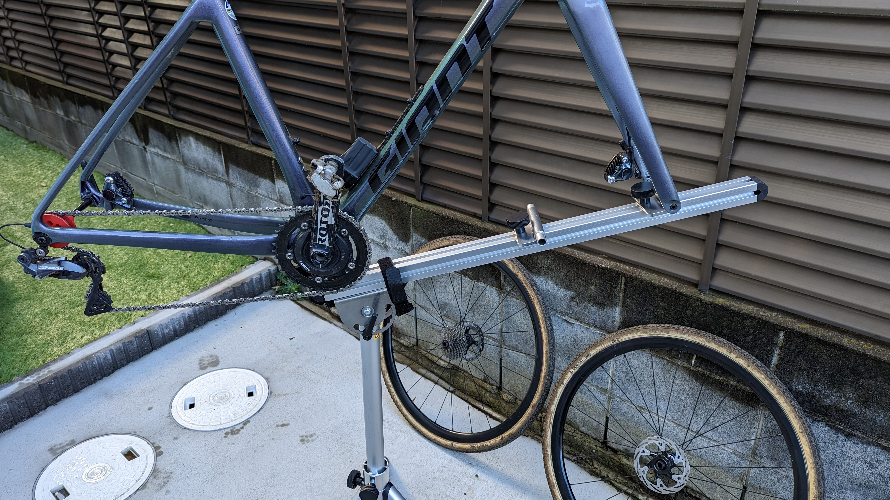

hoge

## MINOURA RS-1800 レーススタンド

レース会場で洗車＆ケミカルサービスを提供していたWAKO'S（和光ケミカル）とコラボして作成したワークスタンド。

上記写真の通り、以前はこのサービスをトップチューブをクランプするメンテナンススタンドを使って提供していた。しかし、このタイプのスタンドは手軽である反面、フレームの**左右を切り替える際に一度フレームを取り外し、フレームを回転させてまたスタンドにセットする**という手間が必要だった。また、**切り替えの際に汚れた手袋でフレームを汚してしまうし、クランプしている箇所は洗車しづらい**というデメリットもある。

[RS-1800](https://amzn.to/3jDsGBD)は、そうした手間を削減する **「BB部は置くだけ、フロントフォークマウント」** のワークスタンドだ。

**土台が回転させられる仕組み**になっており、フレームの左右を切り替えて洗う際の手間が大きく削減されていることもポイント。

<LinkBox url="https://www.amazon.co.jp/gp/product/B078GVS4CT/" isAmazonLink />

## セットアップ

## 実際に洗ってみた

