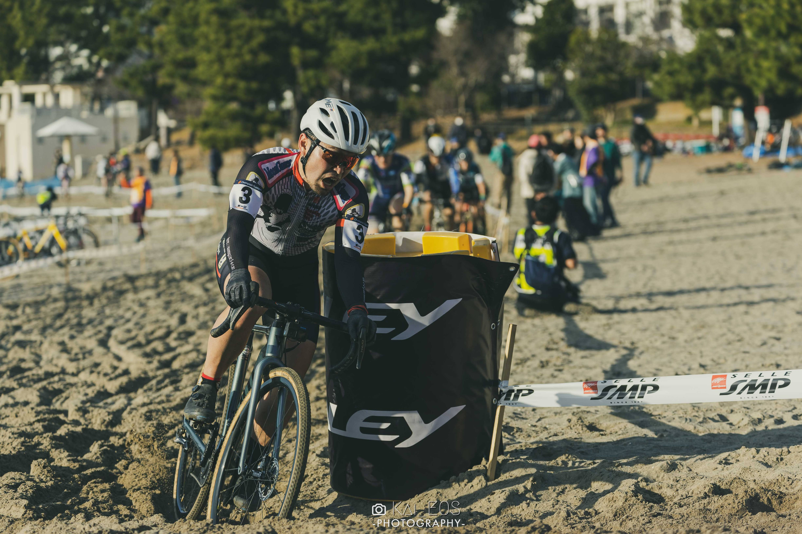
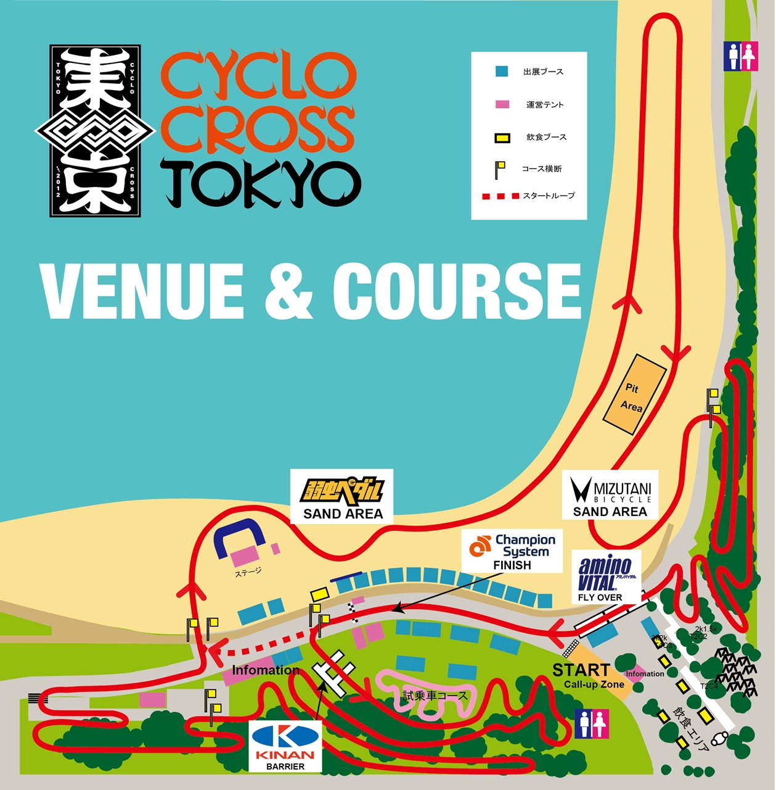
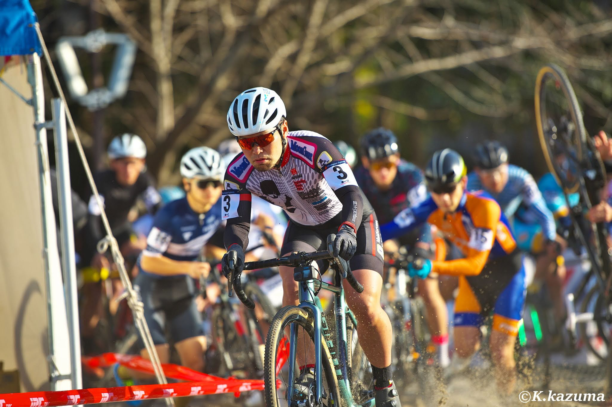

## Summary

勝負所を砂と割り切ったセッティングと、前方スタートを活かして今期レースとしては満足いくリザルトとなった。（当社比で）得意の砂なのでワンチャン一桁かと思ったがそちらには届かず。

潮の満ち引きをしっかり調べて最後に別ラインを活用できた点がGood。

## リザルト

12/67位 (+3:34) 17%

### 機材

- メインバイク
  - GIANT TCX ADVANCED PRO
  - Farsports CX TU + Dusgat Smallbird(F:1.40Bar, R:1.45Bar)

## 会場メモ

海浜公園北側駐車場が、会場にすぐアクセスできて上限設定もある良い駐車場に見えるが、同じく上限設定のあるフロンティアビル駐車場もおすすめ。地下ではあるものの高さ制限2.3mと緩めの制限で、直線距離では海浜公園駐車場より近い。そしてちょっと安い。

ルーフキャリア以外の積載ならフロンティアビルの方がオススメできる選択だった。なお、こうした会場までちょっと距離のある駐車場設定の場合は[アウトドアワゴン](https://amzn.to/3IjtDIS)が役に立つ。

<LinkBox url="https://www.amazon.co.jp/dp/B00SLO7VTA/" isAmazonLink  />

## 試走レビュー

5年ぶりのシクロクロス東京。2013年の非AJOCCレースで、シクロクロス競技初の表彰台に立って以来、可能な限り参加を続けてきた自分にとって特別なレースだ。

歴史を感じさせるツイートをしたのに公式が拾ってくれなかったので、ここに供養しておく。

<blockquote class="twitter-tweet">
シクロクロス東京トリコロールマンです <a href="https://t.co/N9BDy8KCM4">pic.twitter.com/N9BDy8KCM4</a>
&mdash; ゲン (@gen_sobunya) <a href="https://twitter.com/gen_sobunya/status/1624560327122907136?ref_src=twsrc%5Etfw">February 12, 2023</a></blockquote>

砂区間は異例の長さ、林間も根っこが多い嫌らしいコースは健在。周長は短いが、1周当たりの時間は普段より1分程度しか短縮されないコース。

林間でもそれなりにタイム差がつくため、どこを重視するかによって空気圧設定が変わってくるが、**チューブラータイヤかつ、勝負どころを決めている自分は迷わず砂特化にセッティング。**

GIANTブースで「TCX友の会」ステッカーをもらったりして午後のレースを待った。

<blockquote class="twitter-tweet">
シクロクロス東京で遂に手に入れました<a href="https://twitter.com/hashtag/TCX%E5%8F%8B%E3%81%AE%E4%BC%9A?src=hash&amp;ref_src=twsrc%5Etfw">#TCX友の会</a> <a href="https://t.co/2gfNVQfcrg">pic.twitter.com/2gfNVQfcrg</a>
&mdash; ゲン (@gen_sobunya) <a href="https://twitter.com/gen_sobunya/status/1624920470796795907?ref_src=twsrc%5Etfw">February 12, 2023</a></blockquote>

### 海レースのライン選び

海辺のレースで波打ち際を走る場合、最速コースは潮の満ち引きによって異なる。

基本は適度に水を含んで固くしまった路面が高速なのだが、**今回は前日までの雨でコースの高いところも踏み固められており、選択肢が二つある**状態。

潮が引いたばかりの砂浜は緩く、引いたあとしばらくして水分が抜け固くなる。この日はレディースカテゴリの時間が干潮のピークで、その後ME2, ME1と満ちてくる予定だった。

試走をしていると、**ME2の時間にちょうど水気が引ききって固くなった路面の面積が最大**となり、砂浜側のラインが大正解になっていた。

ただ、ME1の時間はどんどん上げ潮でコースが狭くなるので、いつ上のラインに乗り換えるかという判断が必要になる。

## レース

今年は関東ローカルを中心に走っていたこともあり、ゼッケン3番で1列目をゲット。70人近い上に、5人1列のこのレースでは大きなアドバンテージだ。

スタートループではすぐに砂場に入るので、トラブルは必至。1列目の特権でうまく切り抜けた。

その後、2周目前半まではなんとかトップ集団（らしきもの）にくらいつくも、次第に実力通りのところへ落ちていく。

心拍が上がり切ってしまったので、中々思い通りのラインをトレースできず、「パワーより轍」という独り言を繰り返していた気がする。林間は心拍を落ち着け、砂でアドバンテージを取りに行くという繰り返しで徐々にポジションが安定。

残り3周あたりになった時点で、周回遅れが発生しだす。**脚力で砂を乗ると疲労で辛くなる時間帯に、砂専用の空気圧が効いてくる。**

徐々に前を捕まえだすが、大洗CXでバトルした宮崎さんが後ろから追いついてきた。いったん離されたが、**ラストラップでは試走で見つけていた上の固いラインにチェンジ。一気に前のパックをごぼう抜き**してジャンプアップする。

徐々に満ち潮で波打ち際が狭くなり、最後の2周ほどは上の方が楽になっていたのを見逃さず、同じことを考えていた誰かのラインを使って一気に追い上げに成功。

砂浜の後の林間ではポジションを落とさないようにして、前走者をスプリントで刺してフィニッシュ……決まったと思ったが周回遅れのライダーだった。悲しい。

**砂対策のセッティングをとり、時間経過とともに現れるベストラインを最後に使って**ジャンプアップするという思い通りの展開には満足。脚力が付けばもっと上を目指せると思う…

今シーズンは残り1か2レースほど。怪我せずに頑張りたい。(エンデューロに続く)
