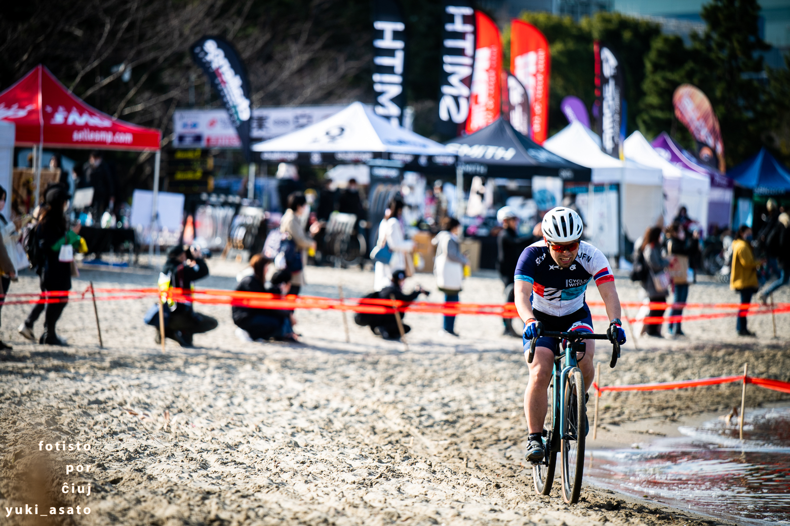
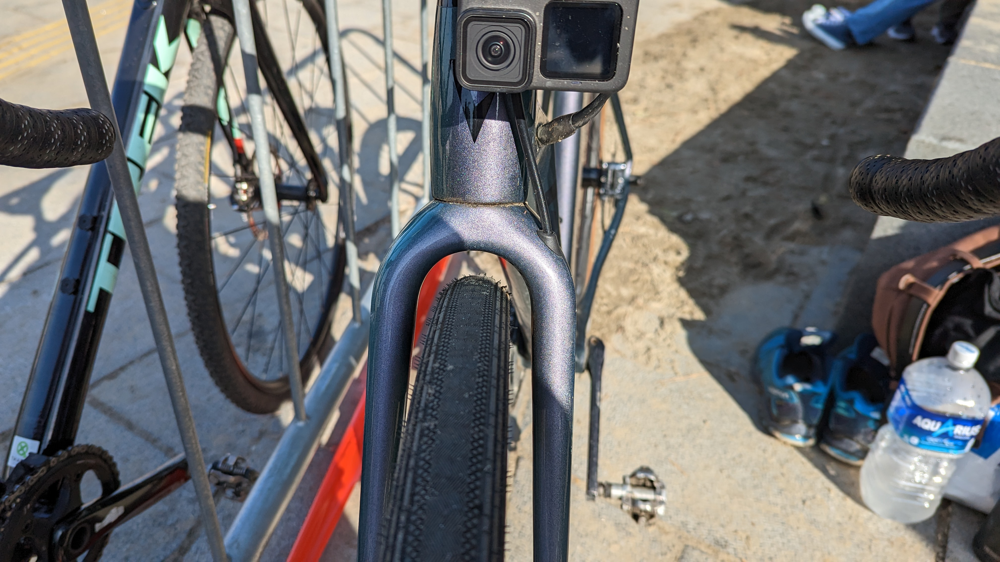
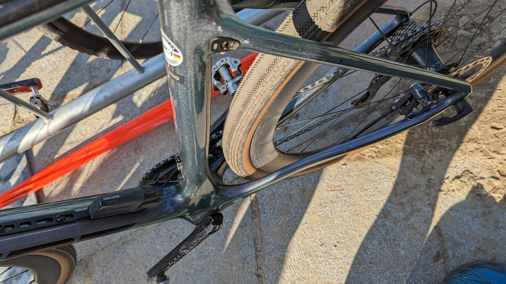

## "本番"の2日目

自分のレースは終わり、シクロクロス東京の日曜日は楽しむための日となる。

エンデューロで軽く運動して、ノンアルコールビールと唐揚げで乾杯！

## エンデューロリザルト

5/63 team (+3:22)

### 機材

- メインバイク
  - GIANT TCX ADVANCED PRO
  - [ZIPP303S](https://paypaymall.yahoo.co.jp/store/qbei/item/pc-810594/) + [Panaracer GravelKing SS TLC 38c](https://amzn.to/3oRbzvd)(F: 1.3bar, R:1.4bar)

## レースレポート

元々3人チームだったのだが、前日のエリートレースで1名負傷によるDNS。ME1の**知り合いから代役を立てようとしたのだが、その知り合いも疲労困憊でDNS**となり結局2人で出走。

当初の参加予定メンバーが1周目を得意としていたこともあり、普段そいつが来ているジャージを自分も着て、スタートループをトップで帰ることを目標に設定した。

今回、姑息にもホイールをグラベルロードに装着されていた38cタイヤ（[Panaracer GravelKing SS](https://amzn.to/3oRbzvd)）しておき、疲労をタイヤの性能でカバーしようと考えた。

ささやかなサイドノブだけども、試走で湿り気の残る林間をちょっと攻めたところ、十分なグリップを発揮してくれた上に、思ったよりタイヤが撚れないとわかる。

林間でタイヤ外れが怖いので、前日のチューブラータイヤと同程度（1.4bar）の空気圧に設定しようかと思っていたが、思いっきり下げても大丈夫そうだったのでそこから更に0.1bar下げてセッティングした。

スタートループの様子はこちら

<iframe width="560" height="315" src="https://www.youtube.com/embed/CDy-FP59wm4" title="YouTube video player" frameborder="0" allow="accelerometer; autoplay; clipboard-write; encrypted-media; gyroscope; picture-in-picture; web-share" allowfullscreen></iframe>

