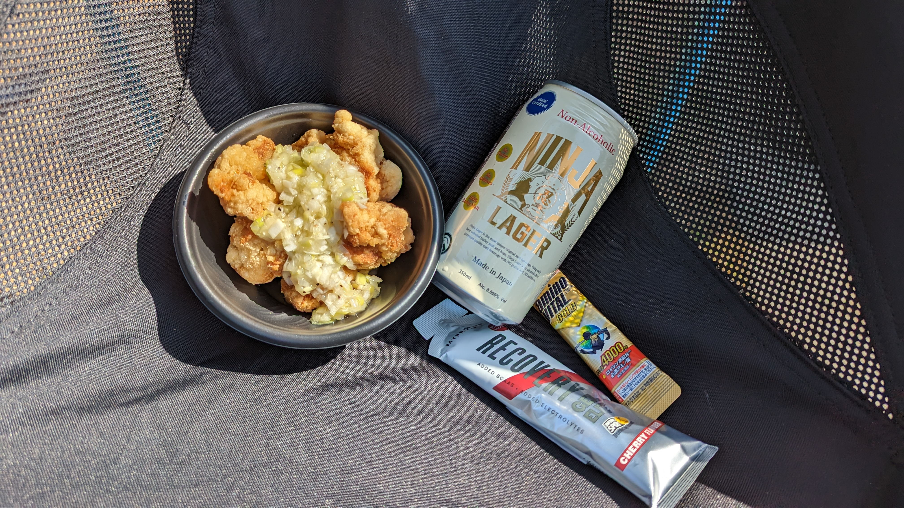
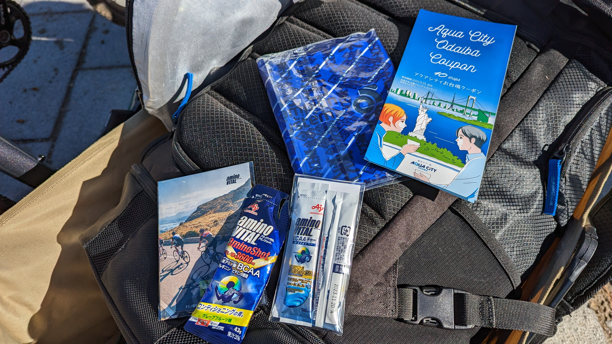

## "本番"の2日目

自分のレースは終わり、シクロクロス東京の日曜日は楽しむための日となる。

エンデューロで軽く運動して、ノンアルコールビールと唐揚げで乾杯！

## エンデューロリザルト

5/63 team (+3:22)

### 機材

- メインバイク
  - GIANT TCX ADVANCED PRO
  - [ZIPP303S](https://paypaymall.yahoo.co.jp/store/qbei/item/pc-810594/) + [Panaracer GravelKing SS TLC 38c](https://amzn.to/3oRbzvd)(F: 1.3bar, R:1.4bar)

## レースレポート

元々3人チームだったのだが、前日のエリートレースで1名負傷によるDNS。ME1の**知り合いから代役を立てようとしたのだが、その知り合いも疲労困憊でDNS**となり結局2人で出走。

当初の参加予定メンバーが1周目を得意としていたこともあり、普段そいつが来ているジャージを自分も着て、スタートループをトップで帰ることを目標に設定した。

今回、姑息にもホイールをグラベルロードに装着されていた38cタイヤ（[Panaracer GravelKing SS](https://amzn.to/3oRbzvd)）しておき、疲労をタイヤの性能でカバーしようと考えた。

ささやかなサイドノブだけども、試走で湿り気の残る林間をちょっと攻めたところ、十分なグリップを発揮してくれた上に、思ったよりタイヤが撚れないとわかる。

林間でタイヤ外れが怖いので、前日のチューブラータイヤと同程度（1.4bar）の空気圧に設定しようかと思っていたが、思いっきり下げても大丈夫そうだったのでそこから更に0.1bar下げてセッティングした。

スタートループの様子はこちら

<iframe width="560" height="315" src="https://www.youtube.com/embed/CDy-FP59wm4" title="YouTube video player" frameborder="0" allow="accelerometer; autoplay; clipboard-write; encrypted-media; gyroscope; picture-in-picture; web-share" allowfullscreen></iframe>

やや後ろからのスタートなので、最初の砂が鬼門かと考えていたところ、1コーナーの砂浜で**全員外側にコケてくれるという奇跡が発生**。

モーゼのごとく開いた空間を突き進み、トップグループに躍り出る。38cのパワーと、1周目特有のランの元気さを駆使して**先頭でスタートループをこなすことに成功！**その後、脚のある複数名に抜かれながら、2人で90分耐え抜くことになるがそれは割愛。

走り終えたらGARMINのリカバリタイムが96時間になった。

<blockquote class="twitter-tweet">
はい <a href="https://t.co/xLoLQgHeFo">pic.twitter.com/xLoLQgHeFo</a>
&mdash; ゲン (@gen_sobunya) <a href="https://twitter.com/gen_sobunya/status/1624605612582768641?ref_src=twsrc%5Etfw">February 12, 2023</a></blockquote>

## フード

レースが終われば、ご飯の時間。

参加賞の[アミノバイタルGOLD](https://amzn.to/3IvGW9l)とマイプロテインの[リカバリージェル](https://px.a8.net/svt/ejp?a8mat=3N3PXV+GF7GHE+45DI+BW0YB&a8ejpredirect=https%3A%2F%2Fwww.myprotein.jp%2Fsports-nutrition%2Frecovery-gel-elite%2F11214831.html)を流し込んだ後に、シクロクロス東京でお馴染みの**日本ビール協会ブース**で販売しているノンアルコールビールを頂く。

マスメーカーのノンアルコールビールと違い、ビールを作った後にアルコールを抜く手法で作ったノンアルはうまい！おなじくフードブースのねぎ塩唐揚げにも舌鼓を打ちながら2日分の疲れを癒していく。このあとのJCXレースで思いっきり観戦しないといけないし、必要な補給。

2日間でアミノバイタル提供の参加賞が2回分、[PRO](https://amzn.to/3IaK4WT), [GOLD](https://amzn.to/3IvGW9l), [WATER](https://amzn.to/3I9glxk)に加えて[アミノショット](https://amzn.to/3I7g0eO)も頂き、これだけで結構お得に思えてくる。

## ME1(JCX)

普段は同じレースなので見ることが叶わないJCXレース。

ここぞとばかりに砂やシケイン、ラインに迷うポイントを勉強しに回る。1周目の砂では、竹之内選手が上のラインを選んでいたのが印象的だった。

<iframe width="560" height="315" src="https://www.youtube.com/embed/V9MlKC6NZ9M" title="YouTube video player" frameborder="0" allow="accelerometer; autoplay; clipboard-write; encrypted-media; gyroscope; picture-in-picture; web-share" allowfullscreen></iframe>

流石というか、前日のME1ではコーナーごとに降車するかしないか分かれていたが、この日はコーナーも全乗車が基本。テクニックと脚が合わさりとんでもないスピードで砂を走っていく。

聖の調子が悪いのか、脚の動きも砂のライン取りも荒かったので、出遅れたまま後半挽回できないことは察することができた。[シクロワイアードの記事によると竹之内の空気圧設定は1.1bar](https://www.cyclowired.jp/news/node/385166)だったらしい。流石本場でシクロクロスを走ってきた超人だ…

<LinkBox url="https://www.cyclowired.jp/media/386669" />

前日入賞で連日走る岩田さんや、その他のメンツに激を飛ばしながら砂浜を走り、ヘトヘトになって帰宅。

チェーン周りとペダルをさっと洗ってメンテし、シクロクロスシーズンの終わりはじめ（オーバーホールの始まり）に向けて交換やメンテ個所をリストアップしはじめる。

今年の自分は茨城シクロクロス取手をもってシーズンオフ予定。それからはグラベル遊びが始まる。

<LinkBox url="https://www.amazon.co.jp/gp/product/B00WLFU160/" isAmazonLink />