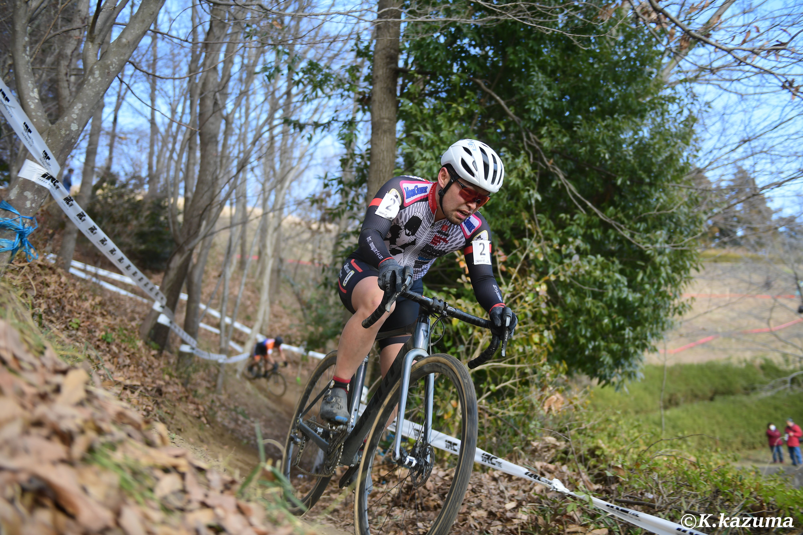

## Summary

らんにんぐ　つらい

GoProマウントのネジが行方不明になったためレース動画を撮影できず。

## リザルト

8/16位 (+5:29) 50%

### 機材

- メインバイク
  - GIANT TCX ADVANCED PRO
  - Farsports CX TU + Dusgat Smallbird(F:1.55Bar, R:1.6Bar)

## 試走レビュー

名物の階段（約70段）、滑りやすい砂利やグラウンドのコーナー。そして思い出したように現れるシングルトラックのテクニカルな下り。

「絶対に辛い」という激坂登坂からの階段はもちろん、空気圧を上げたいところと下げたいところが交互にくるレイアウトとなっており、空気圧設定が悩ましい。

下りも先にフロントの方向を決め打ちしてリアは滑らせないと理想的なスピードで下れないなど、何度か練習してコツをつかむ必要があった。

タイム差のつきやすいところはコントロールライン前の舗装路登り・グラウンド側の山登り序盤の乗車orラン・階段の3か所といったところか。

空気圧は、最終的に**「迷ったら下げる」という原則**に従って高速コースとしては低めの空気圧でレーススタートすることにした。

## レース

ゼッケンは2番だが、1列目のメンツは大洗よりも格上が多かった。そもそも2列しかないのであまりアドバンテージも大きくない。

スタートは景気よく4番手辺りに位置取り、最初の玉砂利コーナーをアウトからスルリと抜け出し、階段を登り切ったところでは2番手につける。

<blockquote class="twitter-tweet" data-partner="tweetdeck">
アウト側うまく取った例 <a href="https://t.co/1aOW6gEwPM">pic.twitter.com/1aOW6gEwPM</a>
&mdash; ゲン (@gen_sobunya) <a href="https://twitter.com/gen_sobunya/status/1622177462846394369?ref_src=twsrc%5Etfw">February 5, 2023</a></blockquote>

<blockquote class="twitter-tweet" data-partner="tweetdeck">
一周目は元気でしたね… <a href="https://t.co/VWBuRFZ92h">pic.twitter.com/VWBuRFZ92h</a>
&mdash; ゲン (@gen_sobunya) <a href="https://twitter.com/gen_sobunya/status/1622172997900730368?ref_src=twsrc%5Etfw">February 5, 2023</a></blockquote>

とはいえ元気だったのはここまで。

その後オーバーペースの代償を数周回に渡って払い続ける羽目になり、階段で脚が上がらず止まる寸前になるなどの醜態を見せつけた…

復活した後は、蠣崎選手とのマッチアップとなる。もう1名パックになりそうだったが、その方はチェーン落ちで脱落。

階段で抜きつ抜かれつ、10秒以上のビハインドを背負う場面もあった。後半は体力も回復してグラウンド側の山を乗車で半分登れるようになり、これで一気にタイムを稼ぎ、グラウンドのスラロームでうまく抜け出すことに成功。

リードを広げながら8位でゴールした。

2レース連続で対人戦を意識する展開となり、レースが楽しくなってきたところでシーズン終わりなのはなんとも残念。お台場には関西から強力なメンツが訪れることを確認しているが、1列目かつ好きな砂レースということで1つでも上を狙っていきたい。
