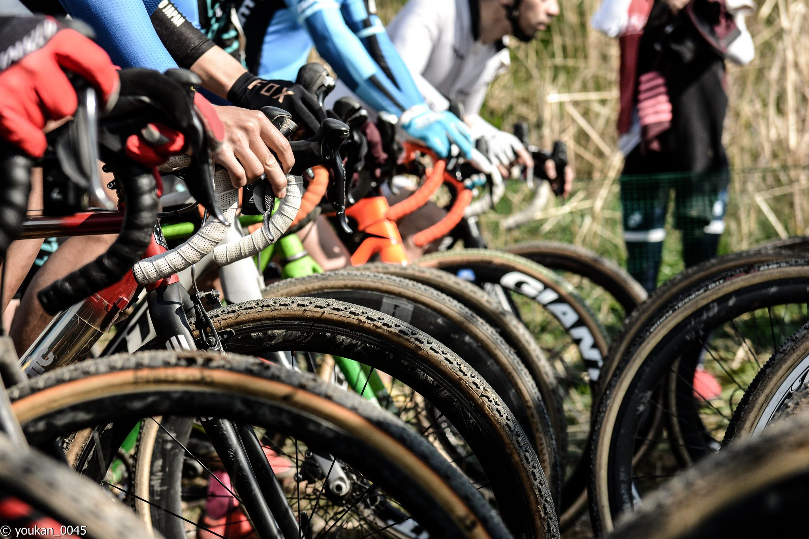
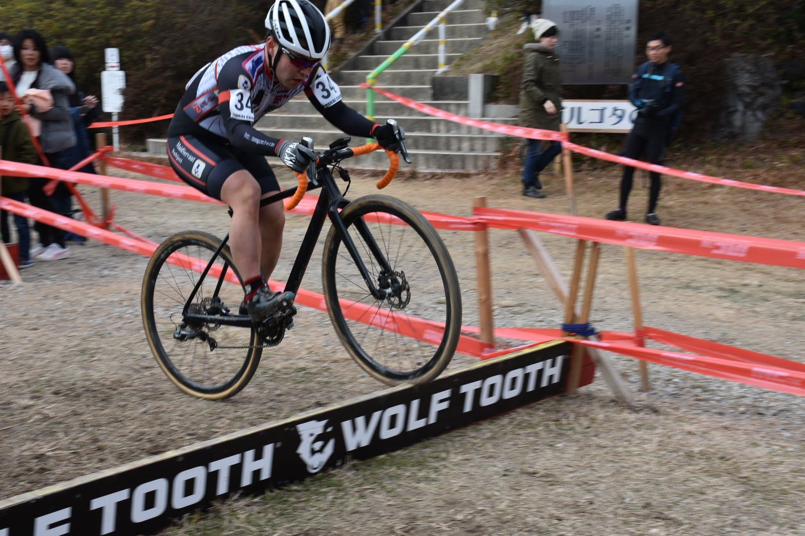
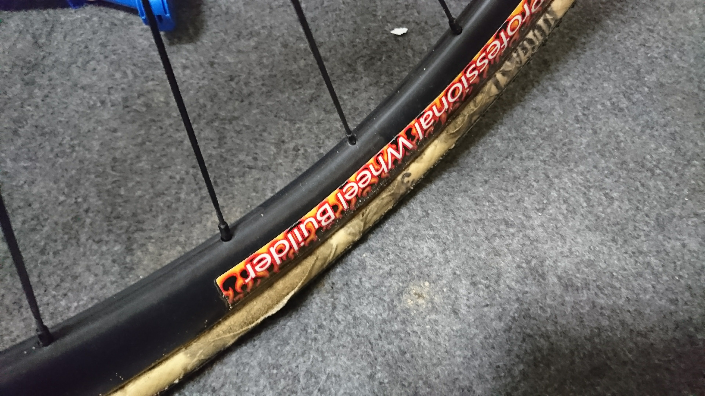
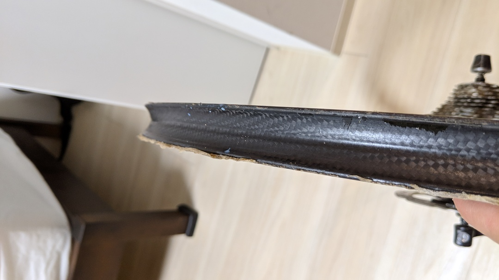
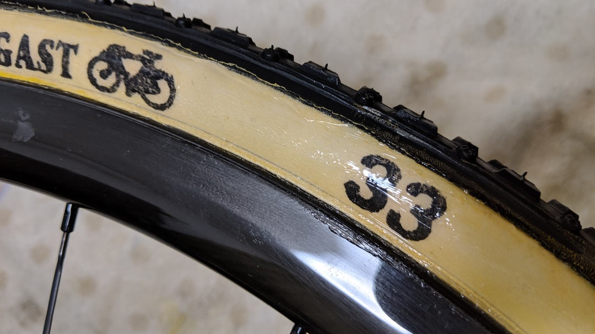
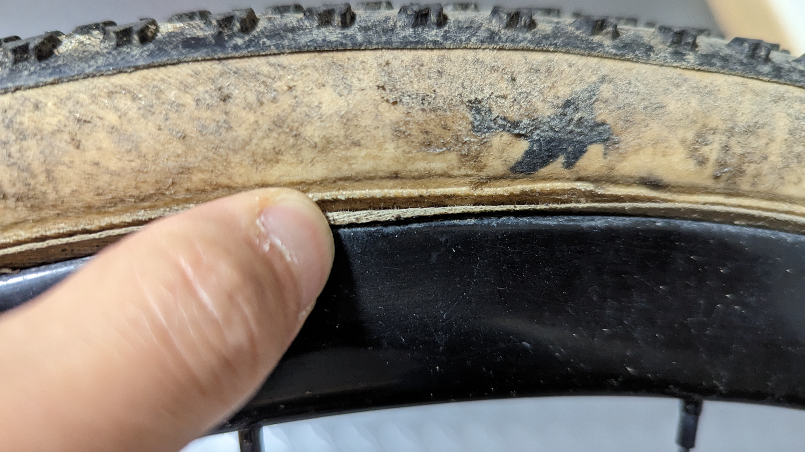

## なぜチューブラータイヤがシクロクロスで持ち上げられるのか

シクロクロスでは、チューブラータイヤが良い。

プロツアーのロードレースシーンですら、クリンチャーやチューブレスの優位性が大きくなり、チューブラーを採用していない選手やチームもいる中で、なぜシクロクロスでは**未だにチューブラー、しかもハンドメイドという精度もクソもない製造方法**のタイヤが使われているのか？

それは、タイヤ幅が33mmに制限されている上にサスペンションもないので、**路面の凹凸をいなしたり、コーナーのグリップを稼いだりする機能を全てタイヤに持たせる必要がある**ためだ。

これらを実現するためには、タイヤの空気圧を下げることが基本的な対応となる。しかし、空気圧を下げることで、タイヤが外れたりリム打ちをしたりするリスクは高まるし、コーナーで腰砕けになると逆にスピードは遅くなってしまうので、ある程度**バランスを取った空気圧を個々人で見つける必要がある。**

一定以上の競技レベルでシクロクロスをすると、タイヤ構造の選択肢はチューブレスかチューブラーの2つ。しかし、チューブレスは低圧運用時に、上記に上げたリスクが大きくなる。マウンテンバイクであればタイヤ幅とタイヤ剛性・リム幅を広げてデメリットを緩和できるのだが、シクロクロスではタイヤ幅が決まっているのでリム幅には限界があり、サスペンションが無い都合でタイヤ剛性を上げるわけにもいかない。

近年でこそ、[タイヤインサート](https://amzn.to/3Et9UEA)の登場によって、リム打ち・タイヤ外れのリスクには対応できるようになったが、まだまだ一般的とは言えない。

## CXチューブラーの泣き所

性能面では優秀であることが間違いないCXチューブラーであるが、こと運用面においては手間が多いとされている。

### 取り付けの難解さ・耐久性

もっともプリミティブな取り付け方法として、[リムセメント](https://amzn.to/41lQH17)を利用してタイヤを取り付ける方法がある。

接着剤をリムとタイヤ側に塗布して、乾かしてからくっつけることで化学反応により接着するという原始的な方法だが、それゆえに強力。ロードバイクのチューブラーと違って、シクロクロスのタイヤは1気圧台で運用するため、空気圧によって強くリムに押し付けるタイプの接着では機能しづらい。

それゆえに、こうした方法は自分がシクロクロスを始めたときはスタンダードな取り付け方法だった。**接着剤でくっつけると一言でいえば単純だが、ノウハウは多岐に渡る。**

リムセメントを何重にも塗る、先にリムにベッドを作る、CXテープ（融解して接着力を高める）を使う、センター出しにおいてリムからセメントがこぼれない方法…など、「俺だけのシクロクロスタイヤ装着テクニック」が何種類も漏れ聞こえてきた。

しかも、この手法は**接着までに多大な手間を要し**、最初の下塗り完走に1日待ち、タイヤを貼って1日待ち…などとリードタイムも長かった。

それでいて、パンクしたらタイヤを外すのも一苦労、取り付けはもう1回という有様。敬遠されるのも無理はない。しかもタイヤは高い（当時でも国内定価は1万円を越えるタイヤが多く、円安の今は直輸入でも5桁はくだらない）

### 地獄の取り外し

セメントで接着したタイヤを外すときは、リムセメントリムーバーという薬品を使わねばならない。

そして、古いセメントは接着力が弱まっているため、一度**すべて綺麗に取り除くする必要が**ある。有機溶剤の香りがする薬品で溶かして除去するのだが、これも面倒であることは想像に難くないと思う…

### 運用の面倒さ

CXチューブラー（高級品）は、タイヤとしてのしなやかさを出すために**タイヤサイドはゴムで覆われずコットンなどの繊維が露出**している。

それゆえに、泥汚れが滲みこんだりすると劣化が速く進んでしまう。泥レースのあとは泥を優しく書き出して、中の水分を抜くために空気をパンパンにして室内保管…といった丁寧さも必要だった。

## リムセメントを使わないチューブラー運用

自分は、そんな熟練の技を使わずにCXチューブラーを安心・安定して**安価で運用する**方法を模索してきた。

安価とは銘打つものの、メンテナンス費用以外にも作業時間や学習時間などのいわゆる**TCO(Total Cost of Ownership)を低く保つことを目標**としている。

主な手段は防水性の高いチューブラーテープである、[Effeto Mariposa Cargona](https://amzn.to/2u8o89K)テープを使ってタイヤを貼り、サイドの保護やリムの接着力強化をどこまで削減できるか、安価に実現できるかというアプローチをとっている。

<LinkBox isAmazonLink url="https://www.amazon.co.jp/dp/B0168TBGR2/" />

なお、リムは防水性を高めるためにスポークホールのないカーボンチューブラーリムを利用している。自分が使っているのはAliexpressが主な入手先で、UCI認定ホイールも作っているFarsports製のリムだが現在は絶版となってしまった。

現在わかっている入手先は[YOELEOのSAT T50ホイール](https://www.yoeleobike.com/products/carbon-road-wheels-disc-brakes-sat-t50-road-db)などが挙げられる。興味のある人は試してみてほしい。

### 取り付け・取り外し

実は前述のリム画像は、テープで貼った**タイヤを素手で剥がしただけの状態**だ。リム側に糊残りもなく、パーツクリーナーなどでさっと表面を脱脂すれば処理が完了する。

マリポサテープは、表と裏で別の接着剤を使用しているらしく、それぞれ性能が最適化されているらしい。この通り、**タイヤを剥がすとテープが全てタイヤ側に残る**。

これによって交換する際の労力を大幅に削減できる。これだけでも相当大きいメリットだ。取り付けは今は無きミヤタのチューブラーテープなどと同じ、フィルムを後から抜く方法だ。（この記事では割愛）

当たり前だが、リムセメントにくらべて**処理もセンター出しもとても簡単だ**。接着剤が力を発揮するための時間は必要。

### これまでのテスト

ME1（旧C1）レーサーが年間20レース程使ってテストしている。

初期は、タイヤのふんどしに防水ボンドを塗布し、サイドにはシリコンコーキングでリムとの隙間を埋めるというフルコースで装着している。

これは2シーズンフル仕様した結果、サイドのケーシングが劣化してバーストするまで使うことができた。**接着部でなくタイヤの寿命が来るまで使えた**という意味ではテープ運用でも実用上問題なく接着できると言って良いだろう。

<LinkBox url="https://blog.gensobunya.net/post/2019/01/tublar_ope/" />

**サイドのみコーキングする方法でも、COVID下のシーズンでは2シーズン**持たせることができた。（とはいえ、レース数は少なかったのでレギュラーシーズン換算だと1.5シーズンといったところか）

今年からは、ふんどしへの防水とサイドのコーキングをともに省略し、**デュガスタイヤのネオプレン加工とテープそのものの防水性に頼った運用**を試している。

これは、タイヤのふんどしへのボンドG17塗布と、シリコンコーキング処理が結構手間なので、ロードチューブラーと同じく**「貼って終わり！」とできるか確認する**というのが趣旨。

<LinkBox url="https://blog.gensobunya.net/post/2022/10/2022_cx_tire/" />

2022-23シーズンも終わりというところで、タイヤの状態を確認して自分なりの結論が出たのでこの記事に書こうと思う。

## 2022シーズンタイヤチェック

今シーズン、テープ運用はそのままにサイドのコーキングをせずに過ごしたタイヤがこちら。

1シーズンで**ふんどしとタイヤの接着が甘くなり始めている**。センター出しが甘く、境界部分が露出してしまっているというミスもあるだろうが、1年でこれは安心とは言い切れない。せめて2シーズンは保って欲しいところ。

### これまでのまとめ

2種類で計3シーズン使った結果は以下の通り

- [ふんどし下処理](https://amzn.to/3KttOmC)＋[サイドコーキング](https://amzn.to/3Iv1AW5)＋[マリポサテープ](https://amzn.to/2u8o89K)…**2年フル使用OK**
- [サイドコーキング](https://amzn.to/3Iv1AW5)＋[マリポサテープ](https://amzn.to/2u8o89K)…**2シーズン問題なく使用（但しCOVID-19のためレース数少な目）**
- [マリポサテープ](https://amzn.to/2u8o89K)のみ…**1年使用時に怪しげな劣化あり**

## 当面の結論

タイヤサイドの擦れや汚れによる劣化からか、**ふんどしとタイヤの間で接着が弱まっている**ことが確認された。一方で、縦方向へのタイヤの浮きは確認されず、**あくまでサイドからの劣化がメイン**と考えられる。

これらから考えると、サイドの保護をネオプレン加工などのタイヤ単体での対策に頼るだけでは弱い。**ケーシング→ふんどし→リムに至るまでの部分は保護が必要**となる。

- スポークホールレスリム
- [Effeto Mariposa Cargona](https://amzn.to/2u8o89K)テープ
- サイドにふんどしを覆うように[シリコンコーキング](https://amzn.to/3xKC5e6)を施工

以上3点が最小限の構成になりそうだ。

課題としては、スポークホールレスリムが入手しづらいことだろうか。とはいえ、ここは内部から水が出てくることを防げばよいので、予めアルミテープなどで穴を塞いでしまうのもアリだろう。

一度貼ってしまえば（滅多にない）パンクかタイヤ寿命まで使い切れるチューブラー。シーズンに何度もチューブレスタイヤをパンクさせるくらいなら、思い切ってチューブラーを使ってみた方がコスト安になる可能性もある。

何年もシクロクロスに参戦してマンネリ化している人は、たまにはシラクではないタイヤを使ってみてもいいんじゃないだろうか。低圧は楽しいぞ。

<LinkBox isAmazonLink url="https://www.amazon.co.jp/dp/B0168TBGR2/" />

<LinkBox isAmazonLink url="https://www.amazon.co.jp/dp/B000TGLPM2/" />
