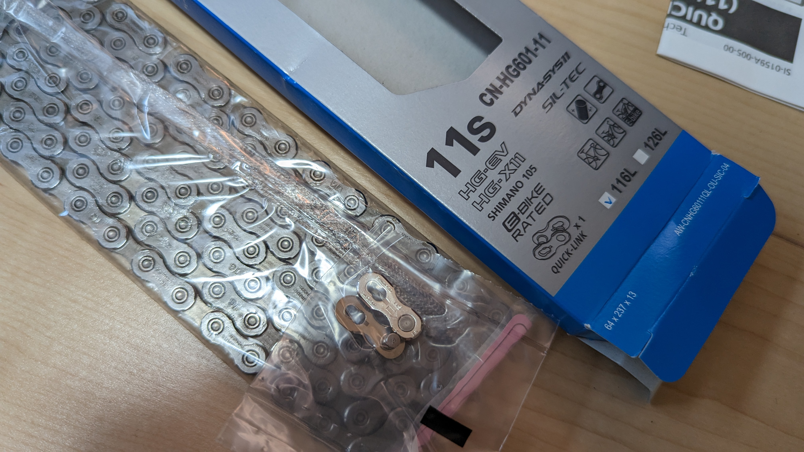
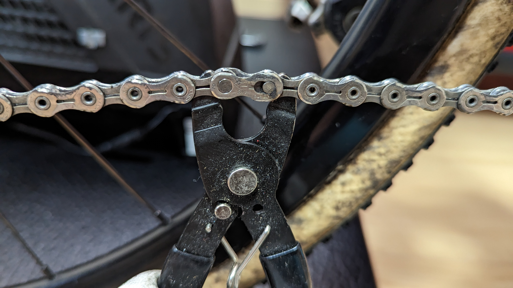
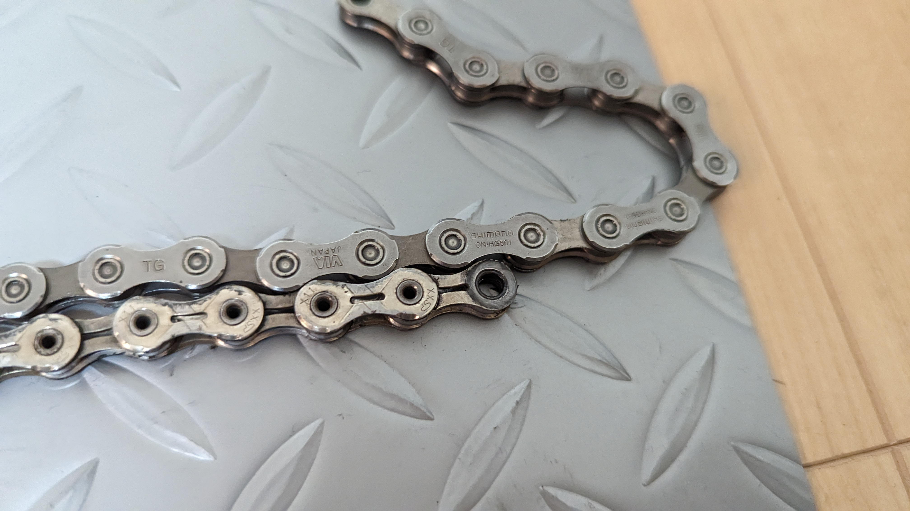

CXシーズンが終わって最初にやることはなんだろうか？

そう、車体のオーバーホールだ。パーツの消耗度をチェックして、交換し、ベアリング周りを綺麗にして、来シーズンに備える。

## チェーン交換だけでは片手落ち

通常、チェーンは毎シーズン交換するものだが、昨年は参戦レース数が少なかったこともありチェーンを交換しなかった。

**CXで使うチェーンはピン周りの摩耗による伸び以外にもダメージが多い**ため、基本はシーズンに1本使う。流石に2シーズン使うと[シマノのチェッカー](https://amzn.to/3k8t34w)で要交換になるほどガッツリ摩耗していた。

<LinkBox url="https://www.amazon.co.jp/dp/B00DT01OBC/" isAmazonLink />

SHIMANOの謹製チェーンチェッカーである[TK-C42](https://amzn.to/3k8t34w)は、**コマの遊びを除いて正しいチェーンの伸び率を計測してくれる**正確なチェーンチェッカー。

2通りのチェッカーがあったり、余計なことを考えないで交換か否か判定できるので愛用している。詳しくは過去記事を参照してほしい。

<LinkBox url="https://blog.gensobunya.net/post/2021/11/shimano_chain_checker/" />

交換したチェーンは[CN-HG601-11](https://amzn.to/438VMuG)だ。なぜかAmazonだとチェーンピン仕様よりクイックリンク仕様の方が安かったので、クイックリンク付のものを購入した。

ミッシングリンクの取り外し、取り付けには[専用工具](https://amzn.to/3MszwpY)があると楽。素手でも可能であるが、正確に並行を出さないといけないので面倒だ。

<LinkBox url="https://www.amazon.co.jp/dp/B00CF8CXFK/" isAmazonLink />

素手ならともかく、保護手袋をした状態で精密作業をするのは現実的ではないので、毎回工具で脱着している。装着時はペダルを蹴るのもいいが、取り付けが甘い状態でもパワーで嵌まってしまい取り外しが面倒になったりリンクが死んだりするのも嫌なので…

交換後に見比べると、かなり伸びていることがわかる。こんな状態で使い続けていると、当然噛み合っている側もただでは済まないわけで…

## チェーンリング交換と、シングルスピードチェーンリングボルトの闇

チェーン交換したはいいものの、オフシーズンの定位置であるスマートローラーにセットして使ったところ、**「ゴロゴロ」という凄まじい駆動音**が。

チェーンが摩耗した状態で使い続けたため、チェーンリングか、スプロケのどちらか（もしくは両方）が死んでしまっているようだ。一度に両方交換してもよいのだが、ローラーの方が実走より短いであろうことと、比較的安価なチェーンリング側をまずは交換してみた。
