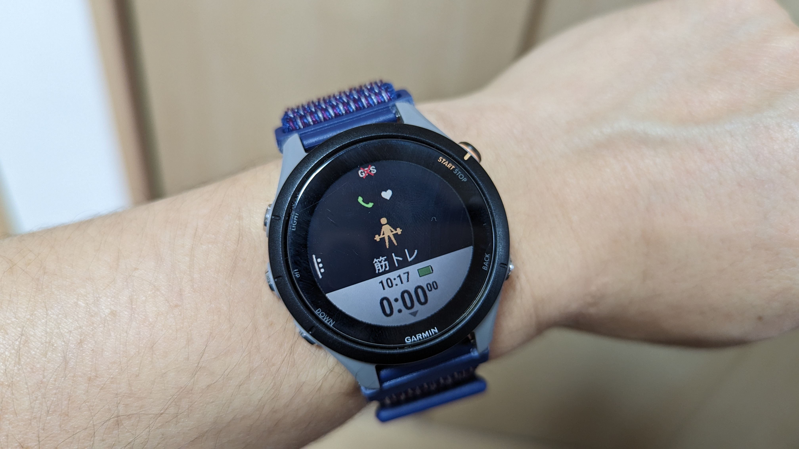
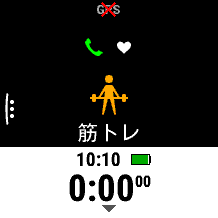
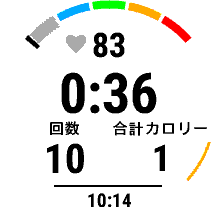
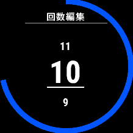
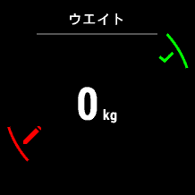
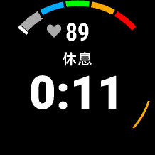

シクロクロスもオフシーズンになり、春夏はもっぱら体づくり。

ランニングをしたり、ジムで筋トレをしたりしているのだが、こういう局面でもGARMINウォッチ（[Forerunner 255S](https://amzn.to/3IMI0Ec)）が活躍してくれる。

機種名の通り、ランニングのログは「ランニングパワー」などの興味深いデータも含め取得してくれるのだが、今回はそれらはおいておき、**あまり注目されない「筋トレ」アクティビティ**のログ機能を紹介したい。

## 筋トレのログ

筋力トレーニングでログを取るなら、最低限の内容として…

- 種目
- 回数
- 重量

この3点は記録したい。

このログを意味あるものにするためには、REP数ごとの限界重量も把握しておく必要があるが、それはあとから分析することもできるので後回し。

## ガーミンウォッチでの筋トレログ取得方法

アクティビティのスタートについてはバイクやランとほぼ同じなのだが、**筋トレの「セット」「レスト」という概念**を記録するために、有酸素運動と違って細かくスマートウォッチを操作する必要がある。

まず、アクティビティ開始時は即1セット目がスタートする。

セット中は回数・心拍・経過時間・消費カロリーを表示。後述するがこの **「回数」は手首の動きから自動的にカウント** となる。

**Back/Lapボタンでレスト**に入るのだが、ここで終了したセットの情報を編集できる。

重量は1セット目は0kgだが、**2回目以降は前セットの重量を引き継ぐ**ため、ドロップセットを組んだりしない限りは種目が変わるまで編集は不要となる。

百の位は別項目扱いであることと、**長押しで5kgずつ上下**させられるため、腕メニューと脚メニューの間で大きく重量が変動する際もさして不便ではない。

レスト中は心拍と時間が表示されるので、これを参考にレスト時間を過ごす。

この時点で前セットの修正を忘れてしまったとしても、レスト中にバックボタン長押しで修正をすることができる。

**筋トレ全体を終えるときはStart/stopボタンをレスト中に押す**と見慣れた保存・削除画面に遷移する。

### 計測する項目

### 自動認識と手動補正

### ログから確認できる内容

## ライフログへの影響はあるか？
