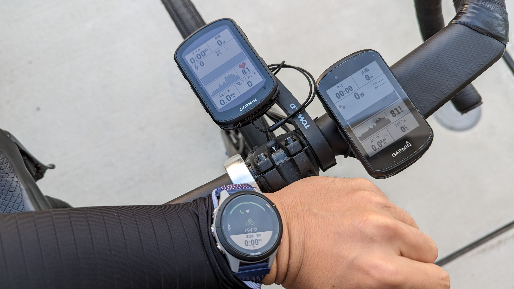
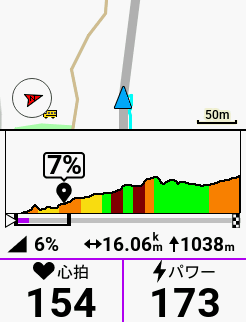
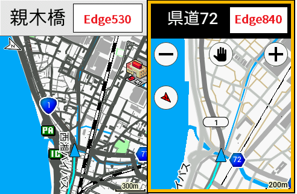
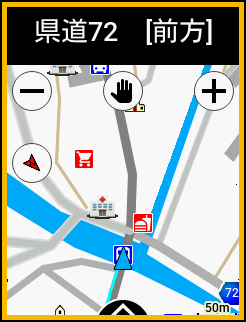
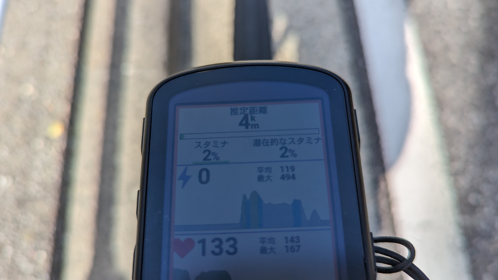
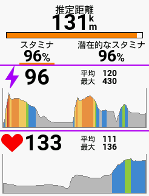
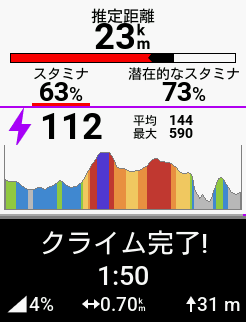
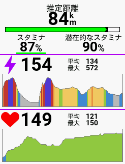

ガジェット好きとしては一大イベントであるGARMINのサイクルコンピューターの新製品発表。

厳密にはEdge1040で世代替わりしているものの、**メインストリームである8xx/5xx系の新型**とあって、例に漏れず自分もここが本番と買い替えることにした。

先行組のインプレを見ていると、どうやら**UIがタッチパネルと親和性が高い**ものになっているほか、高機能化により一覧できるデータが増えたことで直感的な操作のニーズが高まったようで、[Edge840 Solor](https://amzn.to/41WpSR9)を購入した。

ロングライダーではないので、ソーラー充電は特に必要ではなかったが、単体販売がないので仕方ない…

<LinkBox url="https://www.amazon.co.jp/dp/B0C1KCTHM8/" isAmazonLink />

**タッチパネル操作の滑らかさ**が前世代に比べて遥かに良くなっている点や、ソーラー充電の充電量、USB Type-C端子によるケーブルの使いまわしなど特筆すべきポイントは多々あるのだが、既に世の中には大量に情報が出回っているので、そのあたりは割愛する。

今回は、走行中の機能である「リアルタイムスタミナ」「リアルタイムClimbPro」「GNSSマルチバンド」のインプレッションがメインだ。

**オンロード平坦50km, 登坂とグラベルのアップダウンが40km**というコースで、下記の3台で同一ライドのログを取得し、ログや走行中の機能を確認していく。

手持ちのGARMINデバイス3台で同時に走行ログを取り、GARMIN CONNECTから確認できる情報を比較していく。

- [Edge530](https://amzn.to/41PalSZ)
- [Edge840 Solor](https://amzn.to/41WpSR9)
- [Forerunner 255S](https://amzn.to/3VmgaF2)（以下255S）

パワーメーターは同一のものをペアリング、心拍系は[255S](https://amzn.to/3VmgaF2)を使って心拍転送モードを活用して全デバイスで同じ心拍データを使っている。

…と言いたいところだが、詰めが甘く[Forerunner 255S](https://amzn.to/3VmgaF2)はパワーメーターとのペアリング設定を忘れ、[Edge840 Solor](https://amzn.to/41WpSR9)のみオートストップ有りと、若干条件を揃えきれなかった部分があった。

オートストップ有りのログは心拍・パワー共に若干上振れしているものが自然として比較を行う。

## GPS精度比較

3台のデバイスで同じタイミングでスタートストップをかけたログの概要がこちら。

**距離は0.75%**(255S/530)ほど、**獲得標高は3%**(255S/840)ほどの誤差が出た。オートストップ有りにもかかわらず、[Edge840 Solor](https://amzn.to/41WpSR9)の計測距離がEdge530（オートストップ無し）の計測距離とほぼ誤差が無い点に注目。

**総上昇量については、気圧計を用いて計測されている影響もあってか、個体差が大きかった。**とはいえ1300mほど登って最大40mほどの差なので、エベレスティングのような獲得標高バトルをしない限りは無視できる値。センサーの差なのか、算出ロジックの差なのかは不明。

距離と獲得標高については**オートストップの有無に拘わらずEdgeシリーズでは一貫性のある値**を示しているように、この比較からは読める。

平均心拍数がおかしく見えるが、[255S](https://amzn.to/3VmgaF2)はオートストップ無しとしつつ、設定確認のため休憩中にログを停止しており20分計測がストップしている点から若干高めに出ていると思われる。走行し始めてから計測が始まる[Edge840 Solor](https://amzn.to/41WpSR9)の平均心拍が高いのは想定通り。

平均パワーも[Edge840 Solor](https://amzn.to/41WpSR9)がオートストップ分高めに出ている。

### トラッキング精度

次に、GPSトラッキングの軌跡が地図情報とどれくらい差がでているか確認してみる。

今回のテストデバイスでは、[Edge530](https://amzn.to/41PalSZ)が「GPS + GLONASS」、[255S](https://amzn.to/3VmgaF2)と[Edge840 Solor](https://amzn.to/41WpSR9)が「マルチバンドGNSS」に対応しており、**後者がより精度において優れている**と宣伝されている。

さて、実際のところどれくらいの差があるのだろうか…差が出やすいであろう、峠（椿ライン）のワインディングエリアでそれぞれのログを確認してみる。

マルチバンドGNSSが**非常に若干ではあるものの、道路の形を正確にとらえた軌跡**を計測しているように見える（特に**画面中央、右端の2か所**）

Edge530以外の**マルチバンドGNSS対応の2台ではほぼ同じ軌跡を描いている**ことから、偶然ではないと思われる。しかし、期待したほど劇的に精度が良くなっているかというとそんな感覚もない。

オンロードではそこまで気にならないが、トレイルの分かれ道でどちらに向かうか…という時に精度が効いてくるのだが、迷わずビタビタのナビをしてくれるとは行かなさそうだ。（そもそも地図と座標のズレが出ているかもしれないし）

## リアルタイムClimbPro

Edge x30シリーズで搭載されたClimbProは、これまで事前のコースナビゲーションが必要だったが、x40シリーズからは自動的に登りセクションを検知して発動するようになっている。また、**検出閾値も設定できる**ので、ちょっとした登りでは出てこないようにすることも可能。

等高線から算出する点は変わっていないようで、トンネル部分はとんでもない斜度になる。**心の準備にはなるが、オマケ程度である**点は変わっていないようだ。

## 地図表示

Edge530と比較して、840のマップはかなり**見た目がすっきりした**。一方で、**施設情報が煩雑であったり、デフォルトの縮尺が細かすぎる**などの課題があるので、ここはアクティビティプロフィールから基本設定をいじっておきたい。

なお、表示方法が変わっただけで**データソースはこれまでに引き続きMapple（昭文社）**なので、地図データ誤差問題などは解決していないと思われる。（未確認）

タッチパネルで**拡大縮小がスマホに近い感覚でサクサク変更できる**点が非常に良い。これまでのGARMINのタッチパネルとはかなり出来が違う。

マップも含め、確認可能なデータが増えてきたので、タッチパネルのメリットは大きそうだ。

## リアルタイムスタミナ

自分が期待していた新機能がこのリアルタイムスタミナ。

この日は休息が不足しており、BodyBatteryが50ほどからスタートしたこともあって最初から走行可能距離が短い…

前評判通り、エンデュランス領域では潜在的スタミナ（総体力）とスタミナ（短期的体力）が減っていき、パワーが上がると総走行距離とスタミナが出力に応じて変化するようだ

格ゲーをやった人はわかると思うが、**2段階体力ゲージのようなもの**を想像してもらえばいい。

ちなみに、**潜在的スタミナによる走行可能距離は走行中回復しない**。回復させるには停止して休む必要がある。

**スタミナが0になった後もオールアウトしているというわけはなく**、走行は可能なので、「スタミナによる距離＝快適に走行出来る距離」と捉えた方がよさそうだ。

短期的なペースアップがどれくらい持久力に影響しているかわかるという点では面白い指標になりえるが、活用法は一考の余地がありそうだ。

## まとめ

Edge X30シリーズに比較して、ソフトウェア面で面白いことができるようになってきたというワクワク感が強い。

GARMIN製品特有のバグも多いが、**起動時やホーム画面にスマートウォッチと同じようなステータスが表示**されたり、**タッチパネルの専用UIを作りつつも物理ボタンを残し**たりと、長年アスリート向けの製品を作っていただけのノウハウは投入されているように思える。

リアルタイムスタミナと合わせて押されているパワーガイドについては今回利用しなかったが、コースを事前に設定するライドでどういったものか見ていきたい。

<LinkBox url="https://www.amazon.co.jp/dp/B0C1KCTHM8/" isAmazonLink />
