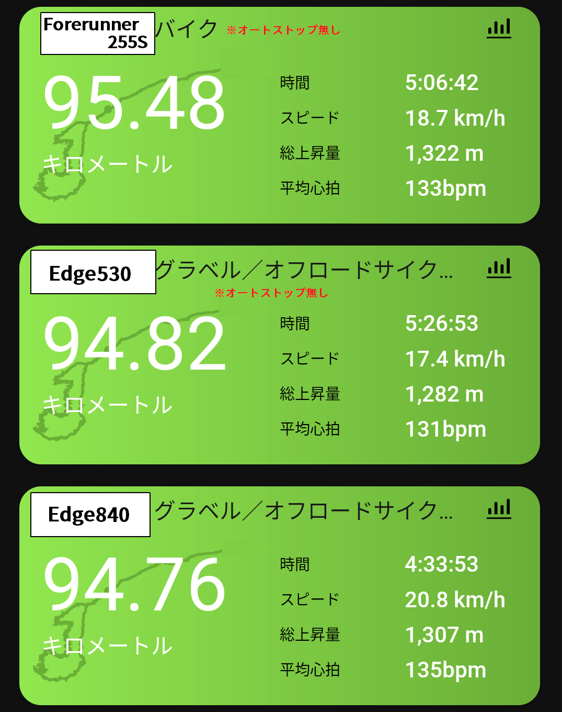
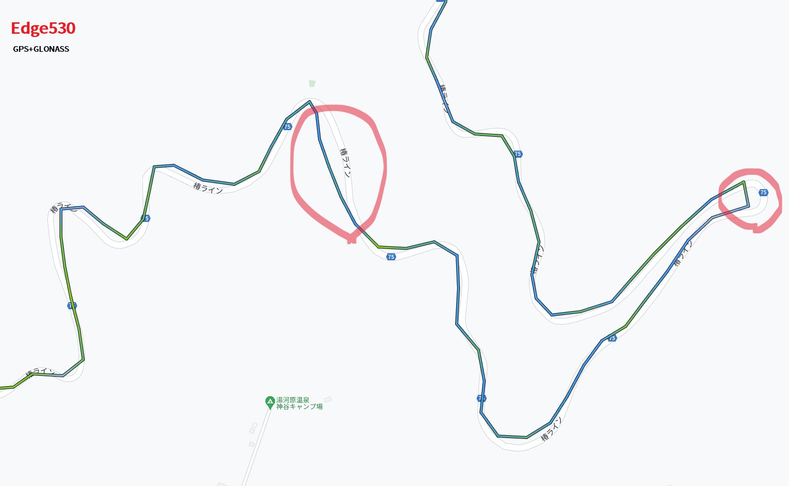
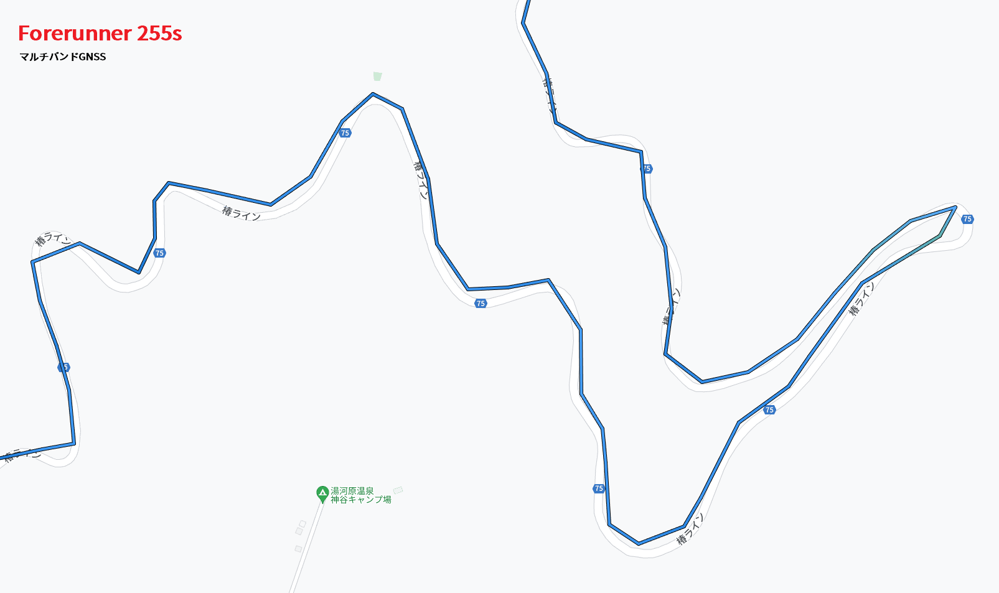

ガジェット好きとしては一大イベントであるGARMINのサイクルコンピューターの新製品発表。

厳密にはEdge1040で世代替わりしているものの、**メインストリームである8xx/5xx系の新型**とあって、例に漏れず自分もここが本番と

先行組のインプレを見ていると、どうやら**UIがタッチパネルと親和性が高い**ものになっているほか、高機能化により一覧できるデータが増えたことで直感的な操作のニーズが高まったようで、[Edge840 Solor](https://amzn.to/41WpSR9)を購入した。

ロングライダーではないので、ソーラー充電は特に必要ではなかったが単体販売がないので仕方ない…

<LinkBox url="https://www.amazon.co.jp/dp/B0C1KCTHM8/" isAmazonLink />

タッチパネルの滑らかさが前世代に比べて遥かに良くなっている点や、ソーラー充電の充電量、USB Type-C端子によるケーブルの使いまわしなど特筆すべきポイントは多々あるのだが、既に世の中には大量に情報が出回っているので、そのあたりは割愛する。

今回は、走行中の機能である「リアルタイムスタミナ」「リアルタイムClimbPro」「GNSSマルチバンド」のライドへの影響を見てみる。

**オンロード平坦50km, 登坂とグラベルのアップダウンが40km**というコースで、下記の3台で同一ライドのログを取得し、ログや走行中の機能を確認していく。

- [Edge530](https://amzn.to/41PalSZ)
- [Edge840 Solor](https://amzn.to/41WpSR9)
- [Forerunner 255S](https://amzn.to/3VmgaF2)（以下255S）

パワーメーターは同一のものをペアリング、心拍系は[255S](https://amzn.to/3VmgaF2)を使って心拍転送モードを活用して全デバイスで同じ心拍データを使っている。

…と言いたいところだが、詰めが甘く[Forerunner 255S](https://amzn.to/3VmgaF2)はパワーメーターとのペアリング設定を忘れ、[Edge840 Solor](https://amzn.to/41WpSR9)(https://amzn.to/41PalSZ)のみオートストップ有りと、若干条件を揃えきれなかった部分があった。

オートストップ有りのログは心拍・パワー共に若干上振れしているものと思われる。

## GPS精度比較

3台のデバイスで同じタイミングでスタートストップをかけたログの概要がこちら。

**距離は0.75%**(255S/530)ほど、**獲得標高は3%**(255S/840)ほどの誤差が出た。オートストップ有りにもかかわらず、[Edge840 Solor](https://amzn.to/41WpSR9)の計測距離がEdge530（オートストップ無し）の計測距離とほぼ誤差が無い点に注目。

**総上昇量については、気圧計を用いて計測されている影響もあってか、個体差が大きかった。**とはいえ1300mほど登って最大40mほどの差なので、エベレスティングのような獲得標高バトルをしない限りは無視できる値。センサーの差なのか、算出ロジックの差なのかは不明。

距離と獲得標高については**オートストップの有無に拘わらずEdgeシリーズでは一貫性のある値**を示しているように、この比較からは読める。

平均心拍数がおかしく見えるが、[255S](https://amzn.to/3VmgaF2)はオートストップ無しとしつつ、設定確認のため休憩中にログを停止しており20分計測がストップしている点から若干高めに出ていると思われる。走行し始めてから計測が始まる[Edge840 Solor](https://amzn.to/41WpSR9)の平均心拍が高いのは想定通り。

平均パワーも[Edge840 Solor](https://amzn.to/41WpSR9)がオートストップ分高めに出ている。

### トラッキング精度

次に、GPSトラッキングの軌跡が地図情報とどれくらい差がでているか確認してみる。

今回のテストデバイスでは、[Edge530](https://amzn.to/41PalSZ)が「GPS + GLONASS」、[255S](https://amzn.to/3VmgaF2)と[Edge840 Solor](https://amzn.to/41WpSR9)が「マルチバンドGNSS」に対応しており、**後者がより精度において優れている**と宣伝されている。

さて、実体はどうなのだろうか…差が出やすいであろう、峠（椿ライン）のワインディングエリアでそれぞれのログを確認してみる。

マルチバンドGNSSが**非常に若干ではあるものの、道路の形を正確にとらえた軌跡**を計測しているように見える（特に**画面中央、右端の2か所**）

Edge530以外の**マルチバンドGNSS対応の2台ではほぼ同じ軌跡を描いている**ことから、偶然ではないと思われる。しかし、期待したほど劇的に精度が良くなっているかというとそんな感覚もない。

オンロードではそこまで気にならないが、トレイルの分かれ道でどちらに向かうか…という時に精度が効いてくるのだが、迷わずビタビタのナビをしてくれるとは行かなさそうだ。（そもそも地図と座標のズレが出ているかもしれないし）

## リアルタイムClimbPro

## 地図表示

## リアルタイムスタミナ
