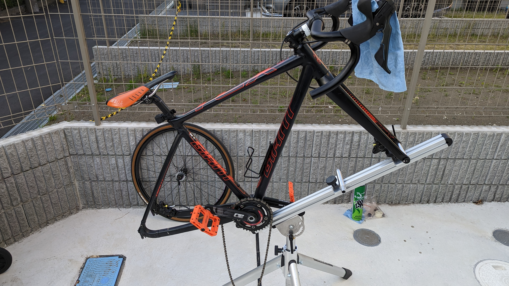
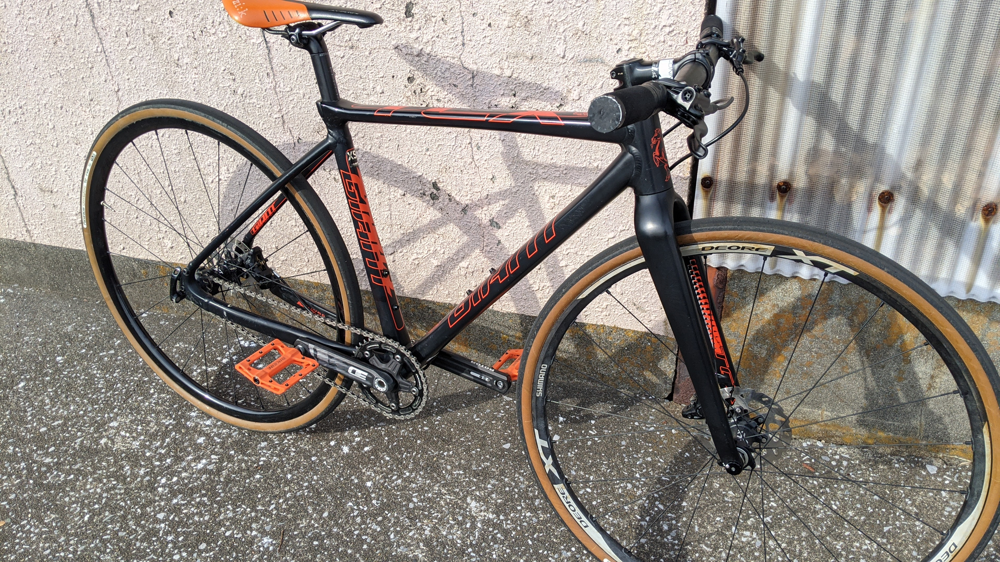
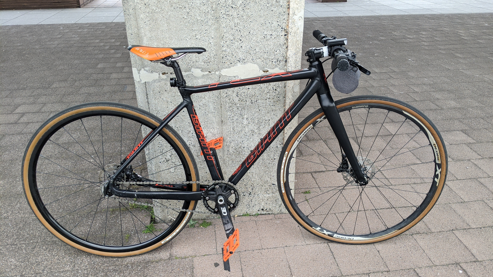
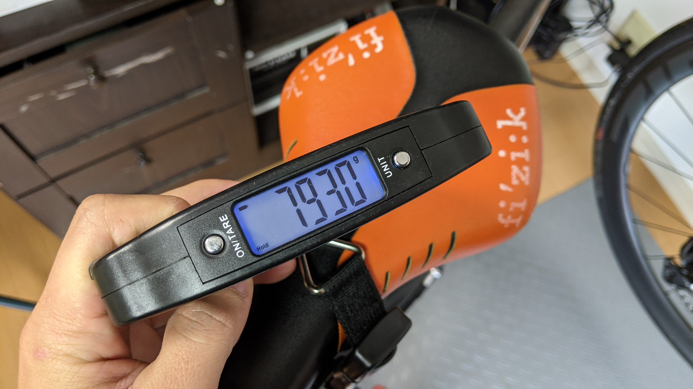
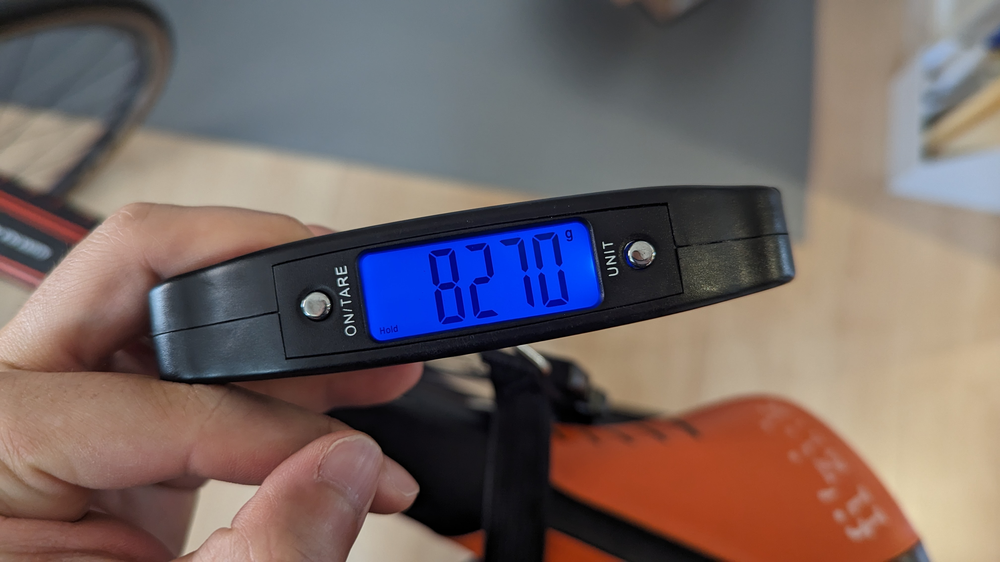

ロードバイクやシクロクロスのような競技用フレームをフラットバーで組み直すと、**重量も走りも異様に軽快な街乗りクロスバイクが出来上がる。**

TCXSSをレースで使わないようになってから、街乗り用に組み直したところ、なんなら手持ちの自転車で最も軽い時期もあるくらいだった。

しかし、3年間使い倒すうちに**「そもそもフラットバーは街乗りに向いていないのでは？」**と思えてきたので、シチュエーションごとの困りごとや、メリットをまとめてみた。

## TL;DR

駐輪事情を勘案すると、ドロップバーのほうが町中で取り回しよく使える。（立てかけ駐輪・機械式駐輪場）

コスト・軽量化の面ではフラットバーの方が有利で、気持ちよく走ることを重視するのならフラットバーも楽しいが、**街乗りバイクにはもっと別に求めるもの**がある。

### 街乗りフラットバー

<PositiveBox>

- パーツが安い（経済性）
- 車重が軽い（軽量性）
- 上体が起きる（ポジション）

</PositiveBox>

<NegativeBox>

- パーツ互換性が怪しくなる
- 駐輪時に扱いづらい（取り回し）
- 幅を取る（取り回し）

</NegativeBox>

### 街乗りドロップハンドル

<PositiveBox>

- ロードバイクのおさがりパーツを使える
- 駐輪場で扱いやすい
- 道路で幅を取らない

</PositiveBox>

<NegativeBox>

- パーツが高い
- 車重が重い
- 常に前傾

</NegativeBox>

## 街乗りにおけるフラットバーとドロップバーの比較

今回の記事のターゲットは**「余ったフレームやバイクを街乗りに転用したい」という層**。

新たに街乗り用自転車を購入するなら好きにすればいいというか、**クロスバイクを買った方が遥かに安上りかつ簡単。**それでも手元に自転車があったらそれを活用したくなるのが人の性。

可能な限りノーメンテで使い倒したい街乗りバイクの要件や、自分の経験を元にしていることもあって**油圧ディスクブレーキを前提**に考えていくが、リムブレーキでもほぼ同様のことが言えるだろう。

## 取り回し

街乗りなので、走るだけではなくカフェや買い物・通勤通学のために駐輪は必須だ。

スタンドを装備できる自転車であれば、考慮が要らないと思いがちだが、駅前や商業施設にあるような**前輪ロックの駐輪場ではスタンドの有無は関係ない**。

近年のフラットバーは、街乗り用でも50cm幅ほど、MTB用なら70cmを越えるなど**ドロップハンドルに比べてかなり幅広。**

駐輪場ではとなりのママチャリに引っかかって出し入れが大変になる。対して**ドロップハンドルは横方向への突起がなく、幅も40cm前後と圧倒的にコンパクト。**密集する駐輪場では取り回しに大きな差が出る。

また、車輪を固定しない駐輪場の場合、スタンドが無ければ壁や柵に立てかけるしかないのが現状だが、**ドロップハンドルは複数点で壁に接壁?させることができ**安定しやすい。

フラットバーではサドルとハンドルで2か所接壁させることは可能だが、壁の形次第で不安定になる上、**ハンドルの先端は堅いバーエンドという**ことが多く、壁の素材次第ではそもそも気が引けることもある。

STIとドロップハンドルはバーテープとSTIカバーゴムで接壁できるため、壁に優しい。

**サドル引っ掛け型スタンドでもハンドル幅の影響は大き**く、隣に気を遣うので、自分は**駐輪が面倒で街乗り用バイクをドロップハンドルに戻した。**

### ハンドル切れ角の課題

しかも、フレームの形状によっては、**ハンドルを切った際に先端がトップチューブを直撃する**という問題もある。（ハンドル先端だったり、ブレーキレバーだったりする）

MTBなんかは傷だらけになっても（金属フレームなら）「仕方ない」で済むが、オンロード系のフレームでは強度も控えめになっている可能性が高く、気を付けないといけない。

## 経済性

**経済性については、フラットバーに優位性**がある。**パーツコストが安い**というメリットが大きい。

**ロード用油圧STIは片側で2万円前後**することは確定だが、**フラットバー用の油圧ブレーキレバーは、4000円もあればお釣りがくる。**

<LinkBox url="https://store.shopping.yahoo.co.jp/qbei/pi-633751.html" linkurl="https://ck.jp.ap.valuecommerce.com/servlet/referral?sid=3171302&pid=887657037&vc_url=https%3A%2F%2Fstore.shopping.yahoo.co.jp%2Fqbei%2Fpi-633751.html" />

リムブレーキをはじめとするワイヤー引きのブレーキレバーではコスト差は小さくなるかもしれないが、この傾向は不変。

MTBは既に油圧ブレーキが廉価帯にまで普及していることもあり、ブレーキレバー単体で製造できる分構造が単純なこともあってか、下を見ればもっと安いパーツもある。

[最低グレードだと3フィンガーブレーキ](https://store.shopping.yahoo.co.jp/qbei/pi-633755.html)だが、流石に指3本だとトレイルMTBと感覚が変わりすぎるということもあり、[2フィンガーブレーキのDeoreグレード](https://store.shopping.yahoo.co.jp/qbei/pi-633751.html)を選んでいる。

### ロード用油圧STIとMTBブレーキキャリパー

幸いというべきか、TCX SSは時代の過渡期の規格を持ったフレームで、MTBブレーキがそのまま使える**ポストマウントで、ローター最小径は140mm**という仕様。

MTBブレーキとロード油圧レバーの互換性は、過去の記事で触れている。

<LinkBox url="https://blog.gensobunya.net/post/2016/08/st-r785mtbcx/" />

最新のR9200, R8100, R7100はそれまでのブレーキと互換性が無いので使えないが、**BR-RS785を軸にして互換表を見る**とXT同一品疑惑のあるBR-R785がロードレバーで引けるように見える。

ブレーキキャリパーに合わせたホースを自己責任で組付けることで、ロード油圧レバーとMTBキャリパーが組み合わせられるのではないかという推測が立ち、実際に運用してきた実績がある。

繰り返すが真似する際は自己責任。

## 軽量性

フラットバーの方がかなり軽い。しかも安いので**重量当たりコストもフラットバーの圧勝**。

機械式油圧105のSTI（ST-R7020）で組んだ際は、ハンドル・レバーしか変わらないにも関わらず**300gもの重量増になる。**

しかも全てハンドルの先という先端部重量が増えるため、主観的な軽快さはかなり失われる。

**ドロップハンドルに装着できる油圧ブレーキレバー（単機能）**があればいいのだが、ニッチすぎてほぼラインナップが無い。

<LinkBox url="https://trpcycling.jp/hylex.html" />

TRPから**Hylexというブレーキレバーがラインナップされている**ものの（昔使っていたが）、長年モデルチェンジもなく、今となっては過渡期の産物という風情が漂っている。

## まとめ

フラットバーで組むと、**コストは安く、重量は低く**一見して軽快で素晴らしい自転車が組みあがるように思える。

世間のクロスバイクも当然ドロップハンドルではなく、フラットバーでもあり、**街乗りはフラットバーという先入観**があるかもしれないが、実際に街乗りで**必要なのはどこでも気軽に駐輪できる**こと。

この点で考えると、**車体自体がコンパクトなドロップハンドル車には大きなメリット**がある。

盗難の危険性なども考慮する必要があるかもしれないが、駐輪で壁やガラスにキズを付ける可能性も比較的低く、**安いロードバイクを街乗りに使うのも一定の合理性があるのだと気付かされた**。

<LinkBox url="https://store.shopping.yahoo.co.jp/qbei/tni-057388.html" linkurl="https://ck.jp.ap.valuecommerce.com/servlet/referral?sid=3171302&pid=887657037&vc_url=https%3A%2F%2Fstore.shopping.yahoo.co.jp%2Fqbei%2Ftni-057388.html" />
