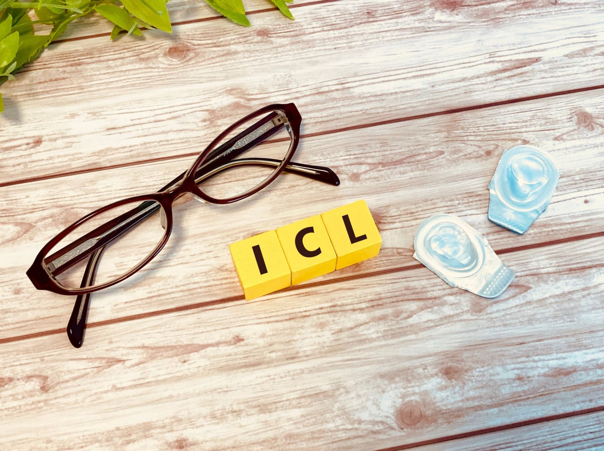
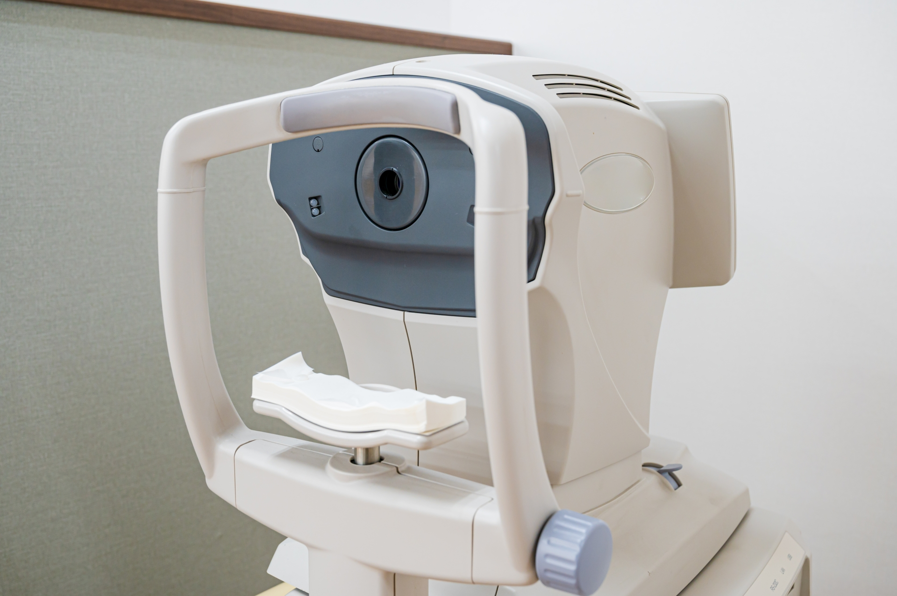

レーシックやICL(IOL)手術は日本でも認知度が上がっており、もはや近視の人では知らない人はいないかと思う。

自分の体を生業とするスポーツ選手でもレーシックをする人が増えてきたりと、体感ではあるが信頼度も向上してきたように見える。何よりもうウン万人も手術して根本的に問題があったら既に大問題になっているだろう。

とはいえ、眼にメス（実際にはレーザーだが）を入れて切開したり、運動制限や術後管理も必要になるので不安になる人も多いだろう。

（一応）ホビーレーサーのサイクリストである自分が、ICL手術を受けて高強度運動解禁になるまでの期間の計画やレポートをメモ形式で残しておく。

**基本的に検査数値の記録や、行動制限とそれに関する計画をメイン**に全2回の記事になる予定。安全性などの統計処理や正しいサンプリングが必要な点には述べないので、**あくまでn=1の話**として受け止めてもらいたい。

## 経緯

ICL手術の費用は医療費控除の対象になると知ったことがきっかけ。

レーシックが気になっていた時期もあり、ICLは費用が掛かる代わりに**可逆的なアプローチ**で将来的な眼の病気にも対応できる他、**夜間の視力問題も出にくい**ということは知っていた。

いつも使っている[2weekコンタクトレンズの費用](https://store.shopping.yahoo.co.jp/y-kojima/2915120002835.html)が両眼3カ月で5000円。1年で2万円、40年で80万円…

**既に手術費用より高い**。実際はケア用品や短期旅行用の1day、眼鏡更新などもあるのでもっとかかる。

それならば、一時の不便や出費があっても**毎日や遠征時の面倒が減らせる上に節税もできるほうがよいのでは…**という結論に至った。

矯正の手間は、こうした矯正具の購入だけでなく、**泊りの際に必ずケアセットを持ち歩かなければならない**という点が大きい。

<LinkBox url="https://www.amazon.co.jp/dp/B01H1DBZ8Y/" isAmazonLink />

出張や遠征先・旅行先でコンビニに駆け込み[サクラプチケア](https://amzn.to/3oVnrzW)を慌てて買ったのは一度や二度ではない。コンタクトレンズが無かったら最低限の生活もできないのだ。

レースや出張もそれなりにある生活をしているので、こうした日々の悩み事が減るというのは非常に助かる。

## 計画

## 適性検査、そして

## 適性検査その2

## 術前の過ごし方
