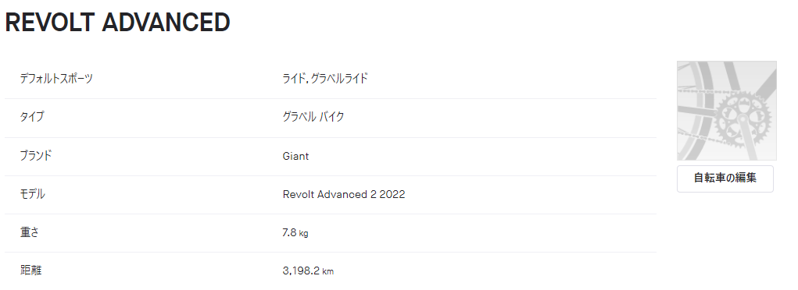
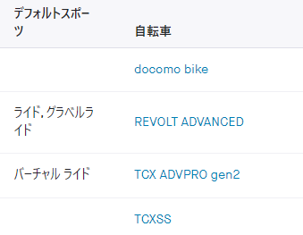
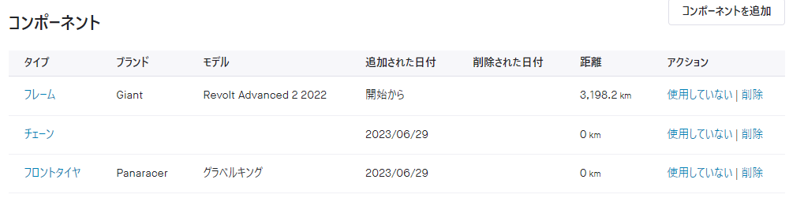

日常的に複数台の自転車を同時に運用している際、どのライドでどのバイクを使ったのか修正するのが面倒ではないだろうか。通勤にはロード、週末のCXレースはシクロクロスバイク、ゲレンデに行くときはMTB…

Stravaの古参ユーザーはデフォルトバイクがまず設定されるので、最も利用頻度の高いバイク以外はログをアップロードした後にポチポチ修正していたのではないだろうか。

## ようやくやってきたスポーツタイプごとのデフォルトギア設定

何年もStravaを使っていた自分も例外ではなく、**ログ確認時に使用バイクの修正をすることがルーチン化**していたが、2023/5のアップデートで、**スポーツタイプごとにデフォルトのギアを選択**できるようになった。

<LinkBox url="https://www.strava.com/clubs/488573/posts/24252550" />

> 自転車とシューズでデフォルト設定が可能なスポーツタイプは、下記をご覧ください。  
🚲自転車ギア: ライド、e-Bikeライド、バーチャルライド、ハンドサイクル、ベロモービルライド、MTBライド、グラベル ライド、e-MTBライド  
👟シューズギア: ランニング、ハイキング、ウォーキング、バーチャルラン、トレイルランニング

これによってグラベルライドはグラベルバイク、ロードライドはロードバイクを自動的に使用バイクへ設定できるようになった。

### Myギアとは

Myギアを使っていない人もいるかもしれないので一応解説。

一言で言うと、自分の自転車やシューズを登録して**アクティビティログと関連付けることでギアごとの利用距離を算出する**ための機能。

これまでは、ランニング・サイクリングといったざっくりとした範囲でしか自動で関連付けが行われず、複数ギアを所持している場合は"デフォルトギア"を設定しておくことで優先的に1つのギアが関連付けられるようになっていた。なお、GARMIN CONNECTも類似の機能がある。

## Zwift, グラベル, ロード, MTBが区別できるように

一覧の都合上PCサイトのスクリーンショットを貼っているが、設定自体はモバイルアプリから可能。

今の自分の自転車リストでは、ロードライドとグラベルライドをRevolt Advancedに、バーチャルライドをTCX Advanced Proに設定できた。ロードバイクがある人は**ライドにロードバイク**を、**MTBライドにMTB**を登録もできる。

早いところシクロクロスのライドタイプにも対応してほしい…と言いたいが、そもそも**Stravaにはアクティビティタイプとしてのシクロクロスが存在しなかった**。辛い。

## チェーンやタイヤの消耗管理に

今回のように自動で利用距離を追えるようになったことで、**ギアごとのコンポーネント記録**が俄然使いやすくなった。

元から存在はしていたものの、複数台運用では不断の努力でログを綺麗にしておく必要があり、使う気の起きない機能だったが今回で事情が変わった。

**チェーンやブレーキパッド・ローターといった利用距離に応じて消耗するパーツ**を登録しておくことで、何km走ったか管理でき、交換タイミングを知っておくことができる。**一番使いたいのはタイヤごとの走行距離だが、複数ホイール運用をうまく扱えない**のが玉に瑕。

ちなみに、**後から過去日スタートで利用ギアを追加しても今日までの積算を算出**してくれるので、消耗品交換した日をTwilogなどで思い出せれば後付けも可能。
