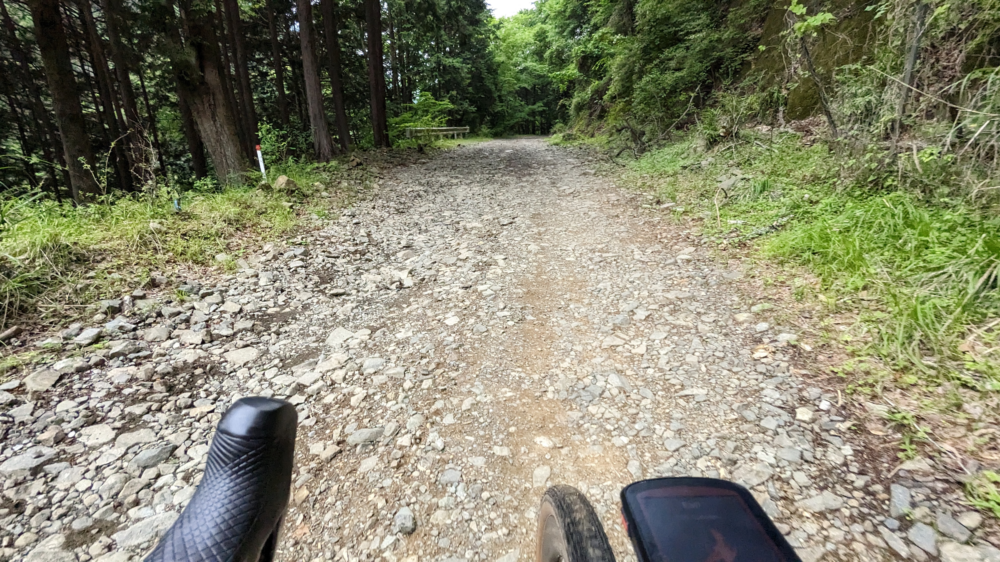

現在住んでいる神奈川県は、東京通勤用ベッドタウン兼、県央や西部は流通・工業地帯として利用されており、**丘陵地はもちろんのこと里山もほとんど住宅として開発されつくしている**。

農道や林道もかなりの路線が整備されており、一般車両で進入が可能な林道は希少。

そんな中で、登山路の近くということもあって未舗装のまま残されている数少ない林道である戸川林道にグラベルロードで向かった。

## 希少な神奈川の未舗装路　戸川林道

<iframe src="https://www.google.com/maps/embed?pb=!1m17!1m12!1m3!1d1625.9530233816618!2d139.16821647129603!3d35.40757929747049!2m3!1f0!2f0!3f0!3m2!1i1024!2i768!4f13.1!3m2!1m1!2zMzXCsDI0JzI3LjMiTiAxMznCsDEwJzA4LjMiRQ!5e0!3m2!1sja!2sjp!4v1685523740400!5m2!1sja!2sjp" width="600" height="450" style="border:0;" allowfullscreen="" loading="lazy" referrerpolicy="no-referrer-when-downgrade"></iframe>

入口は秦野市の中心部を流れる水無川上流、秦野戸川公園の更に奥にある。水無川沿いに進んでいってもいいが、そのまま進んでいくと公園内に入ってしまう。**公園内は自転車走行禁止**なので注意。

尾根を抜けたり、反対側に降りられるというコースではなく登山口の**駐車場まで行って行き止まりのピストンコース**となる。

中盤もゴールも駐車場があるので、自動車やツーリングに来たバイクも多いので、注意。

### 走行感

路面は全体的に荒め。

砕石で水はけを良くしているので、**石が尖り気味**であることに加え、全面が平らという個所は少なく、**登りでも走りやすいラインを選んでいくことになる。**

車やエンジン付きバイクも多数通る道でありながら、左端キープは望むべくもないので**対向車の音には常に気を配りたい。**

コースの一部は水の流れ道になっている、いわゆる洗い越しの個所も数か所ある。

**知名度やオープンさに反して、走行難易度は高め**だ。一方で、**斜度は10%未満の区間がほとんど**なので、その意味であまりハードではないともいえる。

## 丹沢山系の注意点

丹沢山系はマダニ・ヤマビルの生息地であり、初夏から気温が下がる晩秋

- ヤマビルには気をつけろ
- 周辺スポット
  - 四十八瀬川グラベル
  - 大井松田IC周辺のグルメ
