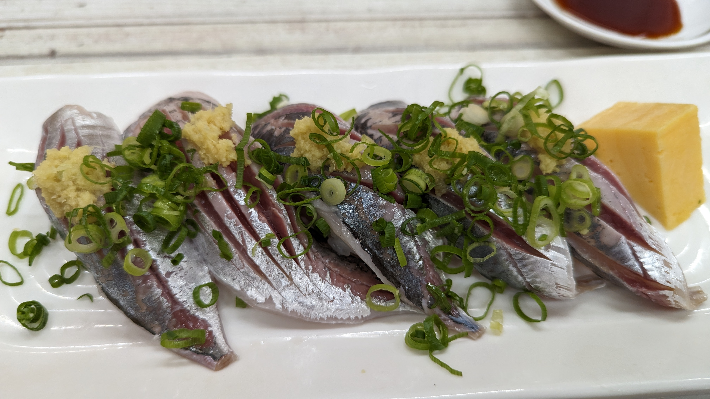

現在住んでいる神奈川県は、東京通勤用ベッドタウン兼、県央や西部は流通・工業地帯として利用されており、**丘陵地はもちろんのこと里山もほとんど住宅として開発されつくしている**。

農道や林道もかなりの路線が整備されており、一般車両で進入が可能な林道は希少。

そんな中で、登山路の近くということもあって未舗装のまま残されている数少ない林道である戸川林道にグラベルロードで向かった。

## 希少な神奈川の未舗装路　戸川林道

<iframe src="https://www.google.com/maps/embed?pb=!1m17!1m12!1m3!1d1625.9530233816618!2d139.16821647129603!3d35.40757929747049!2m3!1f0!2f0!3f0!3m2!1i1024!2i768!4f13.1!3m2!1m1!2zMzXCsDI0JzI3LjMiTiAxMznCsDEwJzA4LjMiRQ!5e0!3m2!1sja!2sjp!4v1685523740400!5m2!1sja!2sjp" width="600" height="450" style="border:0;" allowfullscreen="" loading="lazy" referrerpolicy="no-referrer-when-downgrade"></iframe>

入口は秦野市の中心部を流れる水無川上流、秦野戸川公園の更に奥にある。水無川沿いに進んでいってもいいが、そのまま進んでいくと公園内に入ってしまう。**公園内は自転車走行禁止**なので注意。

尾根を抜けたり、反対側に降りられるというコースではなく登山口の**駐車場まで行って行き止まりのピストンコース**となる。

中盤もゴールも駐車場があるので、自動車やツーリングに来たバイクも多いので、注意。

### 走行感

路面は全体的に荒め。

砕石で水はけを良くしているので、**石が尖り気味**であることに加え、全面が平らという個所は少なく、**登りでも走りやすいラインを選んでいくことになる。**

車やエンジン付きバイクも多数通る道でありながら、左端キープは望むべくもないので**対向車の音には常に気を配りたい。**

コースの一部は水の流れ道になっている、いわゆる洗い越しの個所も数か所ある。

**知名度やオープンさに反して、走行難易度は高め**だ。

一方で、**斜度は10%未満の区間がほとんど**なので、その意味であまりハードではないともいえる。

## 丹沢山系の注意点

丹沢山系はマダニ・ヤマビルの生息地であり、特に**戸川林道を含めた東部では、初夏から気温が下がる晩秋にかけてヤマビルが出現する。**

<LinkBox url="https://www.pref.kanagawa.jp/docs/t4i/cnt/f986/p10106.html" />

> 吸血されます。
> 吸血の際に、吸血時の痛みをなくし、血液の凝固を妨げる「ヒルジン」という物質を出すため、本人は吸血されていることに気づかず、しかも吸血後傷跡からタラタラと出血が続きます。

**「止まらない」「地肌を出さない」「[忌避剤](https://amzn.to/3oLtYgv)を使う」**という対策が必要。

<LinkBox url="https://www.amazon.co.jp/dp/B00YB1V5N0/" isAmazonLink />

自分はというと、この日は**林道に差し掛かってからこのことを思い出した**ので、思いっきり脚を出したまま走行していた…

おかげで、一切止まることが許されず、終点で記念撮影をしてからそそくさとダウンヒルをすることに。

**コーヒーを出してくれる山小屋**的なところもあったので、寄ってみたかったのだが断念。

### バイクの汚れにも注意

降り切ったところで体を確認。

泥はついているものの、素肌にヤマビルは認められず、一安心して昼ご飯を食べて帰宅した。

その後、サンダルで自転車を洗い流し、シャワーを浴びようとしたところで**靴下の脚の甲に血のシミがある**ことに気がついた。

シューズの上から噛まれることは考えづらく、どうやら洗車の時に**ダウンチューブ裏にでもくっついていたやつに飛びついて吸血された**らしい。

傷口も小さかったので、かなり小さい個体だとは思うが40km近くへばりついたまま生きているというタフさに身震いした。家に帰っても気を抜かないことが必要。

## ライド後の癒し

降り切った後は、246沿いに帰ったり金目川沿いに平塚へ向かったりするのもよいが、そのまま大井松田IC方面にオンロードを下っていくことをおすすめしたい。

途中にある**四十八瀬川の周辺には未舗装路のダブルトラックがあり、おまけのコースとして楽しめる**他、**大井松田IC周辺は美味しい店が多く、昼飯や補給に最適**だ。

写真のアジ寿司は[丼万次郎](https://goo.gl/maps/JraWyqcyaX5Nb61o9)のもの。

道の駅足柄もグルメが充実しているし、開成町も[Cafe hacco](https://goo.gl/maps/nVVE4zQEp1JUUHc27)や[ナチュラルーチェ](https://goo.gl/maps/9NaQbUs6UL1Z4U7P9)を初めとした良いカフェが多いので、是非探してみてほしい。

お出かけの際は長袖インナーを忘れずに。

<LinkBox url="https://www.amazon.co.jp/gp/product/B0BRZXP9M3/" isAmazonLink />
