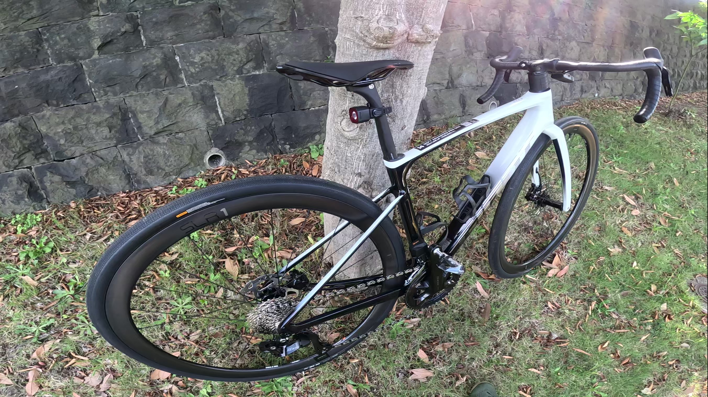
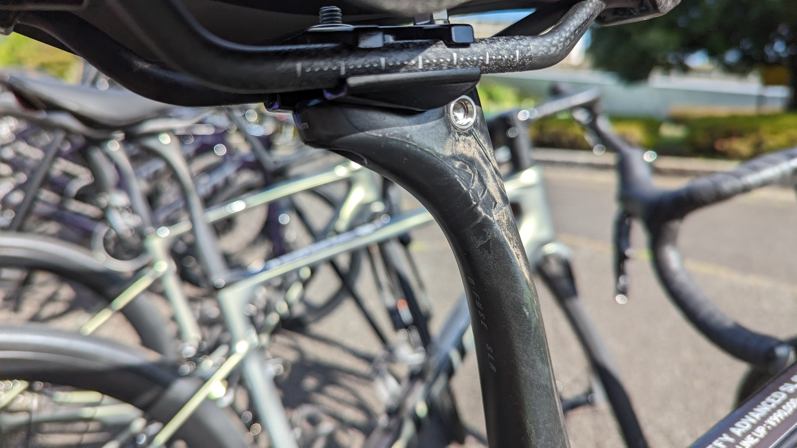
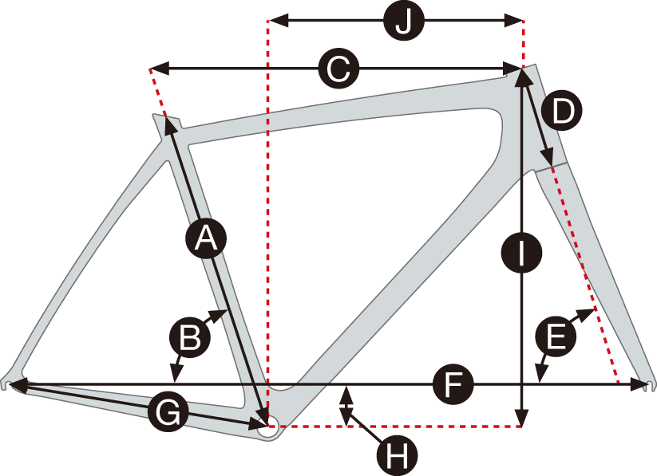
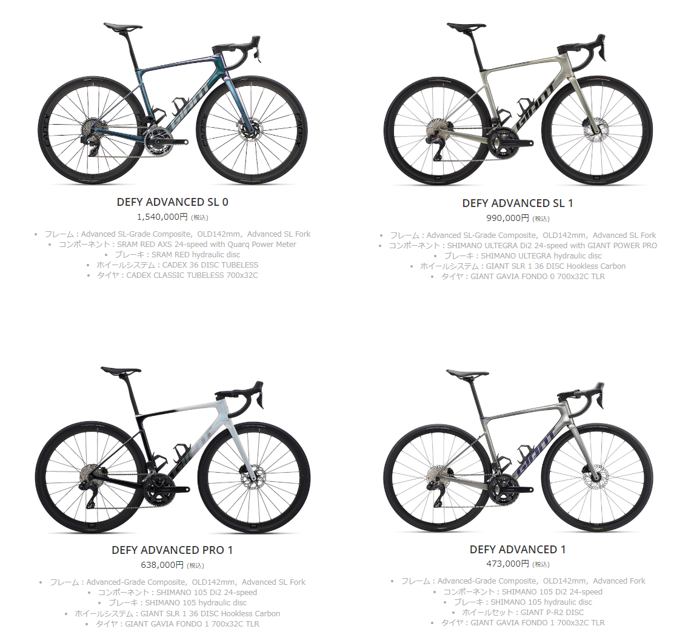

先週末は、稲城中央公園で行われたGIANTジャパンの「ハイエンドロードバイク試乗会」に参加した。

1台1500～2000円で40分間ほどの試乗時間が約束されており、GIANTのパフォーマンスロードバイクラインの**TCR, PROPEL, DEFYそれぞれで、ADVANCED SL/ADVANCED PROグレードの全サイズから選択**できるという、乗り比べとフィッティングの性質を兼ね備えた試乗会だ。

もちろん、ペダルは自分のものを持ち込みで利用できる。

<LinkBox url="https://www.giant.co.jp/news/event/9976" />

TCRは前世代を乗り込んでいたので、今回はPROPELとDEFYのADVANCED PROグレードを乗り比べた。

| **No.** | **試乗モデル**                              | **適応身長** | **ホイール・備考**           |
| :------ | :------------------------------------------ | :----------- | :--------------------------- |
| 8       | PROPEL ADVANCED PRO：FORCE ETAP（XSサイズ） | 155-170cm    | GIANT SLR 1 50 DISC HOOKLESS |
| 14      | DEFY ADVANCED PRO：105 Di2（XSサイズ）      | 155-170cm    | GIANT SLR 1 36 DISC HOOKLESS |

完成車と同じように、GIANTのフックレスホイールが装着されており、試乗表には記載されていないがPROPELは25cのCADEXタイヤ、DEFYは32cのGIANT製タイヤが装着されていた。

この記事では、今年の注目株である新型DEFYについてフォーカスしていく。

## 2024 GIANT DEFYシリーズ

2024年モデルでフルモデルチェンジしたエンデュランスロードのDEFY。モデルチェンジでは**軽量化と内装ケーブルシステム**にフォーカスされている。

> エンデュランスロード「ディファイ」がフルモデルチェンジ。前世代よりも軽量化したフレームとアドバンスドSLグレードのカーボンフォークがスムースなライドフィールを実現。フレア形状のハンドルと新型ステムによる内装ケーブルシステムが、クリーンな外観とメンテナンス性を両立。PRO 1はシマノ「105 Di2」電動12速コンポと軽量高剛性カーボンフックレスホイールシステム「SLR 1」を採用。

もちろん、太いタイヤに対応して38cまでのタイヤクリアランスを持っている。

### 普通のパーツでありながら快適性を向上

エンデュランスロードとして、より長い間サドルの上で過ごすことを追及しているが、DEFYは**他社のようにシートポストやヘッド周りに特殊な構造を入れずに、軽量性を手に入れている。**

それでいながら、快適性は新型DEFYに併せて開発されたD-Fuse SLRシートポストと、D型断面のハンドルによってしなりを与えることで付与している

D型シートポストはこれまでもGIANTのX-ROAD（シクロクロス・グラベル）を中心にクロスバイクでも採用されていたが、**DEFYのそれはこれまでのどれよりも薄くしなりやすい形状**となっている。もちろんその分軽量。

TCXやREVOLTには利用できず、新型DEFYシリーズ専用なのはちょっともったいない気もする。

ハンドルも同様にD型断面とすることで、上下方向のみに変形してそれ以外…つまりスプリントやダンシングの変形を抑えるというアプローチをとっている。

### ジオメトリ

エンデュランスロードといえばアップライトなポジションのためにヘッドチューブを長くすることが定石だったところを、**DEFYではヘッドチューブ長をレーシングロードであるTCRに近づけている**

2024モデルではMサイズ以上でさらにTCRにヘッドチューブ長が近づき、TCRとDEFYで同様のポジションを作りやすくなった。

| SIZE (mm) | 2024 DEFY(D)(mm) | TCR(D)(mm) | 2023 DEFY(D)(mm) | 適応身長 (cm) |
| :-------: | :--------------: | ---------- | ---------------- | :-----------: |
|    XS     |       120        | 120        | 120              |   155〜170    |
|     S     |       140        | 130        | 140              |   165〜175    |
|     M     |       150        | 145        | 160              |   170〜185    |
|    ML     |       175        | 165        | 185              |   180〜190    |

乗り込んでいるユーザーほど前傾姿勢は深くなるもの。エアロロードのスーパーバイク化が進む中、中上級者でもDEFYを選ぶにあたって移行障壁を下げているように見えなくもない。

### DEFYの立ち位置

私と同年代で同程度の経験を持つサイクリストなら、**最初のロードバイクがアルミのDEFYだったという人も少なくない**のではないだろうか。

今はアルミフレームのモデルはなくなってしまっているが、当時は最も安価なクラスのロードバイクとして、エントリー機の役割を担っていた印象が強い。

ダボ穴装備でキャリアに荷物を積んだツーリングができたり、ロングアーチのキャリパーブレーキで太いタイヤに対応していたり、1台目としての懐の深さと、のめりこんだあとの使い倒せるバイクとしての役割の両方をこなすことができていた。

時代の流れでカーボン化したものの、**軽量化を謳った今作でもフェンダーブリッジ用の穴は健在**で、「いつでも使える」性格はそのままだ。

前モデルから、エンデュランスロードとしての「レーサーではない人たち」向けロードバイクのモデルとして存在感があったが、今作では性格をそのままに性能をレーシングロードに近づけたように読める。

## インプレッション

### グラベル性能

## まとめ
