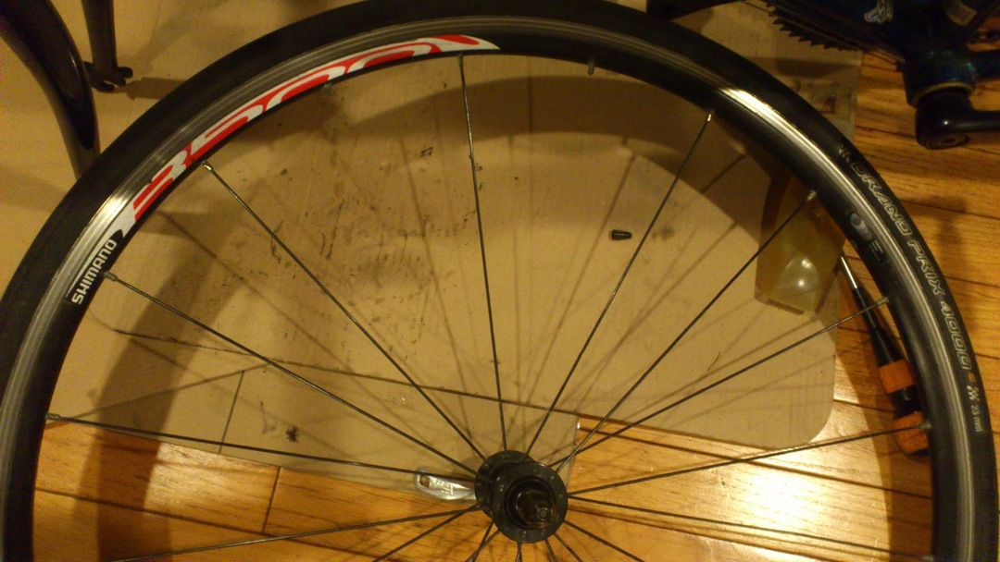
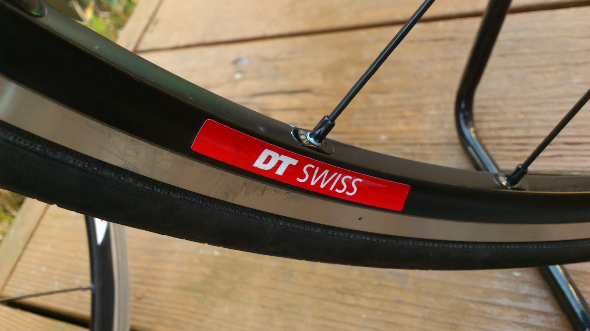

通学車兼旅行車に装備していたR500がとうとう逝去されました

  

急に前輪が振れたな？と思ったらニップルの根本からスポークが折れてました…

そして新しいホイールが届くまで誤魔化し誤魔化し使おうと周辺のスポークテンション調整してたらもう一本パキっとｗ

3年間キャンプツーリングで日本中を回ったりヨーロッパに行ったりトレイルに突っ込んだりした思い出あるホイールでした

むしろこれだけやりながらよく今まで壊れなかったなと…

変なスポークの折れ方をしたのは素人調整でテンションを上げまくっていたのでねじれに耐え切れずに折れた？のですかねー

リアは今のところセーフですがこれを機に前後とも新しくしようかと。来年からは街乗り車になるのでちょっと飾り気がありつつ実用性も兼ね備えて…と

届きました

  

  

  

DT swissのR1800 Tubelessを購入しました

パンクリスクの非常に低いチューブレスを街乗りにしない手はない。街乗り車に使えるやっすいチューブレスホイールを探してこれに行き着きました。RS61が鉄板といえば鉄板ですが、シマノホイール以外も使ってみたかったし、うん。

今のところは余っているGP4000Sを使うつもりですがストックがなくなり次第Intensive TLを履かせていこうかなと。

そうなるとめでたく？手持ちのバイクから換えチューブという概念が消え去ります。！！！荷物が減るよ！やったねたえちゃん！

このホイールのインプレですが、セールで安かったとはいえ、一応カタログ重量1700gのホイールなので、それなりに踏み出しは軽いです。R500から劇的に変化したとは言いがたいですが…さすがR500最強すぎる

意外だったのが乗り心地の変化ですね。R500についていたタイヤチューブをそのまま移植したのでよくわかります。フロントのコツコツした感じがかなり丸くなっています。リアもちょっといいかんじです。

スポーク数はF20R24からF18R24に変化した以外、フロントラジアルリア2クロスという組み方にも変化がないので純粋にリムとスポークの性能差ですかね？

R500をテンションマシマシで使っていたせいもありそうですが、ともかく乗り心地は明らかに良くなりました。

転がりに関してはDTのハブだし少し期待していたのですがまぁ変わりません。当たり前ですがデュラの足を止めてもヌルヌルスルスル進んでいく感じは無し。

走行性能は明らかに上がりましたが同時にR500のコスパの素晴らしさを痛感しましたね。シマノさんR500TLとか作っていいんですよ？待ってますよ？

