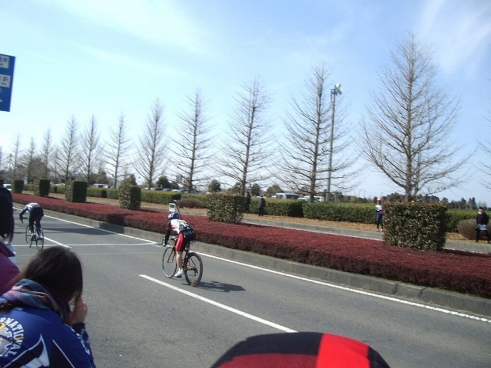

JCRC第1戦走って来ましたよー

神奈川の南側からひたちなかは中々の遠さ…しかし得意な平坦コースでしかも公道レースとあって即出場決定！

今回のコースは試走できないのでXを走った人からコースの特徴を聞いてちょこちょこ作戦を立てる。どうやらガーッと下ってゆるい登りがあってガーッと下る感じらしい。

ホームストレートが1km近くあるので早駆けしたら自爆必至～とのこと。

2周しかないのでこういう情報がすごくありがたいですね。

Eクラスの出走は10:00なので適度に暖かいと思いきや結構気温が低くてレッグウォーマー無しで走るのが恒例になっている自分にとってはちょっと寒い。

レーススタートからそんなにペースは上がらず。40km/h程度での走行が続く、下りでもフツーの速度域でそんなにキツイ登りでもないのに全く加速する人がおらず、みなさんスプリント勝負に持ち込みたいご様子。

自分にとっても願ったり叶ったりなので、後ろに沈まないように適度にローテーションに参加したりポジション引き上げたりしつつ前方に位置取り。

2周目の後半でややポジション争いが激しくなるも危なげなく前方をキープ。

ホームストレートに入って割とすぐに一人アタックし、集団のペースが一気に上がる。

みなカウンターのタイミングを伺うために横一列でピリピリした状態に。でも誰も行かない…

2列目にいて「脚残ってそうな人が出て行ったら後ろに付こう…」なんて考えていたら

ラスト400mくらいでワイズの人がスプリントをスタートしたので自分も反応！

  

後ろは引き離したものの差せずに2着…

西湖と同じじゃないですかこの展開…写真撮っていただいたBBさんありがとうございます

昇格＋表彰台で上々の結果を残したものの、同時にゴール手前での戦略を見直すという課題も残されたレースでした。Dクラスの皆さんこれからよろしくお願いします。

修善寺はそこまで得意コースでもないので参加するかは悩み中です

