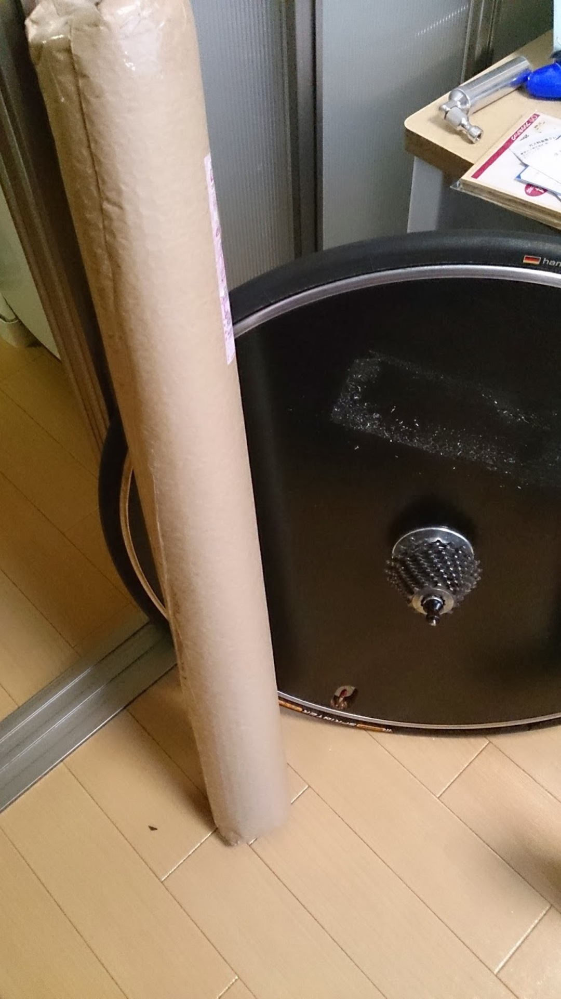
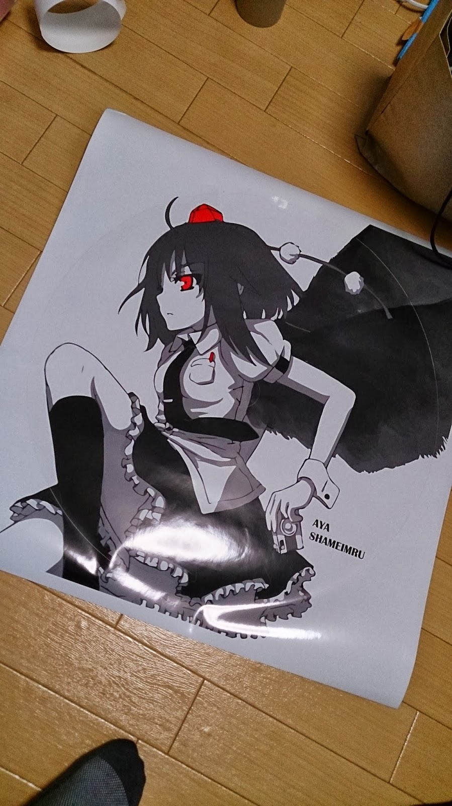
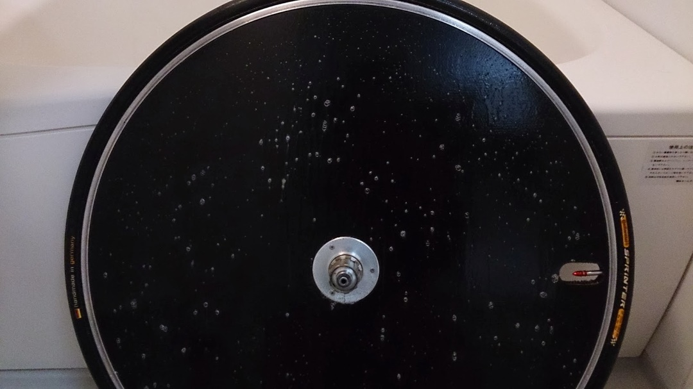
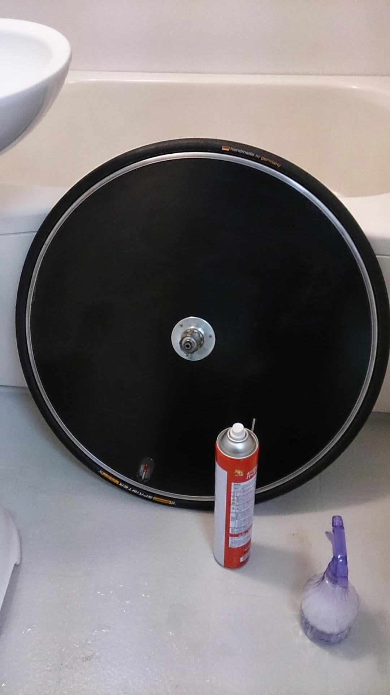
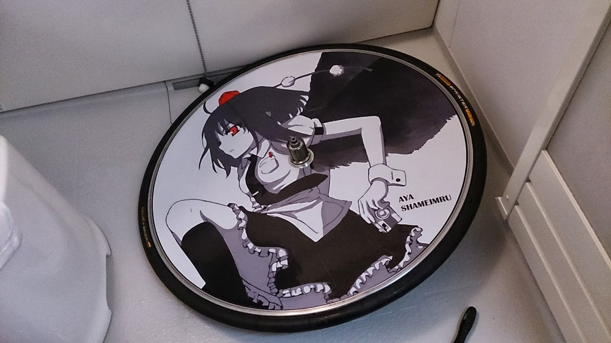

  

お久しぶりです。

試される大地に送り込まれている間なかなか更新できませんでしたがまた再開しようかと思います。

というわけで…

ブツが届いたぜ！

  

なぜTRINITYにディスクを履かせたかというとこれがやりたかったからですよ～

貼り付け初心者なので丁寧に

  

&nbsp;①脱脂

②中性洗剤薄めて霧吹きでバシャー

  

③貼り付けて完成！定規で水抜きして仕上げして偏らないように上を向けて乾かします

バルブホールはもう隠しちゃいます。片面出てれば空気は入るのでノンドライブ側からの空気入れに限定します。
