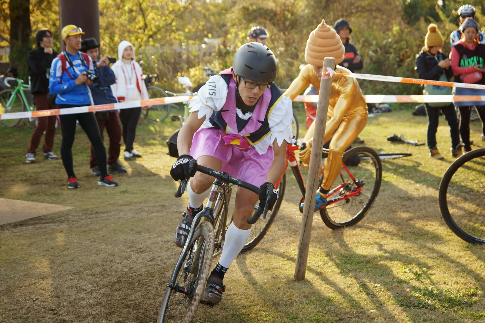

  

今年もバイクロアがやってきました。

調子に乗って2日5レースエントリー。

**1日目**

・チームラリーフレンドA

・ロケットレース

・サンセットレース

**2日目**

・ファストクラス

・オウルクラス

↓結果↓

**1日目**

・チームラリーフレンドA：2位

・ロケットレース：予選1回戦落ち

・サンセットレース：8位

**2日目**

・ファストクラス：8位

・オウルクラス：3位

老若男女貧脚剛脚だれでもワイワイ楽しめるし飯もビールも美味い！

カテゴリレースでもないから殺伐とした空気は0。

脚力目安でファンクラスとファストクラスが分かれているのですが、ファンクラスにも

C1選手とか出てるし実質無差別級レースです。

メインレースは仮装あり（というか仮装しかいない）オウルクラスにセット。

射命丸コスも用意してヤル気満々。

### チームラリーフレンドA

ASSO RACING 3人で参加。

後ろからのスタートだったが、1走のチームメイトSが上手く抜けだしてくれて上位で戻ってくる。2走の自分もノルマの3周を全力疾走。

1周5分で15分キッチリ出しきるつもりが3周目で大タレした、ペース配分は難しい…

3走のチームメイトYが途中でパンク、急遽自分が出発し、2周でSとチェンジ。

しばらくしたらタイヤ交換して復活したので、元の交代ペースに。

この辺りで実況により2,3,4位を団子で争っていることを知る。

ラスト2周の最終走者は自分に決定。交代時点で3位、前は15秒くらい先。

全力で踏んでたらシングルトラックで詰まっていたお陰で2位チームのPTTをキャッチ。

完全に身内争いである…

PTTはそのまま交代だったのでピット分得して2位に躍り出る。4位のチームはこの時点で見えず。

序盤のストレートで何人か遅い人を抜いて、シングルトラックで蓋をしてもらう作戦。

4人はパスして「勝った！」と思ってたらいつの間にか3位チームPTTのエースやんぼーが背後に…

仕方ないのでスプリント勝負かなーと思っていたら観客から

「4位来てるぞ！」

との声。

ハッハッハそんな馬鹿な…と思ったら本当にいました。影も形もなかったのに…

BlueLugの人速すぎィ！

堆肥ゾーンの手前で抜かれないよう、うまーく寄せてブロックしてたら肩からねじ込まれた、上手い。

しかしこの時点で頭のなかは

「ヤバイヤバイヤバイヤバイヤバイヤバイヤバイヤバイ抜かなきゃ」の一色。

堆肥ゾーンをハスる寸前まで詰めて抜けた瞬間ダッシュ掛けて抜け出し。

ゴールまで死ぬ気で走りきって無事2位でゴール！

テンション高すぎてガッツポーズしすぎたのでMCが困惑したとか何とか…

2位なので、表彰式で「2番目に抽選ができる権利」をゲット！

入賞しても名誉だけなのはバイクロアっぽい。

自分の順位は引けませんでしたｗ

### ロケットレース

「フルコースだから最初スプリントしてたら持たないな」とか考えてたら、

誰もタレなかった。ゴール前でキャッチできたものの差せずに予選でさよなら～

### サンセットレース

予定が押して完全にナイトレースになった影響で30分の予定を20分に短縮。

MCも「ナイトレース招集でーす」とか言ってたし…

3周目か4周目で派手にマンホールにリム打ちしてパンク(´・ω・｀)

後輪滑らせながら走ってホームストレートで「リアパンクした！」って叫んだら

次の周回で「ホイールあるよ！」との声。

しかもカーボンチューブラーだよこれ。好意を裏切るまいとガシガシ踏んでいく。

でも流石に表彰までは届かず8位でフィニッシュ。

###
ファストクラス

日曜午前はのーんびりして待機。

ファンクラスで無双するC1選手を眺める。

本番ことオウルクラスとの時間差がなく、「4周で降りて射命丸に着替えるか～」とか

思ってました。1列目スタートなんですけどC1選手多すぎてあまりモチベなし。

というかオウルクラスのことで頭一杯。

1列目なのでモタモタしてると後ろ突かれかねないし、なにより走る分に関しては手を抜きたくなかったのでスタートは真面目に！って走ったらホールショット取れたｗ

そのまま行けるところまでいくぞ～とか思ってたら3周の間ずっと先頭逃げを決めてしまう。

こんなにいい位置でレース降りられるわけもなく、アドレナリンの命じるままに走り続ける。

地味～にC1選手と聖くんに抜かされていく。ポツポツと抜かされたところラスト2周で

で振り返ると誰もいない。これ以上順位を落とさないように踏み直し！

8位でフィニッシュして即自陣へ行って幻想郷最速のお着替えをかます。

表彰式は見てない。

###
オウルクラス

大急ぎで着替えて招集へ。

ギリギリで呼ばれる順番に間に合う。

右も左も変な奴しかいない空間である。

  

スタート直後から早々にコスプレ表彰狙いガチ勢が抜け出す。

1周目終わった時点で、プリキュア（やんぼー）・ウンコさん（ディフェンディングチャンピオン）・俺（射命丸）のパックが出来上がる。

自分はちょっと遅れ気味。

  

  

華麗に途中で遅れだす俺。

ファストクラス頑張りすぎたか…？

  

優勝はプリキュアでした。

ゴールするそばから広場に集まりだす魑魅魍魎、そして始まる撮影会。

間違いなくバイクロア最も盛り上がる瞬間である。

  

  最初はこれだけだが…

  

&nbsp;徐々に増える化物達

  

ほぼ全員集合。

来年はプリキュア倒すぞ！

お　わ　り

写真下さった皆さん本当に有難うございます。

  

    
  

  

    

<a href="http://www.amazon.co.jp/exec/obidos/ASIN/B00JNSB5YU/gensobunya-22/ref=nosim/" name="amazletlink" target="_blank">千と千尋の神隠し カオナシ 風 衣装セット (衣装、マスク、手袋) コスチューム 男女共用 フリーサイズ</a>

  posted with <a href="http://www.amazlet.com/" title="amazlet" target="_blank">amazlet</a> at 16.10.29

(ヴィンテージローズ)vintagerose  売り上げランキング: 25

  <a href="http://www.amazon.co.jp/exec/obidos/ASIN/B00JNSB5YU/gensobunya-22/ref=nosim/" name="amazletlink" target="_blank">Amazon.co.jpで詳細を見る</a>

  

  

  

