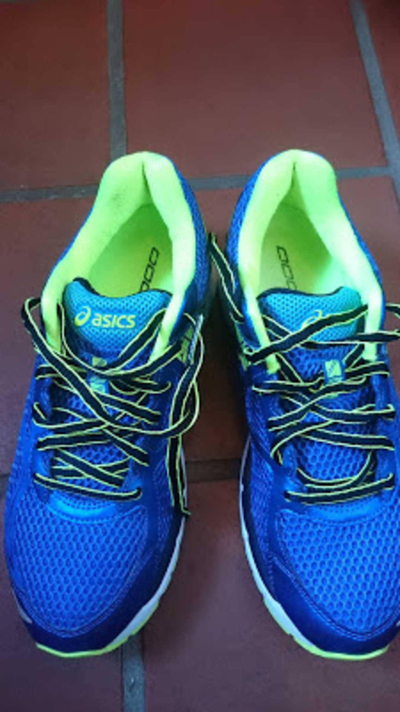
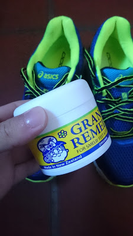

  

C2のシングルリザルトが定位置になってしまって、昇格まであと1人というところで逃し続けている。

JCX中井ではキッチリとペースを刻んで最後追い込んだのに差されて4位。

ペーシングとか技術ではなくベースの脚力や体力を改善しないといけないなと悟った。

レースの後、そのままスポーツショップへ向かってランシューを新調。

前のものが5年以上使ってボロボロであったため、クッション性が段違いにアップした。

お台場に向けてランを強化していく。自転車乗るよりランをやったほうが体も絞れる。

  

ランシューに限らずシューズに欠かせないのがこいつ、「グランズレメディ」

乾燥・消臭・除菌をこなしてくれる、オフィスで使う革靴もこれさえあれば臭いとおさらば。

欠点は靴下と中敷きが白い粉が付着することだが、シミになるわけでもないしそもそも見えないので問題なし。

  

    
  

  

    

<a href="http://www.amazon.co.jp/exec/obidos/ASIN/B008F4NV72/gensobunya-22/ref=nosim/" name="amazletlink" target="_blank">グランズレメディ ORIGINAL（無香料) 50g [海外直送品]</a>

  posted with <a href="http://www.amazlet.com/" title="amazlet" target="_blank">amazlet</a> at 16.03.21

グランズレメディ  売り上げランキング: 22

  <a href="http://www.amazon.co.jp/exec/obidos/ASIN/B008F4NV72/gensobunya-22/ref=nosim/" name="amazletlink" target="_blank">Amazon.co.jpで詳細を見る</a>

  

  

  

  

    
  

  

    

<a href="http://www.amazon.co.jp/exec/obidos/ASIN/B00ORJ8AYS/gensobunya-22/ref=nosim/" name="amazletlink" target="_blank">[アシックス] asics ランニングシューズ GT-2000 NEW YORK 3</a>

  posted with <a href="http://www.amazlet.com/" title="amazlet" target="_blank">amazlet</a> at 16.03.21

ASICS  売り上げランキング: 3,739

  <a href="http://www.amazon.co.jp/exec/obidos/ASIN/B00ORJ8AYS/gensobunya-22/ref=nosim/" name="amazletlink" target="_blank">Amazon.co.jpで詳細を見る</a>

  

  

  

