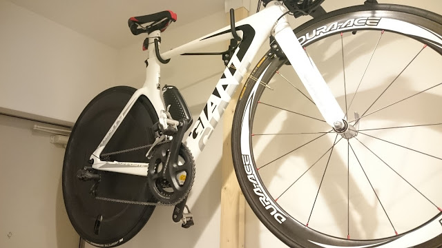
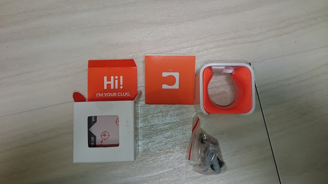
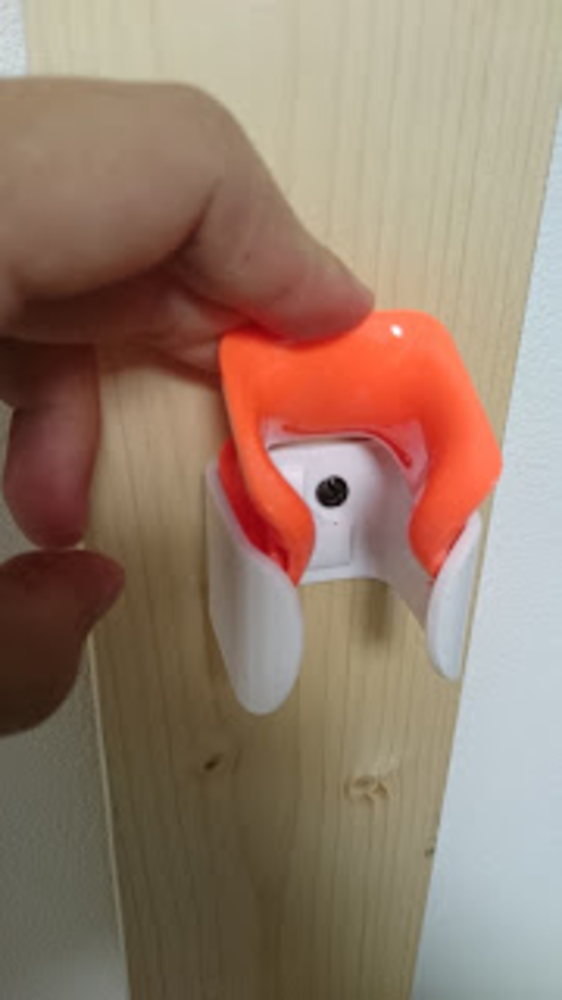
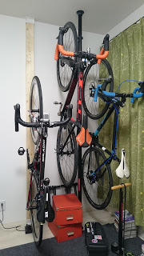

  

### 間違いだらけの自転車部屋記事

自宅での自転車保管方法には皆頭を悩ませていると思う。

特に賃貸物件に住んでいる人ならなおさらである。

自転車雑誌で「あなたの自転車保管方法見せてください！」という記事は定期的に出てくるが、持ち家をいかにお洒落にカスタムするかという点に偏っていることが多い。

それは違う！違うのだ！と声を大にして言いたい。

大抵の人は狭いスペースをどう活用するかに頭を悩ませている。

ましてや賃貸物件では壁や天井に穴を開けることなど夢のまた夢。

だがそんな人たちに希望を与える記事を見つけた。

<a href="http://jitensha-hoken.jp/blog/2015/11/roadbike-wall-keep/" target="_blank">狭くて賃貸でも大丈夫！室内にロードバイクを壁掛け保管する方法  </a>

市販の2&#215;4材を<a href="http://www.amazon.co.jp/gp/product/B00QM84KDM/ref=as_li_ss_tl?ie=UTF8&camp=247&creative=7399&creativeASIN=B00QM84KDM&linkCode=as2&tag=gensobunya-22" rel="nofollow">ディアウォール </a>で突っ張り、そこに穴を開けるという手法。

ただ、該当記事とこのエントリのトップ画像は同じ手法だが、どうにも圧迫感が強い。

### 更なる省スペース化を目指して

圧迫感の解消には、専有する床面積を下げることが重要との結論に至ったが、そのためには縦置きが必須。

世界最小スタンドの<a href="http://www.amazon.co.jp/gp/product/B01119G72S/ref=as_li_ss_tl?ie=UTF8&camp=247&creative=7399&creativeASIN=B01119G72S&linkCode=as2&tag=gensobunya-22" rel="nofollow">CLUGS</a>を使ってみることにした。

  

内容物はこれだけ。

木ネジも同梱なので必要工具はドライバーのみ。

  

付属のネジは2&#215;4材でも使用可能な長さだった。

  

高さを決めてネジ止めするだけ。

ネジ用のアンカーが付属していたが、ホワイトウッドが柔らかいためドリル不要でネジ止め可能だったので、利用しなかった。

  

こちらが配置結果。

<a href="http://www.amazon.co.jp/gp/product/B0071I27NW/ref=as_li_ss_tl?ie=UTF8&camp=247&creative=7399&creativeASIN=B0071I27NW&linkCode=as2&tag=gensobunya-22" rel="nofollow">MINOURAバイクピット３</a>と組み合わせることで、ハンドルの高さを変えることで大幅に横幅を削減できた。

### 改良点・課題

<a href="http://www.amazon.co.jp/gp/product/B000VT2CS8/ref=as_li_ss_tl?ie=UTF8&camp=247&creative=7399&creativeASIN=B000VT2CS8&linkCode=as2&tag=gensobunya-22" rel="nofollow">BBBのパーキングフック</a>を利用すれば、2&#215;4材のみで高さの変更も可能かもしれない。

また、年単位では木材の劣化が心配なので湿気を吸う梅雨までに保護用ニスの塗布も行ったほうが良い。

ディアウォール用の木材をカットした際、少し短めになってしまったが、余っているコラムスペーサーで事なきを得た。

斜め手前に力のベクトルがかかるため、長さの調整はシビアになったほうが良さそうだ。

  

    
  

  

    

<a href="http://www.amazon.co.jp/exec/obidos/ASIN/B00QM84KDM/gensobunya-22/ref=nosim/" name="amazletlink" target="_blank">WAKAI ディアウォール 上下パッド 1セットツーバイフォー</a>

  posted with <a href="http://www.amazlet.com/" target="_blank" title="amazlet">amazlet</a> at 16.03.02

若井産業   売り上げランキング: 21

  <a href="http://www.amazon.co.jp/exec/obidos/ASIN/B00QM84KDM/gensobunya-22/ref=nosim/" name="amazletlink" target="_blank">Amazon.co.jpで詳細を見る</a>

  

  

  

  

    
  

  

    

<a href="http://www.amazon.co.jp/exec/obidos/ASIN/B01119G72S/gensobunya-22/ref=nosim/" name="amazletlink" target="_blank">ロジック CLUG 自転車スタンド Sサイズ ブルー タイヤ対応サイズ幅：約23～32mm</a>

  posted with <a href="http://www.amazlet.com/" target="_blank" title="amazlet">amazlet</a> at 16.03.02

ロジック

  <a href="http://www.amazon.co.jp/exec/obidos/ASIN/B01119G72S/gensobunya-22/ref=nosim/" name="amazletlink" target="_blank">Amazon.co.jpで詳細を見る</a>

  

  

  

  

    
  

  

    

<a href="http://www.amazon.co.jp/exec/obidos/ASIN/B0071I27NW/gensobunya-22/ref=nosim/" name="amazletlink" target="_blank">MINOURA(ミノウラ) バイクピット3 ポール式縦置きスタンド(2台用)</a>

  posted with <a href="http://www.amazlet.com/" target="_blank" title="amazlet">amazlet</a> at 16.03.02

MINOURA(ミノウラ) (2012-01-25)  売り上げランキング: 32,916

  <a href="http://www.amazon.co.jp/exec/obidos/ASIN/B0071I27NW/gensobunya-22/ref=nosim/" name="amazletlink" target="_blank">Amazon.co.jpで詳細を見る</a>

  

  

  

  

    
  

  

    

<a href="http://www.amazon.co.jp/exec/obidos/ASIN/B000VT2CS8/gensobunya-22/ref=nosim/" name="amazletlink" target="_blank">BBB バイクスタンド バイクストレージ パーキングフック BTL-26 102204</a>

  posted with <a href="http://www.amazlet.com/" target="_blank" title="amazlet">amazlet</a> at 16.03.02

BBB   売り上げランキング: 64,827

  <a href="http://www.amazon.co.jp/exec/obidos/ASIN/B000VT2CS8/gensobunya-22/ref=nosim/" name="amazletlink" target="_blank">Amazon.co.jpで詳細を見る</a>

  

  

  

