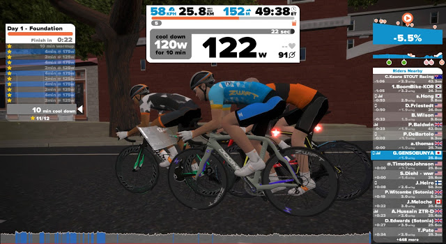

  

本記事は下記の続きです。

<blockquote class="tr_bq">
  

    Zwiftで始めるパワートレーニング0日目 &#8211; FTP test(shorter)  <a href="/2016/01/21/zwift0-ftp-testshorter.html">/2016/01/21/zwift0-ftp-testshorter.html</a>
  

</blockquote>

### 拍子抜け

やる気出してページを開いたらすごく簡単なメニューが出てきた…

2日目はちょっと歯ごたえありそうだけど3日目と4日目はまた簡単なメニュー。

ひとまず6週間やりきることが目標なので音楽聴きながら50分回す。

  

ケイデンス維持とペダリングを綺麗に意識しながら音楽聞いていたら汗もほとんどかかずにあっさり終了。

ワークアウト中は自分の目の前に画面が浮かぶ演出が入る。

しかもきっちりパワー値まで反映されていてムダに手が込んでいるなーと。

それくらいしか考えていなかった。

  

    
  

  

    

<a href="http://www.amazon.co.jp/exec/obidos/ASIN/B0050GL5GM/gensobunya-22/ref=nosim/" name="amazletlink" target="_blank">SUUNTO(スント) Movestick Mini USB 【日本正規品】 S016591000</a>

  posted with <a href="http://www.amazlet.com/" target="_blank" title="amazlet">amazlet</a> at 16.02.27

SUUNTO(スント) (2011-11-14)  売り上げランキング: 46,667

  <a href="http://www.amazon.co.jp/exec/obidos/ASIN/B0050GL5GM/gensobunya-22/ref=nosim/" name="amazletlink" target="_blank">Amazon.co.jpで詳細を見る</a>

  

  

  

