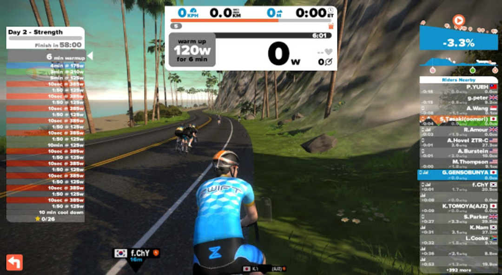
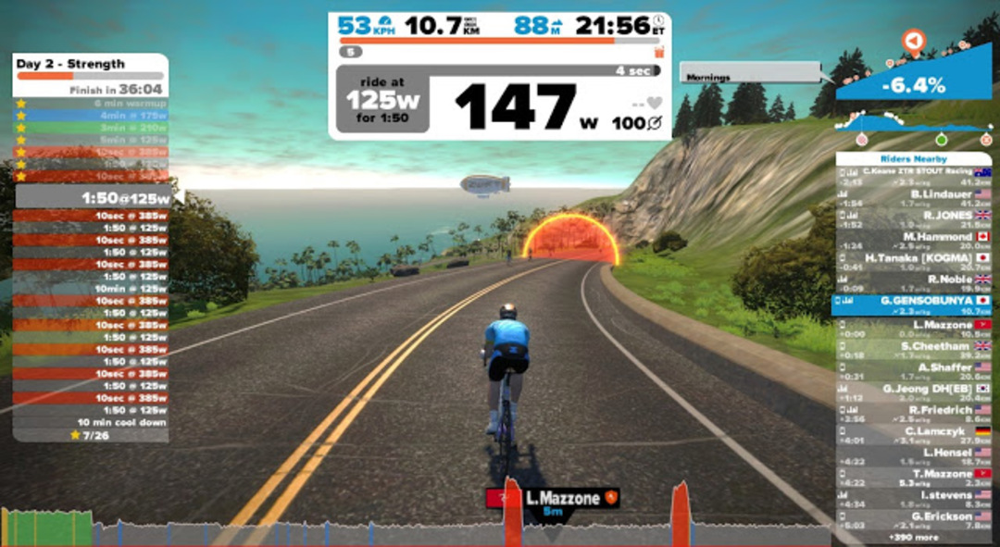
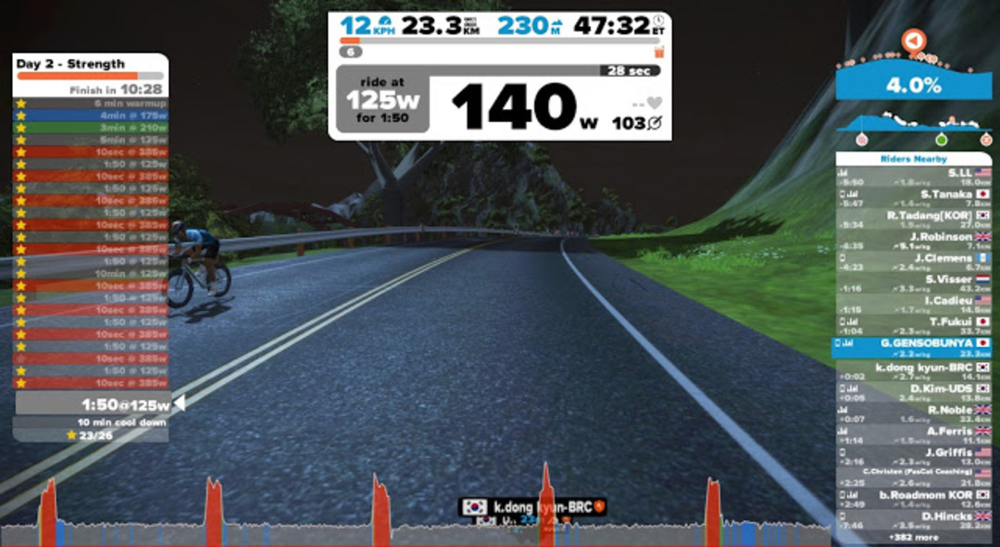

  

### Strength(笑)

土日はスクールクロスで思いっきり楽しんできた。

硬い路面を硬い靴で走った代償に特大の筋肉痛が。

確か今日のメニューはStrengthとかいうキツそうなメニューだった気がする。

走りだしたらほとんどレストだったけど…

  

それでも変化があると中々飽きないもので、赤いゲートは踏む気にさせてくれる。

  

踏みすぎて失敗判定を食らった。

一時間飽きずに走れたのでよし。

前回の記事はこちら

<blockquote class="tr_bq">
  

    Zwiftで始めるパワートレーニング1日目 &#8211; 6wks FTP builder Week 1 Day 1  <a href="/2016/01/22/zwift1-6wks-ftp-builder-week-1-day-1.html">/2016/01/22/zwift1-6wks-ftp-builder-week-1-day-1.html</a>
  

</blockquote>

  

    
  

  

    

<a href="http://www.amazon.co.jp/exec/obidos/ASIN/B0050GL5GM/gensobunya-22/ref=nosim/" name="amazletlink" target="_blank">SUUNTO(スント) Movestick Mini USB 【日本正規品】 S016591000</a>

  posted with <a href="http://www.amazlet.com/" target="_blank" title="amazlet">amazlet</a> at 16.02.27

SUUNTO(スント) (2011-11-14)  売り上げランキング: 46,667

  <a href="http://www.amazon.co.jp/exec/obidos/ASIN/B0050GL5GM/gensobunya-22/ref=nosim/" name="amazletlink" target="_blank">Amazon.co.jpで詳細を見る</a>

  

  

  

  

    
  

  

    

<a href="http://www.amazon.co.jp/exec/obidos/ASIN/B01826VY6M/gensobunya-22/ref=nosim/" name="amazletlink" target="_blank">トレーニングマット</a>

  posted with <a href="http://www.amazlet.com/" target="_blank" title="amazlet">amazlet</a> at 16.02.27

takizawa   売り上げランキング: 25,061

  <a href="http://www.amazon.co.jp/exec/obidos/ASIN/B01826VY6M/gensobunya-22/ref=nosim/" name="amazletlink" target="_blank">Amazon.co.jpで詳細を見る</a>

  

  

  

  

    
  

  

    

<a href="http://www.amazon.co.jp/exec/obidos/ASIN/B000O38Z2I/gensobunya-22/ref=nosim/" name="amazletlink" target="_blank">MINOURA(ミノウラ) セフティーネット</a>

  posted with <a href="http://www.amazlet.com/" target="_blank" title="amazlet">amazlet</a> at 16.02.27

MINOURA(ミノウラ)   売り上げランキング: 15,311

  <a href="http://www.amazon.co.jp/exec/obidos/ASIN/B000O38Z2I/gensobunya-22/ref=nosim/" name="amazletlink" target="_blank">Amazon.co.jpで詳細を見る</a>

  

  

  

