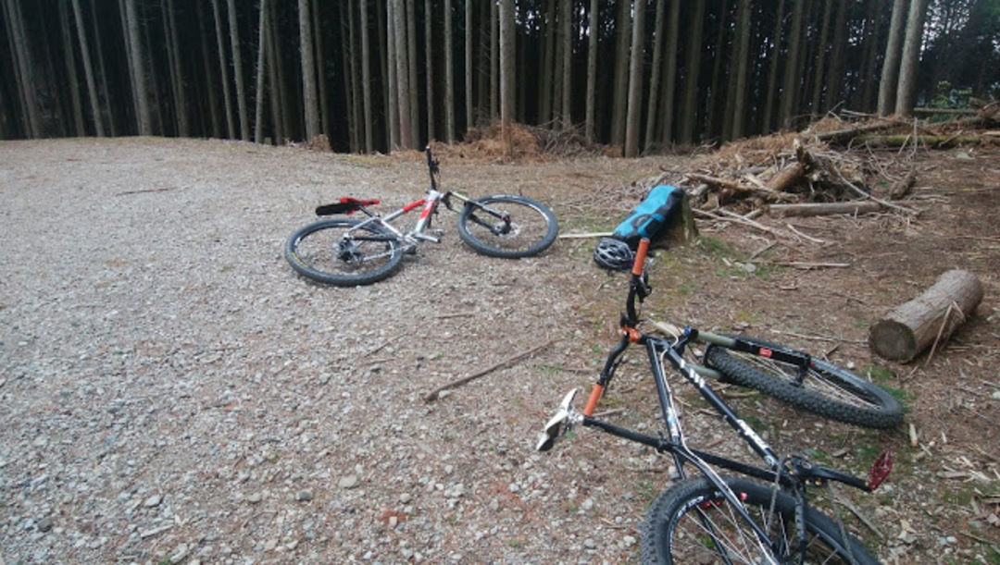
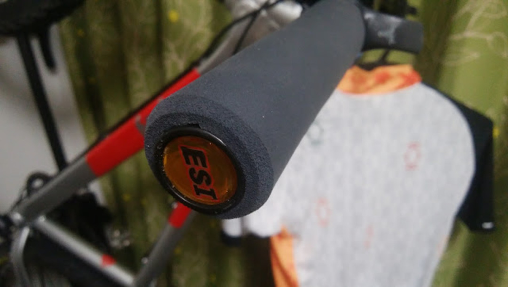

  

組んだばかりのMTBを早速シェイクダウンへ、トレイルが近い家は良い。

モリモリ登ってモリモリ下る。

地元のMTBerのアテンドで何本かのトレイルを繋ぎ、激登りはあれど激下りは無し、だけども退屈な道も無しという楽しいコースを組んで頂けた。

王滝がメインスコープになるバイクなので、それにちなんだパーツを幾つか入れてみたなかで、当たりのパーツをメモ。どれも有名なので、今更インプレするまでもないかもしれないが…

&nbsp;

### ESI Grips chunky

  

グリップに悩んでいたところオススメされ、Ergonと悩みながら購入した一品。

結論から言うと大正解。

30mm径のRacer&#8217;s Edgeはロンドンオリンピックで装着率40%という売り文句。こいつは32mmのトレイル向けモデル。

ゴム製のグリップは放っておくと加水分解してベトベトになってしまうが、ESIグリップはシリコン製なのでそうはならない。カラーが多いのもポイント高い。

   

絶妙なグリップと振動吸収性で、以前の経験からカーボンハンドルの導入を迷っていた気持ちが雲散霧消。

王滝のような長期戦で、後半の握力を奪いに来る微振動をほとんどカットしてくれる。

ロックオンではないので、装着がクソ面倒だがそれだけの価値がある一品。

最近は気持ちだけエルゴノミック形状になったバージョンが有るらしい。

&nbsp;

  

    
  

  

    

<a href="http://www.amazon.co.jp/exec/obidos/ASIN/B002UMFS5S/gensobunya-22/ref=nosim/" target="_blank" rel="noopener" name="amazletlink">ESI grips(イーエスアイ グリップス) MTB グリップ Chunky Grips CESGRCHRD レッド 外径32mm x 長さ130mm</a>

  posted with <a title="amazlet" href="http://www.amazlet.com/" target="_blank" rel="noopener">amazlet</a> at 17.04.17

Extreme Steering(エクストリームステアリング)   売り上げランキング: 303,865

  <a href="http://www.amazon.co.jp/exec/obidos/ASIN/B002UMFS5S/gensobunya-22/ref=nosim/" target="_blank" rel="noopener" name="amazletlink">Amazon.co.jpで詳細を見る</a>

  

  

     
  

### Brand-X Ascend Dropper seatpost

いわゆるドロッパーポスト。

MTB界における21世紀最大の発明らしい。

たった1回のライドで使っただけだがドロッパーのないトレイルバイクは考えられない。

ステルスドロッパー（シートチューブにワイヤーを通せる仕組み）なので見た目はスッキリだがセッティングはとっても面倒だった。

有名ブランドのドロッパーポストの7割～半額程度の値段で買えるが、ひとまず文句なく動いてくれた。耐久性は未知数だが、初期からガタつくなどの不具合は無し。

### その他

  

<a href="https://togs.com/" target="_blank" rel="noopener">TOGS</a>も使ってみた。ESIグリップの写真でよく見るとついているのがわかると思う。

登りでポジションが限定されるのは嬉しいが、思ったほど感動しなかった。

ドロッパーの衝撃が大きすぎたせいだろう。手のマッサージには非常に有効。

MTBのDi2も使ってみたいけど、まだちょっと予算がね…？

オークリーのPrizmTrailレンズも投入。

視界の明るさがほぼ一定に保たれる上、ハイコントラストレンズのおかげで路面のギャップが見えやすくなる。

外した際の視界がおかしくなるのはカラーレンズのお約束。木漏れ日の中下るようなシチュエーションで効果を発揮してくれる。

シクロクロスみたいなシビアなライン取りが必要になる時も有効

<a href="https://ck.jp.ap.valuecommerce.com/servlet/referral?sid=3171302&pid=883104724&vc_url=http%3A%2F%2Fwww.wiggle.jp%2Foakley-radarlock-prizm-trail-%25E3%2582%25B5%25E3%2583%25B3%25E3%2582%25B0%25E3%2583%25A9%25E3%2582%25B9%2F%3Flang%3Dja%26curr%3DJPY%26dest%3D33%26sku%3D5360699262%26utm_source%3Dgoogle%26utm_term%26utm_campaign%3DJP_Shopping_High%2BMargin%26utm_medium%3Dbase%26utm_content%3Dmkwid_sOmeDMm0I-dc_pcrid_89577854566_pkw__pmt__prd_5360699262ja%26utm_source%3Dvaluecommerce%26utm_medium%3Daffiliates%26utm_campaign%3Daffiliate-website" target="_blank" rel="nofollow noopener">Oakley &#8211; Radarlock Prizm Trail サングラス</a><a href="https://ck.jp.ap.valuecommerce.com/servlet/referral?sid=3171302&pid=883104724&vc_url=http%3A%2F%2Fwww.wiggle.jp%2Foakley-radarlock-prizm-trail-%25E3%2582%25B5%25E3%2583%25B3%25E3%2582%25B0%25E3%2583%25A9%25E3%2582%25B9%2F%3Flang%3Dja%26curr%3DJPY%26dest%3D33%26sku%3D5360699262%26utm_source%3Dgoogle%26utm_term%26utm_campaign%3DJP_Shopping_High%2BMargin%26utm_medium%3Dbase%26utm_content%3Dmkwid_sOmeDMm0I-dc_pcrid_89577854566_pkw__pmt__prd_5360699262ja%26utm_source%3Dvaluecommerce%26utm_medium%3Daffiliates%26utm_campaign%3Daffiliate-website" target="_blank" rel="nofollow noopener"></a>