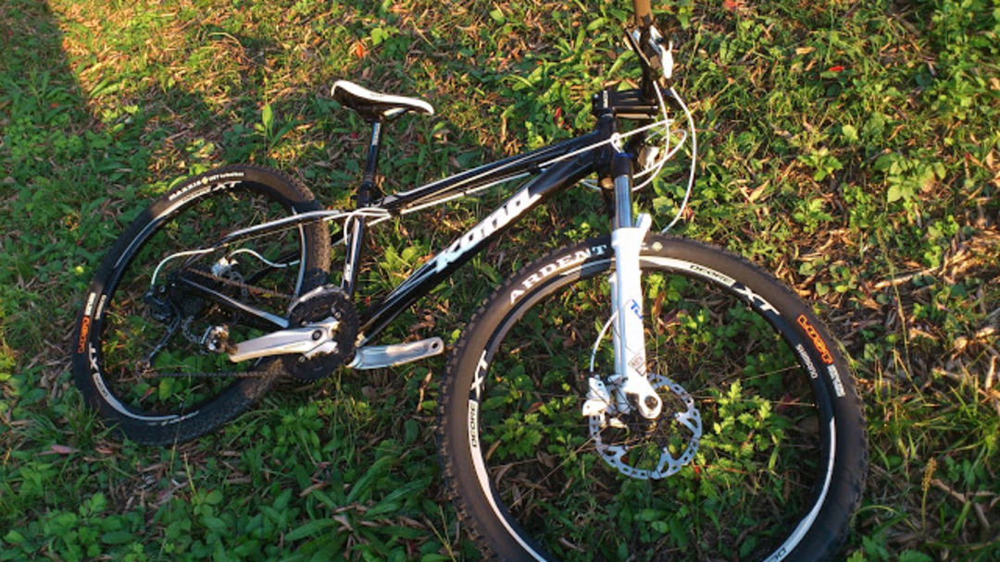

続いてはMTB。[KONA](http://www.konaworld.jp/)のBlast(2011モデル）です。

オフロード走りたいなー！と思ってMTBショップでお手頃な前年モデルのセール品を探しまわって巡りあった。

つい本日ホイールとタイヤをXT M788とMaxxisのチューブレス（F: Ardent, R:CrossMark)に新調しました。ついでにディスクローターもSLXのセンターロックに。

6穴アダプターよりローターの方が安いとか信じられん…

その他はハンドル幅を詰めてステムをKOREのごっついのに交換しただけでドノーマルです。チューブレス化したこととフロントをオールマウンテン気味のタイヤにしたので食いつきが良くなっていることを期待しています。

活動場所は地元のトレイルがほとんど、たまに相模湖の常設コース行ったりですかね・・・将来的には王滝も出てみたいです。
